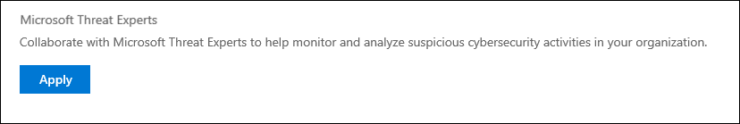
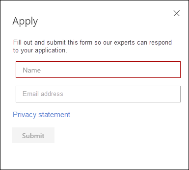
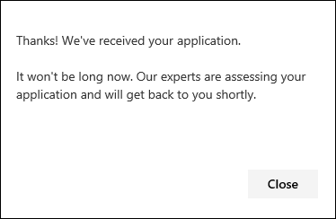
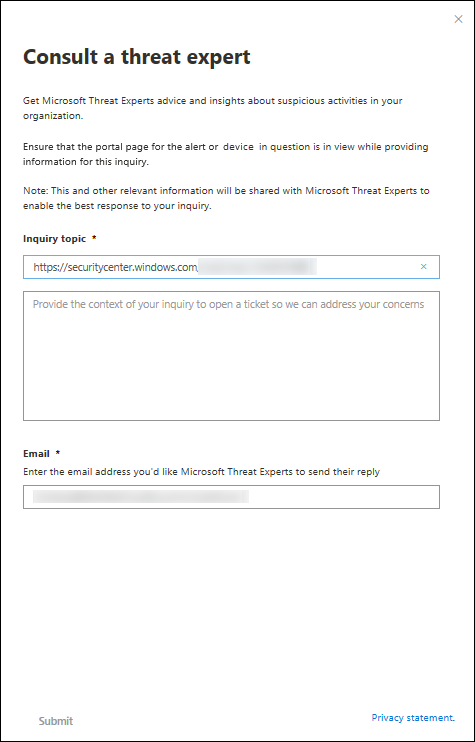

# Configure and manage Microsoft Threat Experts capabilities

[!INCLUDE [Microsoft 365 Defender rebranding](../../includes/microsoft-defender.md)]

**Applies to:**
- [Microsoft Defender for Endpoint](https://go.microsoft.com/fwlink/p/?linkid=2146631)
- [Microsoft 365 Defender](https://go.microsoft.com/fwlink/?linkid=2118804)

>Want to experience Defender for Endpoint? [Sign up for a free trial.](https://www.microsoft.com/microsoft-365/windows/microsoft-defender-atp?ocid=docs-wdatp-assignaccess-abovefoldlink)

## Before you begin 
> [!NOTE]
> Discuss the eligibility requirements with your Microsoft Technical Service provider and account team before you apply to the managed threat hunting service.

Ensure that you have Defender for Endpoint deployed in your environment with devices enrolled, and not just on a laboratory set-up.

If you're a Defender for Endpoint customer, you need to apply for Microsoft Threat Experts - Targeted Attack Notifications to get special insights and analysis to help identify the most critical threats, so you can respond to them quickly. Contact your account team or Microsoft representative to subscribe to Microsoft Threat Experts - Experts on Demand to consult with our threat experts on relevant detections and adversaries.

## Apply for Microsoft Threat Experts - Targeted Attack Notifications service 
If you're already a Defender for Endpoint customer, you can apply through the Microsoft Defender Security Center. 

1. From the navigation pane, go to **Settings > General > Advanced features > Microsoft Threat Experts - Targeted Attack Notifications**.

2. Click **Apply**.

    

3. Enter your name and email address so that Microsoft can get back to you on your application.

    

4. Read the [privacy statement](https://privacy.microsoft.com/en-us/privacystatement), then click **Submit** when you're done. You will receive a welcome email once your application is approved.

    

When accepted, you will receive a welcome email and you will see the **Apply** button change to a toggle that is “on”. In case you want to take yourself out of the Targeted Attack Notifications service, slide the toggle “off” and click **Save preferences** at the bottom of the page. 

## Where you'll see the targeted attack notifications from Microsoft Threat Experts 
You can receive targeted attack notification from Microsoft Threat Experts through the following medium:  
- The Defender for Endpoint portal's **Incidents** page 
- The Defender for Endpoint portal's **Alerts** dashboard  
- OData alerting [API](https://docs.microsoft.com/windows/security/threat-protection/microsoft-defender-atp/get-alerts) and [REST API](https://docs.microsoft.com/windows/security/threat-protection/microsoft-defender-atp/pull-alerts-using-rest-api)
- [DeviceAlertEvents](https://docs.microsoft.com/windows/security/threat-protection/microsoft-defender-atp/advanced-hunting-devicealertevents-table) table in Advanced hunting
- Your email, if you choose to configure it 

To receive targeted attack notifications through email, create an email notification rule.

### Create an email notification rule 
You can create rules to send email notifications for notification recipients. See  [Configure alert notifications](configure-email-notifications.md) to create, edit, delete, or troubleshoot email notification, for details.

## View the targeted attack notification  
You'll start receiving targeted attack notification from Microsoft Threat Experts in your email after you have configured your system to receive email notification.  

1. Click the link in the email to go to the corresponding alert context in the dashboard tagged with **Threat experts**. 

2. From the dashboard, select the same alert topic that you got from the email, to view the details.  

## Subscribe to Microsoft Threat Experts - Experts on Demand
If you're already a Defender for Endpoint customer, you can contact your Microsoft representative to subscribe to Microsoft Threat Experts - Experts on Demand. 

## Consult a Microsoft threat expert about suspicious cybersecurity activities in your organization 
You can partner with Microsoft Threat Experts who can be engaged directly from within the Microsoft Defender Security Center for timely and accurate response. Experts provide insights to better understand complex threats, targeted attack notifications that you get, or if you need more information about the alerts, a potentially compromised device, or a threat intelligence context that you see on your portal dashboard. 

> [!NOTE]
> - Alert inquiries related to your organization's customized threat intelligence data are currently not supported. Consult your security operations or incident response team for details.
> - You need to have the **Manage security settings** permission in the Security Center portal to be able to submit a "Consult a threat expert" inquiry.

1. Navigate to the portal page with the relevant information that you'd like to investigate, for example, the **Incident** page. Ensure that the page for the relevant alert or device is in view before you send an investigation request. 

2. From the upper right-hand menu, click the **?** icon. Then, select **Consult a threat expert**. 

    

    A flyout screen opens. The following screen shows when you are on a trial subscription.

    

    The following screen shows when you are on a full Microsoft Threat Experts - Experts on-Demand subscription.

    

    The **Inquiry topic** field is pre-populated with the link to the relevant page for your investigation request. For example, a link to the incident, alert, or device details page that you were at when you made the request.

3.  In the next field, provide enough information to give the Microsoft Threat Experts enough context to start the investigation.
  
4. Enter the email address that you'd like to use to correspond with Microsoft Threat Experts.

> [!NOTE]
> If you would like to track the status of your Experts on Demand cases through Microsoft Services Hub, reach out to your Technical Account Manager. 

Watch this video for a quick overview of the Microsoft Services Hub.

>[!VIDEO https://www.microsoft.com/videoplayer/embed/RE4pk9f] 

   
## Sample investigation topics that you can consult with Microsoft Threat Experts - Experts on Demand 

**Alert information**
- We see a new type of alert for a living-off-the-land binary: [AlertID]. Can you tell us something more about this alert and how we can investigate further?
- We’ve observed two similar attacks, which try to execute malicious PowerShell scripts but generate different alerts. One is "Suspicious PowerShell command line" and the other is "A malicious file was detected based on indication provided by O365". What is the difference?
- I receive an odd alert today for abnormal number of failed logins from a high profile user’s device. I cannot find any further evidence around these sign-in attempts. How can Defender for Endpoint see these attempts? What type of sign-ins are being monitored?
- Can you give more context or insights about this alert: “Suspicious behavior by a system utility was observed”. 

**Possible machine compromise**
- Can you help answer why we see “Unknown process observed?” This message or alert is seen frequently on many devices. We appreciate any input to clarify whether this message or alert is related to malicious activity.
- Can you help validate a possible compromise on the following system on [date] with similar behaviors as the previous [malware name] malware detection on the same system in [month]?

**Threat intelligence details**
- We detected a phishing email that delivered a malicious Word document to a user. The malicious Word document caused a series of suspicious events, which triggered multiple Microsoft Defender alerts for [malware name] malware. Do you have any information on this malware? If yes, can you send me a link?
- I recently saw a [social media reference, for example, Twitter or blog] post about a threat that is targeting my industry. Can you help me understand what protection Defender for Endpoint provides against this threat actor? 

**Microsoft Threat Experts’ alert communications** 
- Can your incident response team help us address the targeted attack notification that we got?
- I received this targeted attack notification from Microsoft Threat Experts. We don’t have our own incident response team. What can we do now, and how can we contain the incident?
- I received a targeted attack notification from Microsoft Threat Experts. What data can you provide to us that we can pass on to our incident response team?

  >[!NOTE]
  >Microsoft Threat Experts is a managed cybersecurity hunting service and not an incident response service. However, the experts can seamlessly transition the investigation to Microsoft Cybersecurity Solutions Group (CSG)'s  Detection and Response Team (DART) services, when necessary. You can also opt to engage with your own incident response team to address issues that requires an incident response. 

## Scenario

### Receive a progress report about your managed hunting inquiry 
Response from Microsoft Threat Experts varies according to your inquiry. They will email a progress report to you about your **Consult a threat expert** inquiry within two days, to communicate the investigation status from the following categories: 
- More information is needed to continue with the investigation 
- A file or several file samples are needed to determine the technical context 
- Investigation requires more time   
- Initial information was enough to conclude the investigation 

It is crucial to respond in quickly to keep the investigation moving. 

## Related topic
- [Microsoft Threat Experts overview](microsoft-threat-experts.md)
