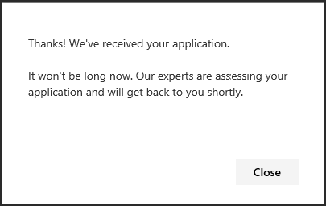
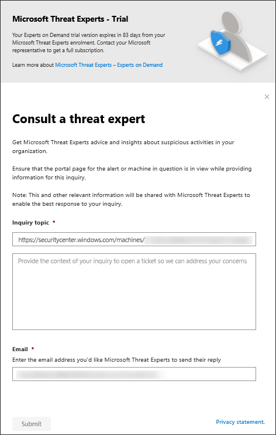

# Configure and manage Microsoft Threat Experts capabilities
**Applies to:**

- [Microsoft Defender Advanced Threat Protection (Microsoft Defender ATP)](https://go.microsoft.com/fwlink/p/?linkid=2069559)

[!include[Prerelease information](prerelease.md)]

## Before you begin 
To experience the full Microsoft Threat Experts targeted attack notification capability in Microsoft Defender ATP, or try the the experts-on-demand capability, you need to have a valid Premier customer service and support account. Premier charges are not incurred during for the capability in trial, but for the generally available capability, there will be charges.

Ensure that you have Microsoft Defender ATP deployed in your environment with machines enrolled, and not just on a laboratory set-up. 

## Register to Microsoft Threat Experts managed threat hunting service 
If you're already a Microsoft Defender ATP customer, you can apply through the Microsoft Defender ATP portal. 

1. From the navigation pane, go to **Settings > General > Advanced features > Microsoft Threat Experts**.

2. Click **Apply**. 

3. Enter your name and email address so that Microsoft can get back to you on your application. 

4. Read the privacy statement, then click **Submit** when you're done. You will receive a welcome email once your application is approved.   

6. From the navigation pane, go to **Settings** > **General** > **Advanced features** to turn the **Threat Experts** toggle on. Click **Save preferences**. 

## Receive targeted attack notification from Microsoft Threat Experts 
You can receive targeted attack notification from Microsoft Threat Experts through the following medium:  
- The Microsoft Defender ATP portal's **Alerts** dashboard  
- Your email, if you choose to configure it 

To receive targeted attack notifications through email, create an email notification rule.

### Create an email notification rule 
You can create rules to send email notifications for notification recipients. See  [Configure alert notifications](configure-email-notifications.md) to create, edit, delete, or troubleshoot email notification, for details.

## View the targeted attack notification  
You'll start receiving targeted attack notification from Microsoft Threat Experts in your email after you have configured your system to receive email notification.  

1. Click the link in the email to go to the corresponding alert context in the dashboard tagged with **Threat experts**. 

2. From the dashboard, select the same alert topic that you got from the email, to view the details.  

## Consult a Microsoft threat expert about suspicious cybersecurity activities in your organization 
>[!NOTE]
>The Microsoft Threat Experts' experts-on-demand capability is still in preview. You can only use the experts-on-demand capability if you have applied for preview and your application has been approved.

You can partner with Microsoft Threat Experts who can be engaged directly from within the Microsoft Defender Security Center for timely and accurate response. Experts provide insights to better understand complex threats, targeted attack notifications that you get, or if you need more information about the alerts, a potentially compromised machine, or a threat intelligence context that you see on your portal dashboard. 

>[!NOTE]
>Alert inquiries related to your organization's customized threat intelligence data are currently not supported. Consult your security operations or incident response team for details.

1. Navigate to the portal page with the relevant information that you'd like to investigate, for example, the **Incident** page. Ensure that the page for the relevant alert or machine is in view before you send an investigation request. 
2. From the upper right-hand menu, click **?**. Then, select **Consult a threat expert**.

>

>The **Inquiry topic** field is pre-populated with the link to the relevant page for your investigation request. For example, a link to the incident, alert, or machine details page that you were at when you made the request. 

3. In the next field, provide enough information to give the Microsoft Threat Experts enough context to start the investigation. 
4. Enter the email address that you'd like to use to correspond with Microsoft Threat Experts.
   

## Sample investigation topics that you can consult with Microsoft Threat Experts

**Alert information**
- We see a new type of alert for a living-off-the-land binary: [AlertID]. Can you tell us something more about this alert and how we can investigate further?
- We’ve observed two similar attacks which try to execute malicious PowerShell scripts but generate different alerts. One is "Suspicious Powershell command line" and the other is "A malicious file was detected based on indication provided by O365". What is the difference?
- I receive an odd alert today for abnormal number of failed logins from a high profile user’s device. I cannot find any further evidence around these sign-in attempts. How can Microsoft Defender ATP see these attempts? What type of sign-ins are being monitored?
- Can you give more context or insights about this alert: “Suspicious behavior by a system utility was observed”. 

**Possible machine compromise**
- Can you help answer why we see “Unknown process observed?” This is seen quite frequently on many machines. We appreciate any input to clarify whether this is related to malicious activity.
- Can you help validate a possible compromise on the following system on [date] with similar behaviors as the previous [malware name] malware detection on the same system in [month]?

**Threat intelligence details**
- This morning, we detected a phishing email that delivered a malicious Word document to a user. This caused a series of suspicious events which triggered multiple Microsoft Defender alerts for [malware name] malware. Do you have any information on this malware? If yes, can you send me a link?
- I recently saw a [social media reference e.g., Twitter or blog] post about a threat that is targeting my industry. Can you help me understand what protection Microsoft Defender ATP provides against this threat actor? 

**Microsoft Threat Experts’ alert communications** 
- Can your incident response team help us address the targeted attack notification that we got?
- I received this targeted attack notification from Microsoft Threat Experts. We don’t have our own incident response team. What can we do now, and how can we contain the incident?
- I received a targeted attack notification from Microsoft Threat Experts. What data can you provide to us that we can pass on to our incident response team?

  >[!NOTE]
  >Microsoft Threat Experts is a managed cybersecurity hunting service and not an incident response service. However, the experts can seamlessly transition the investigation to Microsoft Cybersecurity Solutions Group (CSG)'s  Detection and Response Team (DART) services, when necessary. You can also opt to engage with your own incident response team to address issues that requires an incident response. 

## Scenario

### Receive a progress report about your managed hunting inquiry 
Response from Microsoft Threat Experts varies according to your inquiry. They will email a progress report to you about your **Consult a threat expert** inquiry within two days, to communicate the investigation status from the following categories: 
- More information is needed to continue with the investigation 
- A file or several file samples are needed to determine the technical context 
- Investigation requires more time   
- Initial information was enough to conclude the investigation 

It is crucial to respond in a timely manner to keep the investigation moving. See the Premier customer service and support service level agreement for details.  
