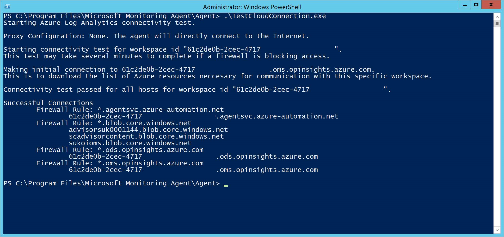

# Configure device proxy and Internet connectivity settings

[!INCLUDE [Microsoft 365 Defender rebranding](../../includes/microsoft-defender.md)]

**Applies to:**
- [Microsoft Defender for Endpoint](https://go.microsoft.com/fwlink/p/?linkid=2146631)
- [Microsoft 365 Defender](https://go.microsoft.com/fwlink/?linkid=2118804)

> Want to experience Defender for Endpoint? [Sign up for a free trial.](https://www.microsoft.com/en-us/WindowsForBusiness/windows-atp?ocid=docs-wdatp-configureendpointsscript-abovefoldlink)

The Defender for Endpoint sensor requires Microsoft Windows HTTP (WinHTTP) to report sensor data and communicate with the Defender for Endpoint service.

The embedded Defender for Endpoint sensor runs in system context using the LocalSystem account. The sensor uses Microsoft Windows HTTP Services (WinHTTP) to enable communication with the Defender for Endpoint cloud service.

>[!TIP]
>For organizations that use forward proxies as a gateway to the Internet, you can use network protection to investigate behind a proxy. For more information, see [Investigate connection events that occur behind forward proxies](investigate-behind-proxy.md).

The WinHTTP configuration setting is independent of the Windows Internet (WinINet) Internet browsing proxy settings and can only discover a proxy server by using the following discovery methods:

- Auto-discovery methods:
  - Transparent proxy
  - Web Proxy Auto-discovery Protocol (WPAD)

    > [!NOTE]
    > If you're using Transparent proxy or WPAD in your network topology, you don't need special configuration settings. For more information on Defender for Endpoint URL exclusions in the proxy, see [Enable access to Defender for Endpoint service URLs in the proxy server](#enable-access-to-microsoft-defender-for-endpoint-service-urls-in-the-proxy-server).

- Manual static proxy configuration:
  - Registry based configuration
  - WinHTTP configured using netsh command – Suitable only for desktops in a stable topology (for example: a desktop in a corporate network behind the same proxy)

## Configure the proxy server manually using a registry-based static proxy

Configure a registry-based static proxy to allow only Defender for Endpoint sensor to report diagnostic data and communicate with Defender for Endpoint services if a computer is not be permitted to connect to the Internet.

The static proxy is configurable through Group Policy (GP). The group policy can be found under:

- Administrative Templates > Windows Components > Data Collection and Preview Builds > Configure Authenticated Proxy usage for the Connected User Experience and Telemetry Service
  - Set it to **Enabled** and select **Disable Authenticated Proxy usage**:
  
- **Administrative Templates > Windows Components > Data Collection and Preview Builds > Configure connected user experiences and telemetry**:
  - Configure the proxy:<br>
    

    The policy sets two registry values `TelemetryProxyServer` as REG_SZ and `DisableEnterpriseAuthProxy` as REG_DWORD under the registry key `HKLM\Software\Policies\Microsoft\Windows\DataCollection`.

    The registry value `TelemetryProxyServer` takes the following string format:

    ```text
    <server name or ip>:<port>
    ```

    For example: 10.0.0.6:8080

    The registry value `DisableEnterpriseAuthProxy` should be set to 1.

## Configure the proxy server manually using netsh command

Use netsh to configure a system-wide static proxy.

> [!NOTE]
> - This will affect all applications including Windows services which use WinHTTP with default proxy.</br>
> - Laptops that are changing topology (for example: from office to home) will malfunction with netsh. Use the registry-based static proxy configuration.

1. Open an elevated command-line:

    a. Go to **Start** and type **cmd**.

    b. Right-click **Command prompt** and select **Run as administrator**.

2. Enter the following command and press **Enter**:

   ```PowerShell
   netsh winhttp set proxy <proxy>:<port>
   ```

   For example: netsh winhttp set proxy 10.0.0.6:8080

To reset the winhttp proxy, enter the following command and press **Enter**

```PowerShell
netsh winhttp reset proxy
```

See [Netsh Command Syntax, Contexts, and Formatting](https://docs.microsoft.com/windows-server/networking/technologies/netsh/netsh-contexts) to learn more.

## Enable access to Microsoft Defender for Endpoint service URLs in the proxy server

If a proxy or firewall is blocking all traffic by default and allowing only specific domains through, add the domains listed in the downloadable sheet to the allowed domains list.

The following downloadable spreadsheet lists the services and their associated URLs that your network must be able to connect to. You should ensure that there are no firewall or network filtering rules that would deny access to these URLs, or you may need to create an *allow* rule specifically for them.


|**Spreadsheet of domains list**|**Description**|
|:-----|:-----|
|<br/>  | Spreadsheet of specific DNS records for service locations, geographic locations, and OS. <br><br>[Download the spreadsheet here.](https://download.microsoft.com/download/8/a/5/8a51eee5-cd02-431c-9d78-a58b7f77c070/mde-urls.xlsx) 


If a proxy or firewall has HTTPS scanning (SSL inspection) enabled, exclude the domains listed in the above table from HTTPS scanning.

> [!NOTE]
> settings-win.data.microsoft.com is only needed if you have Windows 10 devices running version 1803 or earlier.<br>


> [!NOTE]
> URLs that include v20 in them are only needed if you have Windows 10 devices running version 1803 or later. For example, ```us-v20.events.data.microsoft.com``` is needed for a Windows 10 device running version 1803 or later and onboarded to US Data Storage region.


> [!NOTE]
> If you are using Microsoft Defender Antivirus in your environment, see [Configure network connections to the Microsoft Defender Antivirus cloud service](https://docs.microsoft.com/windows/security/threat-protection/microsoft-defender-antivirus/configure-network-connections-microsoft-defender-antivirus).

If a proxy or firewall is blocking anonymous traffic, as Defender for Endpoint sensor is connecting from system context, make sure anonymous traffic is permitted in the previously listed URLs.

### Microsoft Monitoring Agent (MMA) - proxy and firewall requirements for older versions of Windows client or Windows Server

The information below list the proxy and firewall configuration information required to communicate with Log Analytics agent (often referred to as Microsoft Monitoring Agent) for the previous versions of Windows such as Windows 7 SP1, Windows 8.1, Windows Server 2008 R2, Windows Server 2012 R2, and Windows Server 2016.

|Agent Resource|Ports |Direction |Bypass HTTPS inspection|
|------|---------|--------|--------|   
|*.ods.opinsights.azure.com |Port 443 |Outbound|Yes |  
|*.oms.opinsights.azure.com |Port 443 |Outbound|Yes |  
|*.blob.core.windows.net |Port 443 |Outbound|Yes |
|*.azure-automation.net |Port 443 |Outbound|Yes |  


> [!NOTE]
> As a cloud-based solution, the IP range can change. It's recommended you move to DNS resolving setting.

## Confirm Microsoft Monitoring Agent (MMA) Service URL Requirements 

Please see the following guidance to eliminate the wildcard (*) requirement for your specific environment when using the Microsoft Monitoring Agent (MMA) for previous versions of Windows.

1.	Onboard a previous operating system with the Microsoft Monitoring Agent (MMA) into Defender for Endpoint (for more information, see [Onboard previous versions of Windows on Defender for Endpoint](https://go.microsoft.com/fwlink/p/?linkid=2010326) and [Onboard Windows servers](configure-server-endpoints.md#windows-server-2008-r2-sp1-windows-server-2012-r2-and-windows-server-2016).

2.	Ensure the machine is successfully reporting into the Microsoft Defender Security Center portal.

3.	Run the TestCloudConnection.exe tool from “C:\Program Files\Microsoft Monitoring Agent\Agent” to validate the connectivity and to see the required URLs for your specific workspace.

4.	Check the Microsoft Defender for Endpoint URLs list for the complete list of requirements for your region (please refer to the Service URLs [Spreadsheet](https://download.microsoft.com/download/8/a/5/8a51eee5-cd02-431c-9d78-a58b7f77c070/mde-urls.xlsx)).



The wildcards (*) used in *.ods.opinsights.azure.com, *.oms.opinsights.azure.com, and *.agentsvc.azure-automation.net URL endpoints can be replaced with your specific Workspace ID. The Workspace ID is specific to your environment and workspace and can be found in the Onboarding section of your tenant within the Microsoft Defender Security Center portal.

The *.blob.core.windows.net URL endpoint can be replaced with the URLs shown in the “Firewall Rule: *.blob.core.windows.net” section of the test results. 

> [!NOTE]
> In the case of onboarding via Azure Security Center (ASC), multiple workspaces maybe used. You will need to perform the TestCloudConnection.exe procedure above on an onboarded machine from each workspace (to determine if there are any changes to the *.blob.core.windows.net URLs between the workspaces).

## Verify client connectivity to Microsoft Defender ATP service URLs

Verify the proxy configuration completed successfully, that WinHTTP can discover and communicate through the proxy server in your environment, and that the proxy server allows traffic to the Defender for Endpoint service URLs.

1. Download the [MDATP Client Analyzer tool](https://aka.ms/mdatpanalyzer) to the PC where Defender for Endpoint sensor is running on.

2. Extract the contents of MDATPClientAnalyzer.zip on the device.

3. Open an elevated command-line:

    a. Go to **Start** and type **cmd**.

    b.  Right-click **Command prompt** and select **Run as administrator**.

4. Enter the following command and press **Enter**:

    ```PowerShell
    HardDrivePath\MDATPClientAnalyzer.cmd
    ```

    Replace *HardDrivePath* with the path where the MDATPClientAnalyzer tool was downloaded to, for example

    ```PowerShell
    C:\Work\tools\MDATPClientAnalyzer\MDATPClientAnalyzer.cmd
    ```

5. Extract the *MDATPClientAnalyzerResult.zip* file created by tool in the folder used in the *HardDrivePath*.

6. Open *MDATPClientAnalyzerResult.txt* and verify that you have performed the proxy configuration steps to enable server discovery and access to the service URLs. <br><br>
   The tool checks the connectivity of Defender for Endpoint service URLs that Defender for Endpoint client is configured to interact with. It then prints the results into the *MDATPClientAnalyzerResult.txt* file for each URL that can potentially be used to communicate with the Defender for Endpoint services. For example:

   ```text
   Testing URL : https://xxx.microsoft.com/xxx
   1 - Default proxy: Succeeded (200)
   2 - Proxy auto discovery (WPAD): Succeeded (200)
   3 - Proxy disabled: Succeeded (200)
   4 - Named proxy: Doesn't exist
   5 - Command line proxy: Doesn't exist
   ```

If at least one of the connectivity options returns a (200) status, then the Defender for Endpoint client can communicate with the tested URL properly using this connectivity method. <br><br>

However, if the connectivity check results indicate a failure, an HTTP error is displayed (see HTTP Status Codes). You can then use the URLs in the table shown in [Enable access to Defender for Endpoint service URLs in the proxy server](#enable-access-to-microsoft-defender-for-endpoint-service-urls-in-the-proxy-server). The URLs you'll use will depend on the region selected during the onboarding procedure.

> [!NOTE]
> The Connectivity Analyzer tool is not compatible with ASR rule [Block process creations originating from PSExec and WMI commands](https://docs.microsoft.com/windows/security/threat-protection/windows-defender-exploit-guard/attack-surface-reduction#attack-surface-reduction-rules). You will need to temporarily disable this rule to run the connectivity tool.


> [!NOTE]
> When the TelemetryProxyServer is set, in Registry or via Group Policy, Defender for Endpoint will fall back to direct if it can't access the defined proxy.

## Related topics

- [Onboard Windows 10 devices](configure-endpoints.md)
- [Troubleshoot Microsoft Defender for Endpoint onboarding issues](troubleshoot-onboarding.md)
