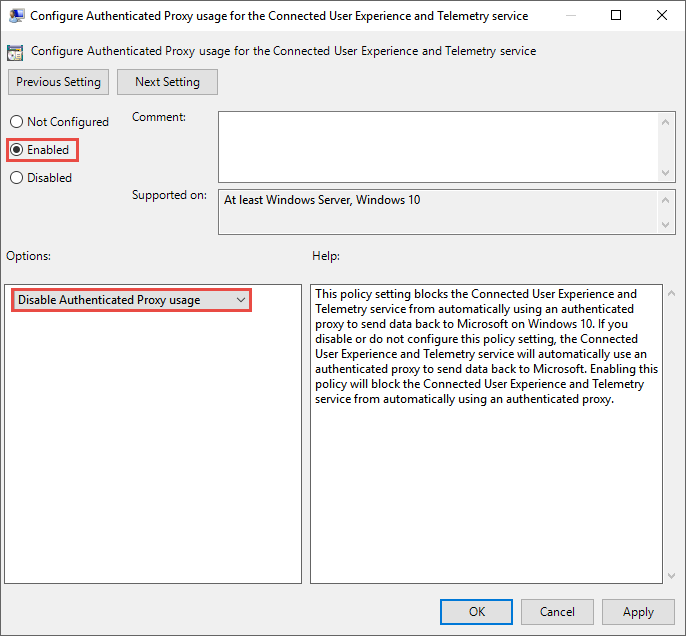

# Configure machine proxy and Internet connectivity settings

**Applies to:**
- [Microsoft Defender Advanced Threat Protection (Microsoft Defender ATP)](https://go.microsoft.com/fwlink/p/?linkid=2069559)


>Want to experience Microsoft Defender ATP? [Sign up for a free trial.](https://www.microsoft.com/en-us/WindowsForBusiness/windows-atp?ocid=docs-wdatp-configureendpointsscript-abovefoldlink)

The Microsoft Defender ATP sensor requires Microsoft Windows HTTP (WinHTTP) to report sensor data and communicate with the Microsoft Defender ATP service.

The embedded Microsoft Defender ATP sensor runs in system context using the LocalSystem account. The sensor uses Microsoft Windows HTTP Services (WinHTTP) to enable communication with the Microsoft Defender ATP cloud service.

The WinHTTP configuration setting is independent of the Windows Internet (WinINet) internet browsing proxy settings and can only discover a proxy server by using the following discovery methods:

 - Auto-discovery methods:
    - Transparent proxy
    - Web Proxy Auto-discovery Protocol (WPAD)

> [!NOTE]
> If you're using Transparent proxy or WPAD in your network topology, you don't need special configuration settings. For more information on Microsoft Defender ATP URL exclusions in the proxy, see [Enable access to Microsoft Defender ATP service URLs in the proxy server](#enable-access-to-microsoft-defender-atp-service-urls-in-the-proxy-server).


 - Manual static proxy configuration:
    - Registry based configuration
    - WinHTTP configured using netsh command – Suitable only for desktops in a stable topology (for example: a desktop in a corporate network behind the same proxy)

## Configure the proxy server manually using a registry-based static proxy
Configure a registry-based static proxy to allow only Microsoft Defender ATP sensor to report diagnostic data and communicate with Microsoft Defender ATP services if a computer is not be permitted to connect to the Internet.

The static proxy is configurable through Group Policy (GP). The group policy can be found under: 
- Administrative Templates > Windows Components > Data Collection and Preview Builds > Configure Authenticated Proxy usage for the Connected User Experience and Telemetry Service
    - Set it to **Enabled** and select **Disable Authenticated Proxy usage**:
    
- **Administrative Templates > Windows Components > Data Collection and Preview Builds > Configure connected user experiences and telemetry**:
  - Configure the proxy:<br>
    

    The policy sets two registry values `TelemetryProxyServer` as REG_SZ and `DisableEnterpriseAuthProxy` as REG_DWORD under the registry key `HKLM\Software\Policies\Microsoft\Windows\DataCollection`.

    The registry value `TelemetryProxyServer` takes the following string format:

    ```text
    <server name or ip>:<port>
    ```
    For example: 10.0.0.6:8080

    The registry value `DisableEnterpriseAuthProxy` should be set to 1.

## Configure the proxy server manually using netsh command

Use netsh to configure a system-wide static proxy.

> [!NOTE]
> - This will affect all applications including Windows services which use WinHTTP with default proxy.</br>
> - Laptops that are changing topology (for example: from office to home) will malfunction with netsh. Use the registry-based static proxy configuration.

1. Open an elevated command-line:

    a. Go to **Start** and type **cmd**.

    b. Right-click **Command prompt** and select **Run as administrator**.

2. Enter the following command and press **Enter**:
   ```
   netsh winhttp set proxy <proxy>:<port>
   ```
   For example: netsh winhttp set proxy 10.0.0.6:8080

To reset the winhttp proxy, enter the following command and press **Enter**
```
netsh winhttp reset proxy
```
See [Netsh Command Syntax, Contexts, and Formatting](https://docs.microsoft.com/windows-server/networking/technologies/netsh/netsh-contexts) to learn more.

## Enable access to Microsoft Defender ATP service URLs in the proxy server
If a proxy or firewall is blocking all traffic by default and allowing only specific domains through or HTTPS scanning (SSL inspection) is enabled, make sure that the following URLs are not blocked by default. Do not disable security monitoring or inspection of these URLs, but allow them as you would other internet traffic. They permit communication with Microsoft Defender ATP service in port 80 and 443:

>[!NOTE]
> URLs that include v20 in them are only needed if you have Windows 10, version 1803 or later machines. For example, ```us-v20.events.data.microsoft.com``` is only needed if the machine is on Windows 10, version 1803 or later. 

Service location | Microsoft.com DNS record
:---|:---
Common URLs for all locations | ```*.blob.core.windows.net``` <br>```crl.microsoft.com```<br> ```ctldl.windowsupdate.com``` <br>```events.data.microsoft.com```<br>```notify.windows.com```
European Union | ```eu.vortex-win.data.microsoft.com```<br>```eu-v20.events.data.microsoft.com```<br>```winatp-gw-neu.microsoft.com```<br>```winatp-gw-weu.microsoft.com```
United Kingdom | ```uk.vortex-win.data.microsoft.com``` <br>```uk-v20.events.data.microsoft.com```<br>```winatp-gw-uks.microsoft.com```<br>```winatp-gw-ukw.microsoft.com```
United States | ```us.vortex-win.data.microsoft.com```<br> ```us-v20.events.data.microsoft.com```<br>```winatp-gw-cus.microsoft.com``` <br>```winatp-gw-eus.microsoft.com```


If a proxy or firewall is blocking anonymous traffic, as Microsoft Defender ATP sensor is connecting from system context, make sure anonymous traffic is permitted in the previously listed URLs.

## Microsoft Defender ATP service backend IP range 
If you network devices don't support the URLs white-listed in the prior section, you can use the following information.

Microsoft Defender ATP is built on Azure cloud, deployed in the following regions:

- \+\<Region Name="uswestcentral">
- \+\<Region Name="useast2">
- \+\<Region Name="useast">
- \+\<Region Name="europenorth">
- \+\<Region Name="europewest">
- \+\<Region Name="uksouth">
- \+\<Region Name="ukwest">


You can find the Azure IP range on [Microsoft Azure Datacenter IP Ranges](https://www.microsoft.com/en-us/download/details.aspx?id=41653).

>[!NOTE]
> As a cloud-based solution, the IP range can change. It's recommended you move to DNS resolving setting.


## Verify client connectivity to Microsoft Defender ATP service URLs

Verify the proxy configuration completed successfully, that WinHTTP can discover and communicate through the proxy server in your environment, and that the proxy server allows traffic to the Microsoft Defender ATP service URLs.

1. Download the [connectivity verification tool](https://aka.ms/mdatpanalyzer) to the PC where Microsoft Defender ATP sensor is running on.

2. Extract the contents of WDATPConnectivityAnalyzer on the machine.

3. Open an elevated command-line:

    a. Go to **Start** and type **cmd**.

    b.  Right-click **Command prompt** and select **Run as administrator**.

4. Enter the following command and press **Enter**:

    ```
    HardDrivePath\WDATPConnectivityAnalyzer.cmd
    ```
    Replace *HardDrivePath* with the path where the WDATPConnectivityAnalyzer tool was downloaded to, for example
    ```
    C:\Work\tools\WDATPConnectivityAnalyzer\WDATPConnectivityAnalyzer.cmd
    ```

5. Extract the *WDATPConnectivityAnalyzerResult.zip* file created by tool in the folder used in the *HardDrivePath*.

6. Open *WDATPConnectivityAnalyzer.txt* and verify that you have performed the proxy configuration steps to enable server discovery and access to the service URLs. <br><br>
   The tool checks the connectivity of Microsoft Defender ATP service URLs that Microsoft Defender ATP client is configured to interact with. It then prints the results into the *WDATPConnectivityAnalyzer.txt* file for each URL that can potentially be used to communicate with the Microsoft Defender ATP  services. For example:
   ```text
   Testing URL : https://xxx.microsoft.com/xxx
   1 - Default proxy: Succeeded (200)
   2 - Proxy auto discovery (WPAD): Succeeded (200)
   3 - Proxy disabled: Succeeded (200)
   4 - Named proxy: Doesn't exist
   5 - Command line proxy: Doesn't exist              
   ```

If at least one of the connectivity options returns a (200) status, then the Microsoft Defender ATP client can communicate with the tested URL properly using this connectivity method. <br><br>

However, if the connectivity check results indicate a failure, an HTTP error is displayed (see HTTP Status Codes). You can then use the URLs in the table shown in [Enable access to Microsoft Defender ATP service URLs in the proxy server](#enable-access-to-microsoft-defender-atp-service-urls-in-the-proxy-server). The URLs you'll use will depend on the region selected during the onboarding procedure.

> [!NOTE]
> The Connectivity Analyzer tool is not compatible with ASR rule [Block process creations originating from PSExec and WMI commands](https://docs.microsoft.com/windows/security/threat-protection/windows-defender-exploit-guard/attack-surface-reduction-exploit-guard#attack-surface-reduction-rules). You will need to temporarily disable this rule to run the connectivity tool.
> When the TelemetryProxyServer is set, in Registry or via Group Policy, Microsoft Defender ATP will fall back to direct if it can't access the defined proxy.

## Related topics
- [Onboard Windows 10 machines](configure-endpoints.md)
- [Troubleshoot Microsoft Defender Advanced Threat Protection onboarding issues](troubleshoot-onboarding.md)