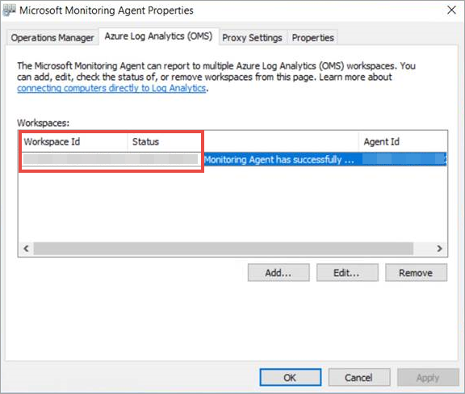
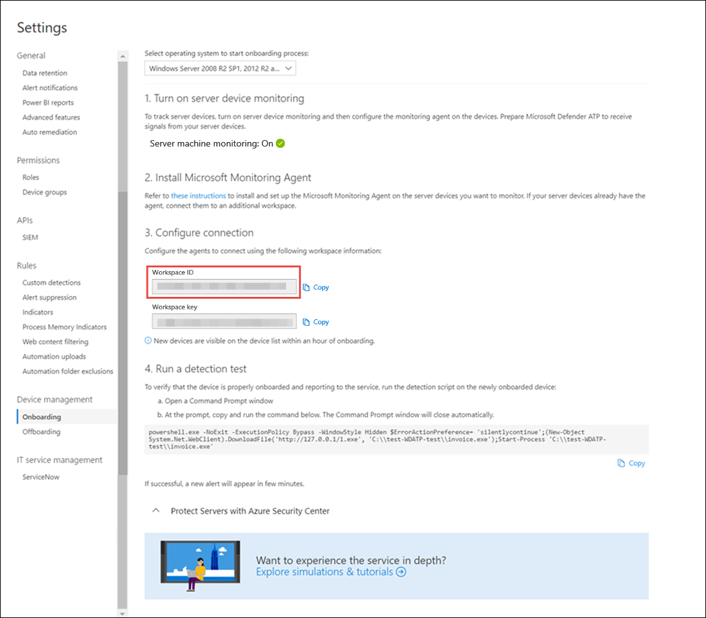

# Onboard servers to the Microsoft Defender ATP service

**Applies to:**

- Windows Server 2012 R2
- Windows Server 2016
- Windows Server, version 1803
- Windows Server, 2019
- [Microsoft Defender Advanced Threat Protection (Microsoft Defender ATP)](https://go.microsoft.com/fwlink/p/?linkid=2069559)

[!include[Prerelease information](prerelease.md)]

>Want to experience Microsoft Defender ATP? [Sign up for a free trial.](https://www.microsoft.com/en-us/WindowsForBusiness/windows-atp?ocid=docs-wdatp-configserver-abovefoldlink)


Microsoft Defender ATP extends support to also include the Windows Server operating system, providing advanced attack detection and investigation capabilities, seamlessly through the Microsoft Defender Security Center console.

The service supports the onboarding of the following servers:
- Windows Server 2012 R2
- Windows Server 2016
- Windows Server, version 1803
- Windows Server 2019


For a practical guidance on what needs to be in place for licensing and infrastructure, see [Protecting Windows Servers with Microsoft Defender ATP](https://techcommunity.microsoft.com/t5/What-s-New/Protecting-Windows-Server-with-Windows-Defender-ATP/m-p/267114#M128).

## Windows Server 2012 R2 and Windows Server 2016

There are two options to onboard Windows Server 2012 R2 and Windows Server 2016 to Microsoft Defender ATP:

- **Option 1**: Onboard through Azure Security Center
- **Option 2**: Onboard through Microsoft Defender Security Center

### Option 1: Onboard servers through Azure Security Center
1. In the navigation pane, select **Settings** > **Machine management** > **Onboarding**.

2. Select Windows Server 2012 R2 and 2016 as the operating system.

3. Click **Onboard Servers in Azure Security Center**. 

4. Follow the onboarding instructions in [Microsoft Defender Advanced Threat Protection with Azure Security Center](https://docs.microsoft.com/azure/security-center/security-center-wdatp).

### Option 2: Onboard servers through Microsoft Defender Security Center
You'll need to tak the following steps if you choose to onboard servers through Microsoft Defender Security Center. 

- For Windows Server 2012 R2: Configure and update System Center Endpoint Protection clients.

    >[!NOTE]
    >This step is required only if your organization uses System Center Endpoint Protection (SCEP) and you're onboarding Windows Server 2012 R2.

- Turn on server monitoring from Microsoft Defender Security Center.
- If you're already leveraging System Center Operations Manager (SCOM) or Azure Monitor (formerly known as Operations Management Suite (OMS)), simply attach the Microsoft Monitoring Agent (MMA) to report to your Microsoft Defender ATP workspace through Multi Homing support. Otherwise, install and configure MMA to report sensor data to Microsoft Defender ATP as instructed below. For more information, see [Collect log data with Azure Log Analytics agent](https://docs.microsoft.com/azure/azure-monitor/platform/log-analytics-agent).


>[!TIP]
> After onboarding the machine, you can choose to run a detection test to verify that it is properly onboarded to the service. For more information, see [Run a detection test on a newly onboarded Microsoft Defender ATP endpoint](run-detection-test.md).

### Configure and update System Center Endpoint Protection clients
>[!IMPORTANT]
>This step is required only if your organization uses System Center Endpoint Protection (SCEP) and you're onboarding Windows Server 2012 R2.

Microsoft Defender ATP integrates with System Center Endpoint Protection to provide visibility to malware detections and to stop propagation of an attack in your organization by banning potentially malicious files or suspected malware. 

The following steps are required to enable this integration: 
- Install the [January 2017 anti-malware platform update for Endpoint Protection clients](https://support.microsoft.com/help/3209361/january-2017-anti-malware-platform-update-for-endpoint-protection-clie) 
- Configure the SCEP client Cloud Protection Service membership to the **Advanced** setting


### Turn on Server monitoring from the Microsoft Defender Security Center portal

1. In the navigation pane, select **Settings** > **Machine management** > **Onboarding**.

2. Select Windows Server 2012 R2 and 2016 as the operating system.
 
3. Click **Turn on server monitoring** and confirm that you'd like to proceed with the environment set up. When the set up completes, the **Workspace ID** and **Workspace key** fields are populated with unique values. You'll need to use these values to configure the MMA agent.

<span id="server-mma"/>
### Install and configure Microsoft Monitoring Agent (MMA) to report sensor data to Microsoft Defender ATP 

1.	Download the agent setup file: [Windows 64-bit agent](https://go.microsoft.com/fwlink/?LinkId=828603).

2.	Using the Workspace ID and Workspace key provided in the previous procedure, choose any of the following installation methods to install the agent on the server:
    - [Manually install the agent using setup](https://docs.microsoft.com/azure/log-analytics/log-analytics-windows-agents#install-the-agent-using-setup) <br>
    On the **Agent Setup Options** page, choose **Connect the agent to Azure Log Analytics (OMS)**.
    - [Install the agent using the command line](https://docs.microsoft.com/azure/log-analytics/log-analytics-windows-agents#install-the-agent-using-the-command-line) and [configure the agent using a script](https://docs.microsoft.com/azure/log-analytics/log-analytics-windows-agents#add-a-workspace-using-a-script). 

3.	You'll need to configure proxy settings for the Microsoft Monitoring Agent. For more information, see [Configure proxy settings](https://docs.microsoft.com/azure/log-analytics/log-analytics-windows-agents#configure-proxy-settings).

Once completed, you should see onboarded servers in the portal within an hour.

<span id="server-proxy"/>
### Configure server proxy and Internet connectivity settings
 
- Each Windows server must be able to connect to the Internet using HTTPS. This connection can be direct, using a proxy, or through the [OMS Gateway](https://docs.microsoft.com/azure/log-analytics/log-analytics-oms-gateway).
- If a proxy or firewall is blocking all traffic by default and allowing only specific domains through or HTTPS scanning (SSL inspection) is enabled, make sure that the following URLs are white-listed to permit communication with Microsoft Defender ATP service:

Agent Resource    |    Ports 
:---|:---
|    *.oms.opinsights.azure.com    |    443    |
|    *.blob.core.windows.net    |    443    |
|    *.azure-automation.net    |    443    |
|    *.ods.opinsights.azure.com    |    443    |
|    winatp-gw-cus.microsoft.com     |    443    |
|    winatp-gw-eus.microsoft.com    |    443    |
|    winatp-gw-neu.microsoft.com    |    443    |
|    winatp-gw-weu.microsoft.com    |    443    |
|winatp-gw-uks.microsoft.com | 443 |
|winatp-gw-ukw.microsoft.com | 443 | 


## Windows Server, version 1803 and Windows Server 2019
To onboard Windows Server, version 1803 or Windows Server 2019, use the same method used when onboarding Windows 10 machines.

Supported tools include:
- Local script
- Group Policy 
- System Center Configuration Manager 2012 / 2012 R2  1511 / 1602
- VDI onboarding scripts for non-persistent machines

 For more information, see  [Onboard Windows 10 machines](configure-endpoints.md). Support for Windows Server, version 1803 and Windows 2019 provides deeper insight into activities happening on the server, coverage for kernel and memory attack detection, and enables response actions on Windows Server endpoint as well. 

1. Configure Microsoft Defender ATP onboarding settings on the server. For more information, see [Onboard Windows 10 machines](configure-endpoints.md). 

2.	If you’re running a third party antimalware solution, you'll need to apply the following Windows Defender AV passive mode settings and verify it was configured correctly:

    a. Set the following registry entry:
       - Path: `HKLM\SOFTWARE\Policies\Microsoft\Windows Advanced Threat Protection`
       - Name: ForceDefenderPassiveMode
       - Value: 1

    b. Run the following PowerShell command to verify that the passive mode was configured:

       ```Get-WinEvent -FilterHashtable @{ProviderName="Microsoft-Windows-Sense" ;ID=84}```

    c. Confirm  that a recent event containing the passive mode event is found:
       
       

3. Run the following command to check if Windows Defender AV is installed:

   ```sc query Windefend```

    If the result is ‘The specified service does not exist as an installed service’, then you'll need to install Windows Defender AV. For more information, see [Windows Defender Antivirus in Windows 10](https://docs.microsoft.com/windows/security/threat-protection/windows-defender-antivirus/windows-defender-antivirus-in-windows-10).


## Integration with Azure Security Center
Microsoft Defender ATP integrates with Azure Security Center to provide a comprehensive server protection solution. With this integration Azure Security Center can leverage the power of Microsoft Defender ATP to provide improved threat detection for Windows Servers.

>[!NOTE]
>You'll need to have the appropriate license to enable this feature. 

The following capabilities are included in this integration:
- Automated onboarding - Microsoft Defender ATP sensor is automatically enabled on Windows Servers that are onboarded to Azure Security Center. For more information on Azure Security Center onboarding, see [Onboarding to Azure Security Center Standard for enhanced security](https://docs.microsoft.com/azure/security-center/security-center-onboarding).

    >[!NOTE]
    > Automated onboarding is only applicable for Windows Server 2012 R2 and Windows Server 2016.

- Servers monitored by  Azure Security Center will also be available in Microsoft Defender ATP - Azure Security Center seamlessly connects to the Microsoft Defender ATP tenant, providing a single view across clients and servers.  In addition, Microsoft Defender ATP alerts will be available in the Azure Security Center console.
- Server investigation -  Azure Security Center customers can access Microsoft Defender Security Center to perform detailed investigation to uncover the scope of a potential breach

>[!IMPORTANT]
>- When you use Azure Security Center to monitor servers, a Microsoft Defender ATP tenant is automatically created. The Microsoft Defender ATP data is stored in Europe by default. 
>- If you use Microsoft Defender ATP before using Azure Security Center, your data will be stored in the location you specified when you created your tenant even if you integrate with Azure Security Center at a later time.


## Offboard servers 
You can offboard Windows Server, version 1803 and Windows 2019 in the same method available for Windows 10 client machines. 

For other server versions, you have two options to offboard servers from the service:
- Uninstall the MMA agent
- Remove the Microsoft Defender ATP workspace configuration

>[!NOTE]
>Offboarding causes the server to stop sending sensor data to the portal but data from the server, including reference to any alerts it has had will be retained for up to 6 months.

### Uninstall servers by uinstalling the MMA agent
To offboard the server, you can uninstall the MMA agent from the server or detach it from reporting to your Microsoft Defender ATP workspace. After offboarding the agent, the server will no longer send sensor data to Microsoft Defender ATP.
For more information, see [To disable an agent](https://docs.microsoft.com/azure/log-analytics/log-analytics-windows-agents#to-disable-an-agent).

### Remove the Microsoft Defender ATP workspace configuration
To offboard the server, you can use either of the following methods:

- Remove the Microsoft Defender ATP workspace configuration from the MMA agent 
- Run a PowerShell command to remove the configuration

#### Remove the Microsoft Defender ATP workspace configuration from the MMA agent 

1. In the **Microsoft Monitoring Agent Properties**, select the **Azure Log Analytics (OMS)** tab.

2. Select the Microsoft Defender ATP workspace, and click **Remove**.

    

#### Run a PowerShell command to remove the configuration

1. Get your Workspace ID:
   a. In the navigation pane, select **Settings** > **Onboarding**.

   b. Select **Windows Server 2012 R2 and 2016** as the operating system and get your Workspace ID:
    
      

2. Open an elevated PowerShell and run the following command. Use the Workspace ID you obtained and replacing `WorkspaceID`:

    ```
    # Load agent scripting object
    $AgentCfg = New-Object -ComObject AgentConfigManager.MgmtSvcCfg
    # Remove OMS Workspace
    $AgentCfg.RemoveCloudWorkspace($WorkspaceID)
    # Reload the configuration and apply changes
    $AgentCfg.ReloadConfiguration()
    ```

## Related topics
- [Onboard Windows 10 machines](configure-endpoints.md)
- [Onboard non-Windows machines](configure-endpoints-non-windows.md)
- [Configure proxy and Internet connectivity settings](configure-proxy-internet.md)
- [Run a detection test on a newly onboarded Microsoft Defender ATP machine](run-detection-test.md)
- [Troubleshooting Microsoft Defender Advanced Threat Protection onboarding issues](troubleshoot-onboarding.md)
