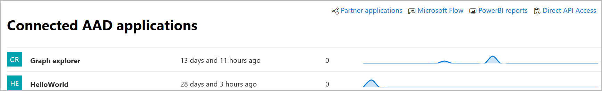

# Connected applications in Microsoft Defender ATP
**Applies to:**
- [Microsoft Defender Advanced Threat Protection (Windows Defender ATP)](https://go.microsoft.com/fwlink/p/?linkid=2069559)

[!include[Prerelease information](prerelease.md)]

Connected applications integrates with the Microsoft Defender ATP platform using APIs. 

Applications use standard OAuth 2.0 protocol to authenticate and provide tokens for use with Microsoft Defender ATP APIs.  In addition, Azure Active Directory (Azure AD) applications allow tenant admins to set explicit control over which APIs can be accessed using the corresponding app.
 
You'll need to follow [these steps](https://docs.microsoft.com/windows/security/threat-protection/microsoft-defender-atp/apis-intro) to use the APIs with the connected application.
 
## Access the connected application page
From the left navigation menu, select **Partners & APIs** > **Connected AAD applications**.

 
## View connected application details
The Connected applications page provides information about the Azure AD applications connected to Microsoft Defender ATP in your organization. You can review the usage of the connected applications: last seen, number of requests in the past 24 hours, and request trends in the last 30 days.

 
## Edit, reconfigure, or delete a connected application
The **Open application settings** link opens the corresponding Azure AD application management page in the Azure portal. From the Azure portal, you can manage permissions, reconfigure, or delete the connected applications.

