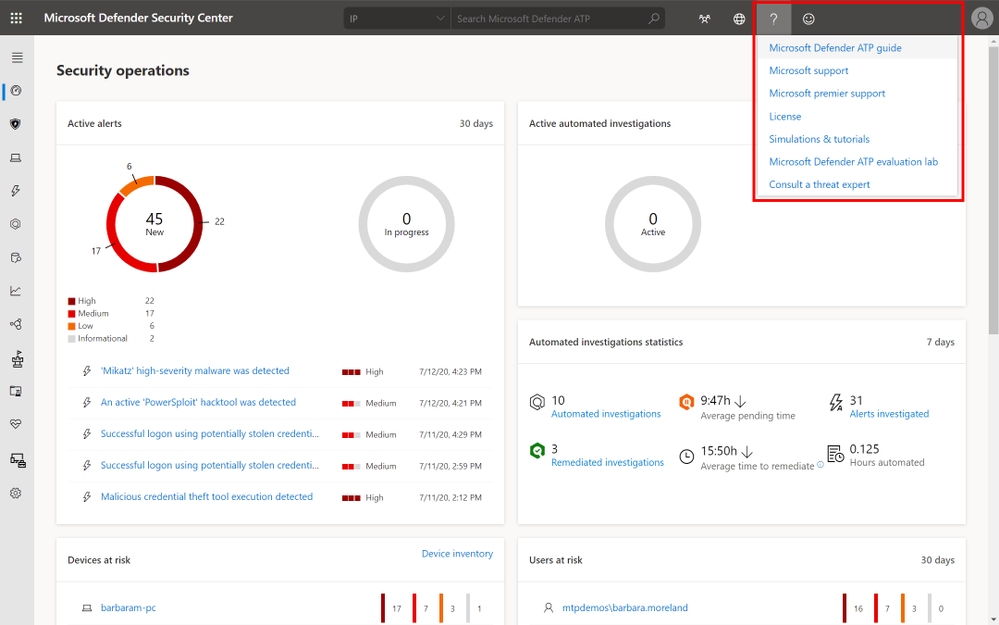
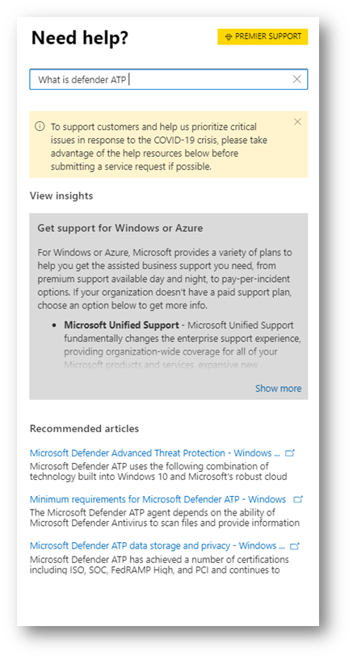
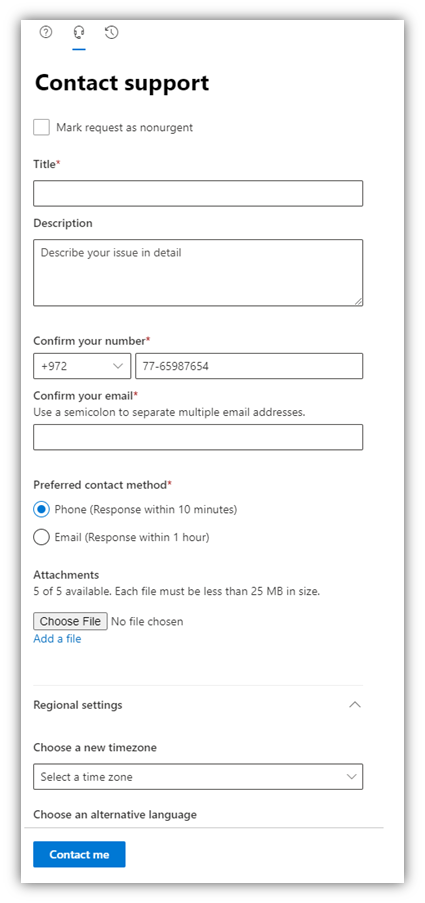

# Contact Microsoft Defender ATP support

[!INCLUDE [Microsoft 365 Defender rebranding](../../includes/microsoft-defender.md)]

**Applies to:**
- [Microsoft Defender Advanced Threat Protection (Microsoft Defender ATP)](https://wincom.blob.core.windows.net/documents/Windows10_Commercial_Comparison.pdf)

Microsoft Defender ATP has recently upgraded the support process to offer a more modern and advanced support experience. 

The new widget allows customers to:
- Find solutions to common problems
- Submit a support case to the Microsoft support team

Accessing the new support widget can be done in one of two ways:

1.  Clicking on the question mark on the top right of the portal and then clicking on "Microsoft support":

    

2. Clicking on the **Need help?**  button in the bottom right of the Microsoft Defender Security Center:

    

In the widget you will be offered two options:

- Find solutions to common problems    
- Open a service request  

## Find solutions to common problems
This option includes articles that might be related to the question you may ask. Just start typing the question in the search box and articles related to your search will be surfaced.

In case the suggested articles are not sufficient, you can open a service request.

## Open a service request

Learn how to open support tickets by contacting Microsoft Defender ATP support. 

### Prerequisites
It's important to know the specific roles that have permission to open support cases.

Only those with an **Admin role (including security admins)** can create support cases. 

Users that have not been assigned a global AAD role with "Manage service requests" will no longer be able to submit support requests via the portal. 

Anyone who has the `microsoft.office365.supportTickets/allEntities/allTasks`  can submit a case.

For more information on which roles have permission see, [Security Administrator permissions](https://docs.microsoft.com/azure/active-directory/users-groups-roles/directory-assign-admin-roles#security-administrator-permissions).

For general information on admin roles, see [About admin roles](https://docs.microsoft.com/microsoft-365/admin/add-users/about-admin-roles?view=o365-worldwide).

### Contact support
This option is available by clicking the icon that looks like a headset. You will then get the following page to submit your support case:

1. Fill in a title and description for the issue you are facing, as well as a phone number and email address where we may reach you. 

2. (Optional) Include up to five attachments that are relevant to the issue in order to provide additional context for the support case. 

3. Select your time zone and an alternative language, if applicable. The request will be sent to Microsoft Support Team. The team will respond to your service request shortly.

## Related topic
- [Troubleshoot service issues](troubleshoot-mdatp.md)
- [Check service health](service-status.md)