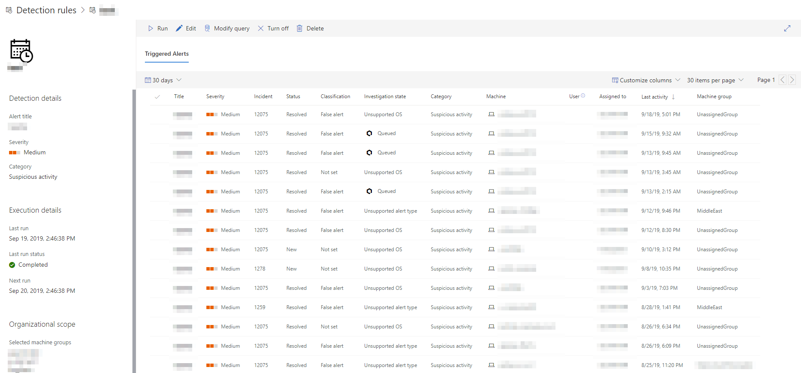

# View and manage custom detection rules

[!INCLUDE [Microsoft 365 Defender rebranding](../../includes/microsoft-defender.md)]

**Applies to:**
- [Microsoft Defender for Endpoint](https://go.microsoft.com/fwlink/p/?linkid=2146631)

Manage your existing [custom detection rules](custom-detection-rules.md) to ensure they are effectively finding threats and taking actions. Explore how to view the list of rules, check their previous runs, and review the alerts they have triggered. You can also run a rule on demand and modify it.

## Required permissions

To create or manage custom detections, [your role](user-roles.md#create-roles-and-assign-the-role-to-an-azure-active-directory-group) needs to have the **manage security settings** permission.

## View existing rules

To view all existing custom detection rules, navigate to **Settings** > **Custom detections**. The page lists all the rules with the following run information:

- **Last run**—when a rule was last run to check for query matches and generate alerts
- **Last run status**—whether a rule ran successfully
- **Next run**—the next scheduled run
- **Status**—whether a rule has been turned on or off

## View rule details, modify rule, and run rule

To view comprehensive information about a custom detection rule, select the name of rule from the list of rules in **Settings** > **Custom detections**. A page about the selected rule displays the following information:

- General information about the rule, including the details of the alert, run status, and scope
- List of triggered alerts
- List of triggered actions

 
*Custom detection rule page*

You can also take the following actions on the rule from this page:

- **Run**—run the rule immediately. This action also resets the interval for the next run.
- **Edit**—modify the rule without changing the query
- **Modify query**—edit the query in advanced hunting
- **Turn on** / **Turn off**—enable the rule or stop it from running
- **Delete**—turn off the rule and remove it

>[!TIP]
>To quickly view information and take action on an item in a table, use the selection column [&#10003;] at the left of the table.

## Related topics
- [Custom detections overview](overview-custom-detections.md)
- [Create detection rules](custom-detection-rules.md)
- [Advanced hunting overview](advanced-hunting-overview.md)
- [View and organize alerts](alerts-queue.md)
