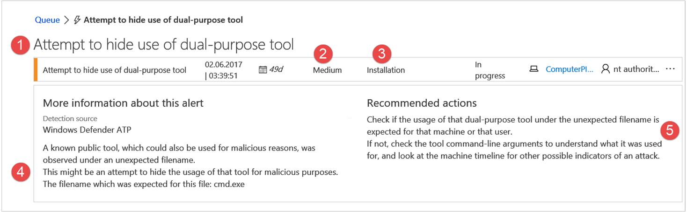

# Create custom alerts using the threat intelligence (TI) application program interface (API) (Deprecated)

**Applies to:**


- [Microsoft Defender Advanced Threat Protection (Microsoft Defender ATP)](https://go.microsoft.com/fwlink/p/?linkid=2069559)


>Want to experience Microsoft Defender ATP? [Sign up for a free trial.](https://www.microsoft.com/en-us/WindowsForBusiness/windows-atp?ocid=docs-wdatp-customti-abovefoldlink) 

You can define custom alert definitions and indicators of compromise (IOC) using the threat intelligence API. Creating custom threat intelligence alerts allows you to generate specific alerts that are applicable to your organization.

## Before you begin
Before creating custom alerts, you'll need to enable the threat intelligence application in Azure Active Directory and generate access tokens. For more information, see [Enable the custom threat intelligence application](enable-custom-ti.md).

### Use the threat intelligence REST API to create custom threat intelligence alerts
You can call and specify the resource URLs using one of the following operations to access and manipulate a threat intelligence resource:

-	GET
-	POST
-	PATCH
-	PUT (used for managing entities relations only)
-	DELETE

All threat intelligence API requests use the following basic URL pattern:

```
    https://TI.SecurityCenter.Windows.com/{version}/{resource}?[query_parameters]
```

For this URL:
-	`https://TI.SecurityCenter.Windows.com` is the threat intelligence API endpoint.
-	`{version}` is the target service version. Currently, the only supported version is: v1.0.
-	`{resource}` is resource segment or path, such as:
  -	AlertDefinitions (for specific single resource, add: (id))
  -	IndicatorsOfCompromise (for specific single resource, add: (id))
-	`[query_parameters]` represents additional query parameters such as $filter and $select.

**Quotas**</br>
Each tenant has a defined quota that limits the number of possible alert definitions, IOCs and another quota for IOCs of Action different than “equals” in the system. If you upload data beyond this quota, you'll encounter an HTTP error status code 507 (Insufficient Storage).

## Request an access token from the token issuing endpoint
Microsoft Defender ATP Threat Intelligence API uses OAuth 2.0. In the context of Microsoft Defender ATP, the alert definitions are a protected resource. To issue tokens for ad-hoc, non-automatic operations you can use the **Settings** page and click the **Generate Token** button. However, if you’d like to create an automated client, you need to use the “Client Credentials Grant” flow. For more information, see the [OAuth 2.0 authorization framework](https://tools.ietf.org/html/rfc6749#section-4.4).

For more information about the authorization flow, see [OAuth 2.0 authorization flow](https://docs.microsoft.com/azure/active-directory/develop/active-directory-protocols-oauth-code#oauth-20-authorization-flow).

Make an HTTP POST request to the token issuing endpoint with the following parameters, replacing `<ClientId>`, `<ClientSecret>`, and `<AuthorizationServerUrl>` with your app's client ID, client secret and authorization server URL.

>[!NOTE]
> The authorization server URL is `https://login.windows.net/<AADTenantID>/oauth2/token`. Replace `<AADTenantID>` with your Azure Active Directory tenant ID.

>[!NOTE]
> The `<ClientId>`, `<ClientSecret>`, and the `<AuthorizationServerUrl>` are all provided to you when enabling the custom threat intelligence application. For more information, see [Enable the custom threat intelligence application](enable-custom-ti.md).


```
POST <AuthorizationServerUrl> HTTP/1.1
Content-Type: application/x-www-form-urlencoded

grant_type=client_credentials
&client_id=<ClientId>
&client_secret=<ClientSecret>
&resource=https://graph.microsoft.com
```
The response will include an access token and expiry information.

```json
{
  "token_type": "Bearer",
  "expires_in": "3599",
  "ext_expires_in": "0",
  "expires_on": "1449685363",
  "not_before": "1449681463",
  "resource": "https://graph.microsoft.com",
  "access_token": "<token>"
}

```

## Threat intelligence API metadata
The metadata document ($metadata) is published at the service root.

For example, you can view the service document for the v1.0 version using the following URL:

```
  https://TI.SecurityCenter.Windows.com/v1.0/$metadata
```

The metadata allows you to see and understand the data model of the custom threat intelligence, including the entity types and sets, complex types, and enums that make up the request and response packets sent to and from the threat intelligence API.

You can use the metadata to understand the relationships between entities in the custom threat intelligence and establish URLs that navigate between entities.

The following sections show a few basic programming pattern calls to the threat intelligence API.

## Create new resource
Typically, you'd need to create an alert definition to start creating custom threat intelligence. An ID is created for that alert definition.
You can then proceed to create an indicator of compromise and associate it to the ID of the alert definition.

### Create a new alert definition

```json
POST https://TI.SecurityCenter.Windows.com/v1.0/AlertDefinitions HTTP/1.1
Authorization: Bearer <access_token>
Content-Type: application/json;


{
  "Name": " The name of the alert definition. Does not appear in the portal. Max length: 100 ",
  "Severity": "Low",
  "InternalDescription": "Internal description for the alert definition. Does not appear in the portal. Max length: 350",
  "Title": "A short, one sentence, description of the  alert definition. Max length: 120",
  "UxDescription": "Max length: 500",
  "RecommendedAction": "Custom text to explain what should be done in case of detection. Max length: 2000",
  "Category": "Category from the metadata",
  "Enabled": true
}
```

The following values correspond to the alert sections surfaced on Microsoft Defender Security Center:


Highlighted section | JSON key name
:---:|:---
1 | Title
2 | Severity
3 | Category
4 | UX description
5 | Recommended Action

If successful, you should get a 201 CREATED response containing the representation of the newly created alert definition, for example:

```json

  "Name": "Connection to restricted company IP address",
  "Severity": "Low",
  "InternalDescription": "Unusual connection to restricted IP from production machine",
  "Title": "Connection to restricted company IP address",
  "UxDescription": "Any connection to this IP address from a production machine should be suspicious. Only special build machines should access this IP address.",
  "RecommendedAction": "Isolate machine immediately and contact machine owner for awareness.",
  "Category": "Trojan",
  "Id": 2,
  "CreatedAt": "2017-02-01T10:46:22.08Z",
  "CreatedBy": "User1",
  "LastModifiedAt": null,
  "LastModifiedBy": null,
  "Enabled": true

```

### Create a new indicator of compromise

```json
POST https://TI.SecurityCenter.Windows.com/v1.0/IndicatorsOfCompromise HTTP/1.1
Authorization: Bearer <access_token>
Content-Type: application/json;


{
"Type": "SHA1",
"Value": "8311e8b377736fb93b18b15372355f3f26c4cd29",
"DetectionFunction": "Equals",
"Enabled": true,
"AlertDefinition@odata.bind": "AlertDefinitions(1)"
}
```
If successful, you should get a 201 CREATED response containing the representation of the newly created indicators of compromise in the payload.

The API currently supports the following IOC types:

- Sha1
- Sha256
- Md5
- IpAddress
- DomainName 

And the following operators:

- Equals
- StartWith
- EndWith
- Contains

## Bulk upload of alert definitions and IOCs
Bulk upload of multiple entities can be done by sending an HTTP POST request to `/{resource}/Actions.BulkUpload`. </br>

>[!WARNING]
>- This operation is atomic. The entire operation can either succeed or fail. If one alert definition or IOC has a malformed property, the entire upload will fail.
>- If your upload exceeds the IOCs or alert definitions quota, the entire operation will fail. Consider limiting your uploads.


The request’s body should contain a single JSON object with a single field. The name of the field in the case that the entity is alert definition is `alertDefinitions` and in the case of IOC is `iocs`. This field’s value should contain a list of the desired entities.

For example:
Sending an HTTP POST to https://TI.SecurityCenter.Windows.com/V1.0/IndicatorsOfCompromise/Actions.BulkUpload

JSON Body:

```json
{
    "iocs": [{
            "Type": "SHA1",
            "Value": "b68e0b50420dbb03cb8e56a927105bf4b06f3793",
            "DetectionFunction": "Equals",
            "Enabled": true,
            "AlertDefinition@odata.bind": "AlertDefinitions(1)"
        },
        {
            "Type": "SHA1",
            "Value": "b68e0b50420dbb03cb8e56a927105bf4b06f3793",
            "DetectionFunction": "Equals",
            "Enabled": true,
            "AlertDefinition@odata.bind": "AlertDefinitions(1)"
        }
    ]
}
```

>[!NOTE]
> - Max bulk size is 5000 entities

## Read existing data
### Get a specific resource

```json
GET https://TI.SecurityCenter.Windows.com/v1.0/IndicatorsOfCompromise(1) HTTP/1.1
Authorization: Bearer <access_token>
Accept: application/json;odata.metadata=none
```

If successful, you should get a 200 OK response containing a single indicator of compromise representation (for the specified ID) in the payload, as shown as follows:

```json
HTTP/1.1 200 OK
content - type: application/json;odata.metadata = none


{
  "value": [{
      "Type": "SHA1",
      "Value": "abcdeabcde1212121212abcdeabcde1212121212",
      "DetectionFunction": "Equals",
      "ExpiresAt": null,
      "Id": 1,
      "CreatedAt": "2016-12-05T15:51:02Z",
      "CreatedBy": "user2@Company1.contoso.com",
      "LastModifiedAt": null,
      "LastModifiedBy": null,
      "Enabled": true
  }]
}
```


### Get the entire collection of entities of a given resource

  ```
  GET https://TI.SecurityCenter.Windows.com/v1.0/AlertDefinitions HTTP/1.1
  Authorization: Bearer <access_token>
  ```

  If successful, you should get a 200 OK response containing the collection of alert definitions representation in the payload, as shown as follows:

  ```json
  HTTP/1.1 200 OK
  content - type: application / json;odata.metadata = none


  {
      "@odata.context": "https://TI.SecurityCenter.Windows.com/V1.0/$metadata#AlertDefinitions",
      "value": [{
              "Name": "Demo alert definition",
              "Severity": "Medium",
              "InternalDescription": "Some description",
              "Title": "Demo short ux description",
              "UxDescription": "Demo ux description",
              "RecommendedAction": "Actions",
              "Category": "Malware",
              "Id": 1,
              "CreatedAt": "2016-12-05T15:50:53Z",
              "CreatedBy": "user@Company1.contoso.com",
              "LastModifiedAt": null,
              "LastModifiedBy": null,
              "Enabled": true
          },
          {
              "Name": "Demo alert definition 2",
              "Severity": "Low",
              "InternalDescription": "Some description",
              "Title": "Demo short ux description2",
              "UxDescription": "Demo ux description2",
              "RecommendedAction": null,
              "Category": "Malware",
              "Id": 2,
              "CreatedAt": "2016-12-06T13:30:00Z",
              "CreatedBy": "user2@Company1.contoso.com",
              "LastModifiedAt": null,
              "LastModifiedBy": null,
              "Enabled": true
          }
      ]
  }
  ```


## Update an existing resource
You can use the same pattern for both full and partial updates.

```json
PATCH https://TI.SecurityCenter.Windows.com/v1.0/AlertDefinitions(2) HTTP/1.1
Authorization: Bearer <access_token>
Content-Type: application/json;
Accept: application/json;odata.metadata=none

{
	"Category": "Backdoor",
	"Enabled": false
}
```

If successful, you should get a 200 OK response containing the updated alert definition representation (per the specified ID) in the payload.

## Update the association (relation) between an indicator of compromise to a different alert definition

```json
PUT https://TI.SecurityCenter.Windows.com/v1.0/IndicatorsOfCompromise(3)/AlertDefinition/$ref HTTP/1.1
Authorization : Bearer <access_token>
Content-Type: application/json;

{
	"@odata.id": "https://TI.SecurityCenter.Windows.com/v1.0/AlertDefinitions(6)"
}
```

## Delete a resource

```
DELETE https://TI.SecurityCenter.Windows.com/v1.0/IndicatorsOfCompromise(1) HTTP/1.1
Authorization: Bearer <access_token>
```

If successful, you should get a 204 NO CONTENT response.

>[!NOTE]
  > - Deleting an alert definition also deletes its corresponding IOCs.  
  > - Deleting an IOC or an alert definition will not delete or hide past alerts matching the alert definition. However, deleting an alert definition and creating a new one with the exact same metadata will result in new alerts in the portal. It's not advised to delete an alert definition and create a new one with the same content.

## Delete all
You can use the HTTP DELETE method sent to the relevant source to delete all resources.

```
DELETE https://TI.SecurityCenter.Windows.com/v1.0/IndicatorsOfCompromise HTTP/1.1
Authorization : Bearer <access_token>
```
If successful, you should get a 204 NO CONTENT response.

## Delete all IOCs connected to a given alert definition
This action will delete all the IOCs associated with a given alert definition without deleting the alert definition itself.

For example, deleting all of the IOCs associated with the alert definition with ID `1` deletes all those IOCs without deleting the alert definition itself.

Send an HTTP POST to `https://TI.SecurityCenter.Windows.com/V1.0/AlertDefinitions(1)/Actions.DeleteIOCs`.

Upon a successful request the response will be HTTP 204.

>[!NOTE]
> As with all OData actions, this action is sending an HTTP POST request not DELETE.


## Microsoft Defender ATP optional query parameters
The Microsoft Defender ATP threat intelligence API  provides several optional query parameters that you can use to specify and control the amount of data returned in a response. The threat intelligence API supports the following query options:

Name | Value | Description
:---|:---|:--
$select |	string |	Comma-separated list of properties to include in the response.
$expand |	string |	Comma-separated list of relationships to expand and include in the response.
$orderby |	string	| Comma-separated list of properties that are used to sort the order of items in the response collection.
$filter	| string |	Filters the response based on a set of criteria.
$top |	int |	The number of items to return in a result set.
$skip |	int	| The number of items to skip in a result set.
$count |	boolean |	A collection and the number of items in the collection.

These parameters are compatible with the [OData V4 query language](http://docs.oasis-open.org/odata/odata/v4.0/errata03/os/complete/part2-url-conventions/odata-v4.0-errata03-os-part2-url-conventions-complete.html#_Toc453752356).


## Code examples
The following articles provide detailed code examples that demonstrate how to use the custom threat intelligence API in several programming languages:
- [PowerShell code examples](powershell-example-code.md)
- [Python code examples](python-example-code.md)


## Related topics
- [Understand threat intelligence concepts](threat-indicator-concepts.md)
- [Enable the custom threat intelligence API in Microsoft Defender ATP](enable-custom-ti.md)
- [PowerShell code examples for the custom threat intelligence API](powershell-example-code.md)
- [Python code examples for the custom threat intelligence API](python-example-code.md)
- [Experiment with custom threat intelligence alerts](experiment-custom-ti.md)
- [Troubleshoot custom threat intelligence issues](troubleshoot-custom-ti.md)
