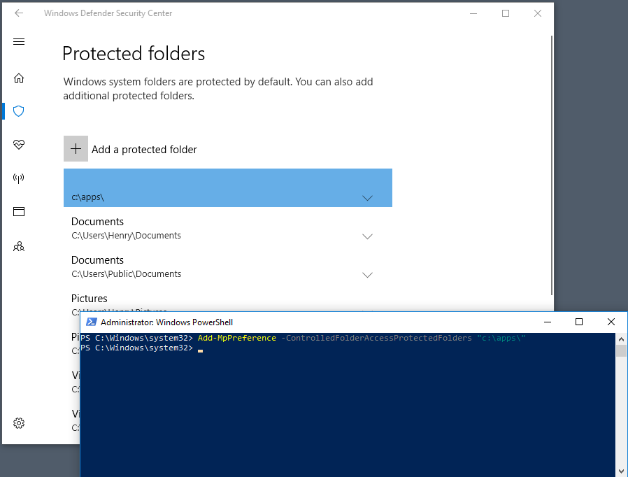
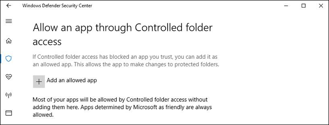
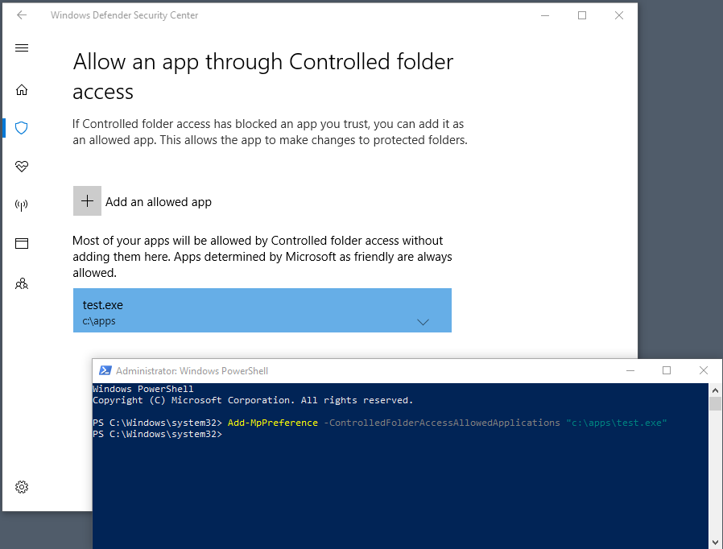

# Customize controlled folder access

[!INCLUDE [Microsoft 365 Defender rebranding](../../includes/microsoft-defender.md)]


**Applies to:**
- [Microsoft Defender for Endpoint](https://go.microsoft.com/fwlink/?linkid=2154037)
- [Microsoft 365 Defender](https://go.microsoft.com/fwlink/?linkid=2118804)

>Want to experience Defender for Endpoint? [Sign up for a free trial.](https://www.microsoft.com/microsoft-365/windows/microsoft-defender-atp?ocid=docs-wdatp-assignaccess-abovefoldlink)


Controlled folder access helps you protect valuable data from malicious apps and threats, such as ransomware. Controlled folder access is supported on Windows Server 2019 and Windows 10 clients.

This article describes how to customize controlled folder access capabilities, and includes the following sections:

- [Protect additional folders](#protect-additional-folders)
- [Add apps that should be allowed to access protected folders](#allow-specific-apps-to-make-changes-to-controlled-folders)
- [Allow signed executable files to access protected folders](#allow-signed-executable-files-to-access-protected-folders)
- [Customize the notification](#customize-the-notification)

> [!IMPORTANT]
> Controlled folder access monitors apps for activities that are detected as malicious. Sometimes, legitimate apps are blocked from making changes to your files. If controlled folder access impacts your organization's productivity, you might consider running this feature in [audit mode](audit-windows-defender.md) to fully assess the impact.

## Protect additional folders

Controlled folder access applies to many system folders and default locations, including folders such as **Documents**, **Pictures**, and **Movies**. You can add additional folders to be protected, but you cannot remove the default folders in the default list.

Adding other folders to controlled folder access can be helpful for cases when you don't store files in the default Windows libraries, or you've changed the default location of your libraries.

You can also specify network shares and mapped drives. Environment variables and wildcards are supported. For information about using wildcards, see [Use wildcards in the file name and folder path or extension exclusion lists](https://docs.microsoft.com/windows/security/threat-protection/microsoft-defender-antivirus/configure-extension-file-exclusions-microsoft-defender-antivirus#use-wildcards-in-the-file-name-and-folder-path-or-extension-exclusion-lists).

You can use the Windows Security app, Group Policy, PowerShell cmdlets, or mobile device management configuration service providers to add and remove additional protected folders.

### Use the Windows Security app to protect additional folders

1. Open the Windows Security app by selecting the shield icon in the task bar or searching the start menu for **Security**.

2. Select **Virus & threat protection**, and then scroll down to the **Ransomware protection** section.

3. Select **Manage ransomware protection** to open the **Ransomware protection** pane.

4. Under the **Controlled folder access** section, select **Protected folders**.

5. Choose **Yes** on the **User Access Control** prompt. The **Protected folders** pane displays.

4. Select **Add a protected folder** and follow the prompts to add folders.

### Use Group Policy to protect additional folders

1. On your Group Policy management computer, open the [Group Policy Management Console](https://docs.microsoft.com/previous-versions/windows/it-pro/windows-server-2008-R2-and-2008/cc731212(v=ws.11)?preserve=true), right-click the Group Policy Object you want to configure, and then and select **Edit**.

2. In the **Group Policy Management Editor**, go to **Computer configuration** and select **Administrative templates**.

3. Expand the tree to **Windows components** > **Microsoft Defender Antivirus** > **Windows Defender Exploit Guard** > **Controlled folder access**.

4. Double-click **Configured protected folders** and set the option to **Enabled**. Select **Show** and enter each folder.

### Use PowerShell to protect additional folders

1. Type **PowerShell** in the Start menu, right-click **Windows PowerShell** and select **Run as administrator**

2. Enter the following cmdlet:

    ```PowerShell
    Add-MpPreference -ControlledFolderAccessProtectedFolders "<the folder to be protected>"
    ```
3. Repeat step 2 until you have added all the folders you want to protect. Folders that are added are visible in the Windows Security app.

   

> [!IMPORTANT]
> Use `Add-MpPreference` to append or add apps to the list. Using the `Set-MpPreference` cmdlet will overwrite the existing list.

### Use MDM CSPs to protect additional folders

Use the [./Vendor/MSFT/Policy/Config/Defender/GuardedFoldersList](https://docs.microsoft.com/windows/client-management/mdm/policy-csp-defender#defender-guardedfolderslist) configuration service provider (CSP) to allow apps to make changes to protected folders.

## Allow specific apps to make changes to controlled folders

You can specify if certain apps are always considered safe and give write access to files in protected folders. Allowing apps can be useful if a particular app you know and trust is being blocked by the controlled folder access feature.

> [!IMPORTANT]
> By default, Windows adds apps that are considered friendly to the allowed list. Such apps that are added automatically are not recorded in the list shown in the Windows Security app or by using the associated PowerShell cmdlets. You shouldn't need to add most apps. Only add apps if they are being blocked and you can verify their trustworthiness.

When you add an app, you have to specify the app's location. Only the app in that location will be permitted access to the protected folders. If the app (with the same name) is in a different location, it will not be added to the allow list and may be blocked by controlled folder access.

An allowed application or service only has write access to a controlled folder after it starts. For example, an update service will continue to trigger events after it's allowed until it is stopped and restarted.

### Use the Windows Defender Security app to allow specific apps

1. Open the Windows Security app by searching the start menu for **Security**.

2. Select the **Virus & threat protection** tile (or the shield icon on the left menu bar) and then select **Manage ransomware protection**.

3. Under the **Controlled folder access** section, select **Allow an app through Controlled folder access**

4. Select **Add an allowed app** and follow the prompts to add apps.

    

### Use Group Policy to allow specific apps

1. On your Group Policy management device, open the [Group Policy Management Console](https://docs.microsoft.com/previous-versions/windows/it-pro/windows-server-2008-R2-and-2008/cc731212(v=ws.11)?preserve=true), right-click the Group Policy Object you want to configure and select **Edit**.

2. In the **Group Policy Management Editor**, go to **Computer configuration** and select **Administrative templates**.

3. Expand the tree to **Windows components** > **Microsoft Defender Antivirus** > **Windows Defender Exploit Guard** > **Controlled folder access**.

4. Double-click the **Configure allowed applications** setting and set the option to **Enabled**. Select **Show** and enter each app.

### Use PowerShell to allow specific apps

1. Type **PowerShell** in the Start menu, right-click **Windows PowerShell** and select **Run as administrator**
2. Enter the following cmdlet:

    ```PowerShell
    Add-MpPreference -ControlledFolderAccessAllowedApplications "<the app that should be allowed, including the path>"
    ```

    For example, to add the executable *test.exe* located in the folder *C:\apps*, the cmdlet would be as follows:

    ```PowerShell
    Add-MpPreference -ControlledFolderAccessAllowedApplications "c:\apps\test.exe"
    ```

   Continue to use `Add-MpPreference -ControlledFolderAccessAllowedApplications` to add more apps to the list. Apps added using this cmdlet will appear in the Windows Security app.



> [!IMPORTANT]
> Use `Add-MpPreference` to append or add apps to the list. Using the `Set-MpPreference` cmdlet will overwrite the existing list.

### Use MDM CSPs to allow specific apps

Use the [./Vendor/MSFT/Policy/Config/Defender/GuardedFoldersAllowedApplications](https://docs.microsoft.com/windows/client-management/mdm/policy-csp-defender#defender-guardedfoldersallowedapplications) configuration service provider (CSP) to allow apps to make changes to protected folders.

## Allow signed executable files to access protected folders

Microsoft Defender for Endpoint certificate and file indicators can allow signed executable files to access protected folders. For implementation details, see [Create indicators based on certificates](https://docs.microsoft.com/windows/security/threat-protection/microsoft-defender-atp/indicator-certificates).

> [!Note]
> This does no apply to scripting engines, including Powershell

## Customize the notification

For more information about customizing the notification when a rule is triggered and blocks an app or file, see [Configure alert notifications in Microsoft Defender for Endpoint](https://docs.microsoft.com/windows/security/threat-protection/microsoft-defender-atp/configure-email-notifications).

## See also

- [Protect important folders with controlled folder access](controlled-folders.md)
- [Enable controlled folder access](enable-controlled-folders.md)
- [Evaluate attack surface reduction rules](evaluate-attack-surface-reduction.md)
