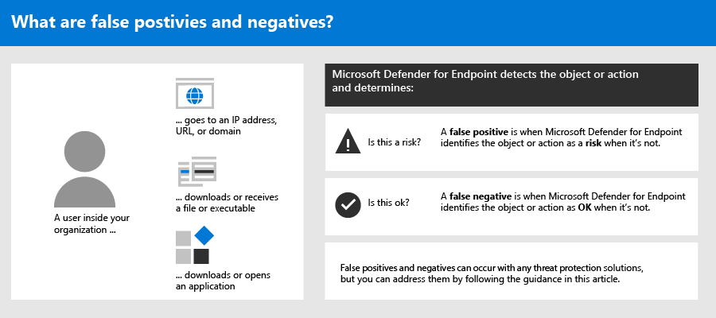
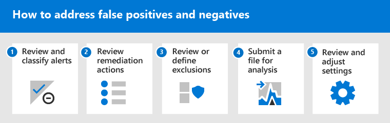
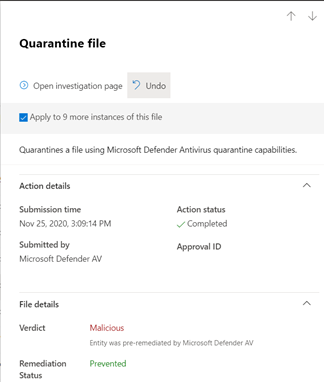
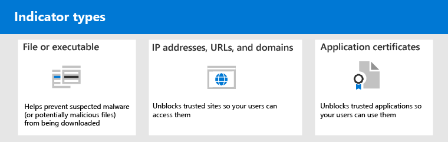

# Address false positives/negatives in Microsoft Defender for Endpoint

[!INCLUDE [Microsoft 365 Defender rebranding](../../includes/microsoft-defender.md)]

**Applies to**

- [Microsoft Defender for Endpoint](https://go.microsoft.com/fwlink/p/?linkid=2146806)

In endpoint protection solutions, a false positive is an entity, such as a file or a process, that was detected and identified as malicious, even though the entity isn't actually a threat. A false negative is an entity that was not detected as a threat, even though it actually is malicious. False positives/negatives can occur with any threat protection solution, including [Microsoft Defender for Endpoint](https://docs.microsoft.com/windows/security/threat-protection/microsoft-defender-atp/microsoft-defender-advanced-threat-protection).

Fortunately, steps can be taken to address and reduce these kinds of issues. If you're seeing false positives/negatives in your [Microsoft Defender Security Center](https://docs.microsoft.com/windows/security/threat-protection/microsoft-defender-atp/use), your security operations can take steps to address them by using the following process:

1.	[Review and classify alerts](#part-1-review-and-classify-alerts) 
2.	[Review remediation actions that were taken](#part-2-review-remediation-actions)
3.	[Review and define exclusions](#part-3-review-or-define-exclusions)
4.	[Submit an entity for analysis](#part-4-submit-a-file-for-analysis)
5.	[Review and adjust your threat protection settings](#part-5-review-and-adjust-your-threat-protection-settings)

And, you can [get help if you still have issues with false positives/negatives](#still-need-help) after performing the tasks described in this article.

> [!NOTE]
> This article is intended as guidance for security operators and security administrators who are using [Microsoft Defender for Endpoint](microsoft-defender-advanced-threat-protection.md).

## Part 1: Review and classify alerts

If you see an [alert](alerts.md) that was triggered because something was detected as malicious or suspicious that should not have been, you can suppress the alert for that entity. You can also suppress alerts that are not necessarily false positives, but are unimportant. We recommend that you classify alerts as well. 

Managing your alerts and classifying true/false positives helps to train your threat protection solution and can reduce the number of false positives or false negatives over time. Taking these steps also helps reduce noise in your security operations dashboard so that your security team can focus on higher priority work items.

### Determine whether an alert is accurate

Before you classify or suppress an alert, determine whether the alert is accurate, a false positive, or benign.

1. Go to the Microsoft Defender Security Center ([https://securitycenter.windows.com](https://securitycenter.windows.com)) and sign in.
2. In the navigation pane, choose **Alerts queue**.
3. Select an alert to more details about the alert. (See [Review alerts](https://docs.microsoft.com/windows/security/threat-protection/microsoft-defender-atp/review-alerts).)
4. Depending on the alert status, take the steps described in the following table: 

| Alert status | What to do |
|:---|:---|
| The alert is accurate | Assign the alert, and then [investigate it](investigate-alerts.md) further. |
| The alert is a false positive | 1. [Classify the alert](#classify-an-alert) as a false positive.  2. [Suppress the alert](#suppress-an-alert).   3. [Create an indicator](#indicators-for-microsoft-defender-for-endpoint) for Microsoft Defender for Endpoint.   4. [Submit a file to Microsoft for analysis](#part-4-submit-a-file-for-analysis). |
| The alert is accurate, but benign (unimportant) | [Classify the alert](#classify-an-alert) as a true positive, and then [suppress the alert](#suppress-an-alert). |

### Classify an alert

Alerts can be classified as false positives or true positives in the Microsoft Defender Security Center. Classifying alerts helps train Microsoft Defender for Endpoint so that, over time, you'll see more true alerts and fewer false alerts.

1. Go to the Microsoft Defender Security Center ([https://securitycenter.windows.com](https://securitycenter.windows.com)) and sign in.
2. Select **Alerts queue**, and then select an alert.
3. For the selected alert, select **Actions** > **Manage alert**. A flyout pane opens.
4. In the **Manage alert** section, select either **True alert** or **False alert**. (Use **False alert** to classify a false positive.)

> [!TIP]
> For more information about suppressing alerts, see [Manage Microsoft Defender for Endpoint alerts](https://docs.microsoft.com/windows/security/threat-protection/microsoft-defender-atp/manage-alerts). And, if your organization is using a security information and event management (SIEM) server, make sure to define a suppression rule there, too. 

### Suppress an alert

If you have alerts that are either false positives or that are true positives but for unimportant events, you can suppress those alerts in the Microsoft Defender Security Center. Suppressing alerts helps reduce noise in your security operations dashboard. 

1. Go to the Microsoft Defender Security Center ([https://securitycenter.windows.com](https://securitycenter.windows.com)) and sign in.
2. In the navigation pane, select **Alerts queue**.
3. Select an alert that you want to suppress to open its **Details** pane.
4. In the **Details** pane, choose the ellipsis (**...**), and then **Create a suppression rule**.
5. Specify all the settings for your suppression rule, and then choose **Save**.

> [!TIP]
> Need help with suppression rules? See [Suppress an alert and create a new suppression rule](https://docs.microsoft.com/windows/security/threat-protection/microsoft-defender-atp/manage-alerts#suppress-an-alert-and-create-a-new-suppression-rule).

## Part 2: Review remediation actions

[Remediation actions](manage-auto-investigation.md#remediation-actions), such as sending a file to quarantine or stopping a process, are taken on entities (such as files) that are detected as threats. Several types of remediation actions occur automatically through automated investigation and Microsoft Defender Antivirus:   
- Quarantine a file
- Remove a registry key
- Kill a process
- Stop a service
- Disable a driver
- Remove a scheduled task

Other actions, such as starting an antivirus scan or collecting an investigation package, occur manually or through [Live Response](live-response.md). Actions taken through Live Response cannot be undone.

After you have reviewed your alerts, your next step is to [review remediation actions](manage-auto-investigation.md). If any actions were taken as a result of false positives, you can undo most kinds of remediation actions. Specifically, you can:
- [Undo one action at a time](#undo-an-action);
- [Undo multiple actions at one time](#undo-multiple-actions-at-one-time); and 
- [Remove a file from quarantine across multiple devices](#remove-a-file-from-quarantine-across-multiple-devices). 

When you're done reviewing and undoing actions that were taken as a result of false positives, proceed to [review or define exclusions](#part-3-review-or-define-exclusions).

### Review completed actions

1. Go to the Action center ([https://securitycenter.windows.com/action-center](https://securitycenter.windows.com/action-center)) and sign in. 
2. Select the **History** tab to view a list of actions that were taken.  
3. Select an item to view more details about the remediation action that was taken.

### Undo an action

1. Go to the Action center ([https://securitycenter.windows.com/action-center](https://securitycenter.windows.com/action-center)) and sign in.
2. On the **History** tab, select an action that you want to undo.
3. In the flyout pane, select **Undo**. If the action cannot be undone with this method, you will not see an **Undo** button. (To learn more, see [Undo completed actions](manage-auto-investigation.md#undo-completed-actions).)

### Undo multiple actions at one time

1. Go to the Action center ([https://securitycenter.windows.com/action-center](https://securitycenter.windows.com/action-center)) and sign in.
2. On the **History** tab, select the actions that you want to undo.
3. In the pane on the right side of the screen, select **Undo**.

### Remove a file from quarantine across multiple devices 

1. Go to the Action center ([https://securitycenter.windows.com/action-center](https://securitycenter.windows.com/action-center)) and sign in.
2. On the **History** tab, select a file that has the Action type **Quarantine file**.
3. In the pane on the right side of the screen, select **Apply to X more instances of this file**, and then select **Undo**. 

## Part 3: Review or define exclusions

An exclusion is an entity, such as a file or URL, that you specify as an exception to remediation actions. The excluded entity can still get detected, but no remediation actions are taken on that entity. That is, the detected file or process won’t be stopped, sent to quarantine, removed, or otherwise changed by Microsoft Defender for Endpoint. 

To define exclusions across Microsoft Defender for Endpoint, perform the following tasks:
- [Define exclusions for Microsoft Defender Antivirus](#exclusions-for-microsoft-defender-antivirus)
- [Create “allow” indicators for Microsoft Defender for Endpoint](#indicators-for-microsoft-defender-for-endpoint)

> [!NOTE]
> Microsoft Defender Antivirus exclusions apply only to antivirus protection, not across other Microsoft Defender for Endpoint capabilities. To exclude files broadly, use exclusions for Microsoft Defender Antivirus and [custom indicators](https://docs.microsoft.com/windows/security/threat-protection/microsoft-defender-atp/manage-indicators) for Microsoft Defender for Endpoint.

The procedures in this section describe how to define exclusions and indicators.

### Exclusions for Microsoft Defender Antivirus

In general, you should not need to define exclusions for Microsoft Defender Antivirus. Make sure that you define exclusions sparingly, and that you only include the files, folders, processes, and process-opened files that are resulting in false positives. In addition, make sure to review your defined exclusions regularly. We recommend using [Microsoft Endpoint Manager](https://docs.microsoft.com/mem/endpoint-manager-overview) to define or edit your antivirus exclusions; however, you can use other methods, such as [Group Policy](https://docs.microsoft.com/azure/active-directory-domain-services/manage-group-policy) (see [Manage Microsoft Defender for Endpoint](manage-atp-post-migration.md)).

> [!TIP]
> Need help with antivirus exclusions? See [Configure and validate exclusions for Microsoft Defender Antivirus scans](https://docs.microsoft.com/windows/security/threat-protection/microsoft-defender-antivirus/configure-exclusions-microsoft-defender-antivirus).

#### Use Microsoft Endpoint Manager to manage antivirus exclusions (for existing policies)

1. Go to the Microsoft Endpoint Manager admin center ([https://endpoint.microsoft.com](https://endpoint.microsoft.com)) and sign in.
2. Choose **Endpoint security** > **Antivirus**, and then select an existing policy. (If you don’t have an existing policy, or you want to create a new policy, skip to [the next procedure](#use-microsoft-endpoint-manager-to-create-a-new-antivirus-policy-with-exclusions)).
3. Choose **Properties**, and next to **Configuration settings**, choose **Edit**.
4. Expand **Microsoft Defender Antivirus Exclusions** and then specify your exclusions.
5. Choose **Review + save**, and then choose **Save**.

#### Use Microsoft Endpoint Manager to create a new antivirus policy with exclusions

1. Go to the Microsoft Endpoint Manager admin center ([https://endpoint.microsoft.com](https://endpoint.microsoft.com)) and sign in.
2. Choose **Endpoint security** > **Antivirus** > **+ Create Policy**. 
3. Select a platform (such as **Windows 10 and later**, **macOS**, or **Windows 10 and Windows Server**).
4. For **Profile**, select **Microsoft Defender Antivirus exclusions**, and then choose **Create**.
5. Specify a name and description for the profile, and then choose **Next**.
6. On the **Configuration settings** tab, specify your antivirus exclusions, and then choose **Next**.
7. On the **Scope tags** tab, if you are using scope tags in your organization, specify scope tags for the policy you are creating. (See [Scope tags](https://docs.microsoft.com/mem/intune/fundamentals/scope-tags).)
8. On the **Assignments** tab, specify the users and groups to whom your policy should be applied, and then choose **Next**. (If you need help with assignments, see [Assign user and device profiles in Microsoft Intune](https://docs.microsoft.com/mem/intune/configuration/device-profile-assign).)
9. On the **Review + create** tab, review the settings, and then choose **Create**.

### Indicators for Microsoft Defender for Endpoint

[Indicators](https://docs.microsoft.com/windows/security/threat-protection/microsoft-defender-atp/manage-indicators) (specifically, indicators of compromise, or IoCs) enable your security operations team to define the detection, prevention, and exclusion of entities. For example, you can specify certain files to be omitted from scans and remediation actions in Microsoft Defender for Endpoint. Or, indicators can be used to generate alerts for certain files, IP addresses, or URLs.

To specify entities as exclusions for Microsoft Defender for Endpoint, create "allow" indicators for those entities. Such "allow" indicators in Microsoft Defender for Endpoint apply to [next-generation protection](https://docs.microsoft.com/windows/security/threat-protection/microsoft-defender-antivirus/microsoft-defender-antivirus-in-windows-10), [endpoint detection and response](https://docs.microsoft.com/windows/security/threat-protection/microsoft-defender-atp/overview-endpoint-detection-response), and [automated investigation & remediation](https://docs.microsoft.com/windows/security/threat-protection/microsoft-defender-atp/automated-investigations).

"Allow" indicators can be created for:

- [Files](#indicators-for-files)
- [IP addresses, URLs, and domains](#indicators-for-ip-addresses-urls-or-domains)
- [Application certificates](#indicators-for-application-certificates)

#### Indicators for files

When you [create an "allow" indicator for a file, such as an executable](https://docs.microsoft.com/windows/security/threat-protection/microsoft-defender-atp/indicator-file), it helps prevent files that your organization is using from being blocked. Files can include portable executable (PE) files, such as `.exe` and `.dll` files. 

Before you create indicators for files, make sure the following requirements are met:
- Microsoft Defender Antivirus is configured with cloud-based protection enabled (see [Manage cloud-based protection](https://docs.microsoft.com/windows/security/threat-protection/microsoft-defender-antivirus/deploy-manage-report-microsoft-defender-antivirus))
- Antimalware client version is 4.18.1901.x or later 
- Devices are running Windows 10, version 1703 or later; Windows Server 2016; or Windows Server 2019 
- The [Block or allow feature is turned on](https://docs.microsoft.com/windows/security/threat-protection/microsoft-defender-atp/advanced-features) 

#### Indicators for IP addresses, URLs, or domains

When you [create an "allow" indicator for an IP address, URL, or domain](https://docs.microsoft.com/windows/security/threat-protection/microsoft-defender-atp/indicator-ip-domain), it helps prevent the sites or IP addresses your organization uses from being blocked.

Before you create indicators for IP addresses, URLs, or domains, make sure the following requirements are met:
- Network protection in Defender for Endpoint is enabled in block mode (see [Enable network protection](https://docs.microsoft.com/windows/security/threat-protection/microsoft-defender-atp/enable-network-protection))
- Antimalware client version is 4.18.1906.x or later 
- Devices are running Windows 10, version 1709, or later 

Custom network indicators are turned on in the Microsoft Defender Security Center (see [Advanced features](https://docs.microsoft.com/windows/security/threat-protection/microsoft-defender-atp/advanced-features))   

#### Indicators for application certificates 

When you [create an "allow" indicator for an application certificate](https://docs.microsoft.com/windows/security/threat-protection/microsoft-defender-atp/indicator-certificates), it helps prevent applications, such as internally developed applications, that your organization uses from being blocked. `.CER` or `.PEM` file extensions are supported.   

Before you create indicators for application certificates, make sure the following requirements are met:
- Microsoft Defender Antivirus is configured with cloud-based protection enabled (see [Manage cloud-based protection](https://docs.microsoft.com/windows/security/threat-protection/microsoft-defender-antivirus/deploy-manage-report-microsoft-defender-antivirus))
- Antimalware client version is 4.18.1901.x or later 
- Devices are running Windows 10, version 1703 or later; Windows Server 2016; or Windows Server 2019 
- Virus and threat protection definitions are up to date  

> [!TIP]
> When you create indicators, you can define them one by one, or import multiple items at once. Keep in mind there's a limit of 15,000 indicators for a single tenant. And, you might need to gather certain details first, such as file hash information. Make sure to review the prerequisites before you [create indicators](manage-indicators.md). 

## Part 4: Submit a file for analysis

You can submit entities, such as files and fileless detections, to Microsoft for analysis. Microsoft security researchers analyze all submissions, and their results help inform Microsoft Defender for Endpoint threat protection capabilities. When you sign in at the submission site, you can track your submissions.

### Submit a file for analysis

If you have a file that was either wrongly detected as malicious or was missed, follow these steps to submit the file for analysis.

1. Review the guidelines here: [Submit files for analysis](https://docs.microsoft.com/windows/security/threat-protection/intelligence/submission-guide).
2. Visit the Microsoft Security Intelligence submission site ([https://www.microsoft.com/wdsi/filesubmission](https://www.microsoft.com/wdsi/filesubmission)), and submit your file(s).

### Submit a fileless detection for analysis

If something was detected as malware based on behavior, and you don’t have a file, you can submit your `Mpsupport.cab` file for analysis. You can get the *.cab* file by using the Microsoft Malware Protection Command-Line Utility (MPCmdRun.exe) tool on Windows 10.

1.	Go to ` C:\ProgramData\Microsoft\Windows Defender\Platform\<version>`, and then run `MpCmdRun.exe` as an administrator.
2.	Type `mpcmdrun.exe -GetFiles`, and then press **Enter**.
   A .cab file is generated that contains various diagnostic logs. The location of the file is specified in the output of the command prompt. By default, the location is `C:\ProgramData\Microsoft\Microsoft Defender\Support\MpSupportFiles.cab`.
3.	Review the guidelines here: [Submit files for analysis](https://docs.microsoft.com/windows/security/threat-protection/intelligence/submission-guide).
4.	Visit the Microsoft Security Intelligence submission site ([https://www.microsoft.com/wdsi/filesubmission](https://www.microsoft.com/wdsi/filesubmission)), and submit your .cab files.

### What happens after a file is submitted?

Your submission is immediately scanned by our systems to give you the latest determination even before an analyst starts handling your case. It’s possible that a file might have already been submitted and processed by an analyst. In those cases, a determination is made quickly.

For submissions that were not already processed, they are prioritized for analysis as follows:

- Prevalent files with the potential to impact large numbers of computers are given a higher priority.
- Authenticated customers, especially enterprise customers with valid [Software Assurance IDs (SAIDs)](https://www.microsoft.com/licensing/licensing-programs/software-assurance-default.aspx), are given a higher priority.
- Submissions flagged as high priority by SAID holders are given immediate attention.

To check for updates regarding your submission, sign in at the [Microsoft Security Intelligence submission site](https://www.microsoft.com/wdsi/filesubmission). 

> [!TIP]
> To learn more, see [Submit files for analysis](https://docs.microsoft.com/windows/security/threat-protection/intelligence/submission-guide#how-does-microsoft-prioritize-submissions).

## Part 5: Review and adjust your threat protection settings

Microsoft Defender for Endpoint offers a wide variety of options, including the ability to fine-tune settings for various features and capabilities. If you’re getting numerous false positives, make sure to review your organization’s threat protection settings. You might need to make some adjustments to:

- [Cloud-delivered protection](#cloud-delivered-protection)
- [Remediation for potentially unwanted applications](#remediation-for-potentially-unwanted-applications)
- [Automated investigation and remediation](#automated-investigation-and-remediation)

### Cloud-delivered protection

Check your cloud-delivered protection level for Microsoft Defender Antivirus. By default, cloud-delivered protection is set to **Not configured**, which corresponds to a normal level of protection for most organizations. If your cloud-delivered protection is set to **High**, **High +**, or **Zero tolerance**, you might experience a higher number of false positives.

> [!TIP]
> To learn more about configuring your cloud-delivered protection, see [Specify the cloud-delivered protection level](https://docs.microsoft.com/windows/security/threat-protection/microsoft-defender-antivirus/specify-cloud-protection-level-microsoft-defender-antivirus).

We recommend using Microsoft Endpoint Manager to edit or set your cloud-delivered protection settings.

We recommend using [Microsoft Endpoint Manager](https://docs.microsoft.com/mem/endpoint-manager-overview) to edit or set your cloud-delivered protection settings; however, you can use other methods, such as [Group Policy](https://docs.microsoft.com/azure/active-directory-domain-services/manage-group-policy) (see [Manage Microsoft Defender for Endpoint](manage-atp-post-migration.md)).

#### Use Microsoft Endpoint Manager to review and edit cloud-delivered protection settings (for existing policies)

1. Go to the Microsoft Endpoint Manager admin center ([https://endpoint.microsoft.com](https://endpoint.microsoft.com)) and sign in.
2. Choose **Endpoint security** > **Antivirus** and then select an existing policy. (If you don’t have an existing policy, or you want to create a new policy, skip to [the next procedure](#use-microsoft-endpoint-manager-to-set-cloud-delivered-protection-settings-for-a-new-policy)).
3. Under **Manage**, select **Properties**. Then, next to **Configuration settings**, choose **Edit**.
4. Expand **Cloud protection**, and review your current setting in the **Cloud-delivered protection level** row. We recommend setting cloud-delivered protection to **Not configured**, which provides strong protection while reducing the chances of getting false positives.
5. Choose **Review + save**, and then **Save**.

#### Use Microsoft Endpoint Manager to set cloud-delivered protection settings (for a new policy)

1. Go to the Microsoft Endpoint Manager admin center ([https://endpoint.microsoft.com](https://endpoint.microsoft.com)) and sign in.
2. Choose **Endpoint security** > **Antivirus** > **+ Create policy**.
3. For **Platform**, select an option, and then for **Profile**, select **Antivirus** or **Microsoft Defender Antivirus** (the specific option depends on what you selected for **Platform**.) Then choose **Create**.
4. On the **Basics** tab, specify a name and description for the policy. Then choose **Next**.
5. On the **Configuration settings** tab, expand **Cloud protection**, and specify the following settings:
   - Set **Turn on cloud-delivered protection** to **Yes**.
   - Set **Cloud-delivered protection level** to **Not configured**. (This level provides a strong level of protection by default while reducing the chances of getting false positives.)
6. On the **Scope tags** tab, if you are using scope tags in your organization, specify scope tags for the policy. (See [Scope tags](https://docs.microsoft.com/mem/intune/fundamentals/scope-tags).)
8. On the **Assignments** tab, specify the users and groups to whom your policy should be applied, and then choose **Next**. (If you need help with assignments, see [Assign user and device profiles in Microsoft Intune](https://docs.microsoft.com/mem/intune/configuration/device-profile-assign).)
9. On the **Review + create** tab, review the settings, and then choose **Create**.  

### Remediation for potentially unwanted applications

Potentially unwanted applications (PUA) are a category of software that can cause devices to run slowly, display unexpected ads, or install other software that might be unexpected or unwanted. Examples of PUA include advertising software, bundling software, and evasion software that behaves differently with security products. Although PUA is not considered malware, some kinds of software are PUA based on their behavior and reputation.

> [!TIP]
> To learn more about PUA, see [Detect and block potentially unwanted applications](https://docs.microsoft.com/windows/security/threat-protection/microsoft-defender-antivirus/detect-block-potentially-unwanted-apps-microsoft-defender-antivirus).
 
Depending on the apps your organization is using, you might be getting false positives as a result of your PUA protection settings. If necessary, consider running PUA protection in audit mode for a while, or apply PUA protection to a subset of devices in your organization. PUA protection can be configured for the Microsoft Edge browser and for Microsoft Defender Antivirus.

We recommend using [Microsoft Endpoint Manager](https://docs.microsoft.com/mem/endpoint-manager-overview) to edit or set PUA protection settings; however, you can use other methods, such as [Group Policy](https://docs.microsoft.com/azure/active-directory-domain-services/manage-group-policy) (see [Manage Microsoft Defender for Endpoint](manage-atp-post-migration.md)).

#### Use Microsoft Endpoint Manager to edit PUA protection (for existing configuration profiles)

1. Go to the Microsoft Endpoint Manager admin center ([https://endpoint.microsoft.com](https://endpoint.microsoft.com)) and sign in.
2. Choose **Devices** > **Configuration profiles**, and then select an existing policy. (If you don’t have an existing policy, or you want to create a new policy, skip to [the next procedure](#use-microsoft-endpoint-manager-to-set-pua-protection-for-a-new-configuration-profile).)
3. Under **Manage**, choose **Properties**, and then, next to **Configuration settings**, choose **Edit**.
4. On the **Configuration settings** tab, scroll down and expand **Microsoft Defender Antivirus**.
5. Set **Detect potentially unwanted applications** to **Audit**. (You can turn it off, but by using audit mode, you will be able to see detections.)
6. Choose **Review + save**, and then choose **Save**.

#### Use Microsoft Endpoint Manager to set PUA protection (for a new configuration profile)

1. Go to the Microsoft Endpoint Manager admin center ([https://endpoint.microsoft.com](https://endpoint.microsoft.com)) and sign in.
2. Choose **Devices** > **Configuration profiles** > **+ Create profile**.
3. For the **Platform**, choose **Windows 10 and later**, and for **Profile**, select **Device restrictions**.
4. On the **Basics** tab, specify a name and description for your policy. Then choose **Next**.
5. On the **Configuration settings** tab, scroll down and expand **Microsoft Defender Antivirus**.
6. Set **Detect potentially unwanted applications** to **Audit**, and then choose **Next**. (You can turn off PUA protection, but by using audit mode, you will be able to see detections.)
7. On the **Assignments** tab, specify the users and groups to whom your policy should be applied, and then choose **Next**. (If you need help with assignments, see [Assign user and device profiles in Microsoft Intune](https://docs.microsoft.com/mem/intune/configuration/device-profile-assign).)
8. On the **Applicability Rules** tab, specify the OS editions or versions to include or exclude from the policy. For example, you can set the policy to be applied to all devices certain editions of Windows 10. Then choose **Next**.
9. On the **Review + create** tab, review your settings, and, and then choose **Create**.

### Automated investigation and remediation

[Automated investigation and remediation](automated-investigations.md) (AIR) capabilities are designed to examine alerts and take immediate action to resolve breaches. As alerts are triggered, and an automated investigation runs, a verdict is generated for each piece of evidence investigated. Verdicts can be *Malicious*, *Suspicious*, or *No threats found*. 

Depending on the [level of automation](https://docs.microsoft.com/windows/security/threat-protection/microsoft-defender-atp/automation-levels) set for your organization and other security settings, remediation actions are taken on artifacts that are considered to be *Malicious* or *Suspicious*. In some cases, remediation actions occur automatically; in other cases, remediation actions are taken manually or only upon approval by your security operations team. 

- [Learn more about automation levels](https://docs.microsoft.com/windows/security/threat-protection/microsoft-defender-atp/automation-levels); and then 
- [Configure AIR capabilities in Defender for Endpoint](https://docs.microsoft.com/windows/security/threat-protection/microsoft-defender-atp/configure-automated-investigations-remediation).

> [!IMPORTANT]
> We recommend using *Full automation* for automated investigation and remediation. Don't turn these capabilities off because of a false positive. Instead, use ["allow" indicators to define exceptions](#indicators-for-microsoft-defender-for-endpoint), and keep automated investigation and remediation set to take appropriate actions automatically. Following [this guidance](automation-levels.md#levels-of-automation) helps reduce the number of alerts your security operations team must handle. 

## Still need help?

If you have worked through all the steps in this article and still need help, contact technical support.

1. Go to the Microsoft Defender Security Center ([https://securitycenter.windows.com](https://securitycenter.windows.com)) and sign in.
2. In the upper right corner, select the question mark (**?**), and then select **Microsoft support**.
3. In the Support Assistant window, describe your issue, and then send your message. From there, you can open a service request.  

## See also

[Manage Microsoft Defender for Endpoint](manage-atp-post-migration.md)

[Overview of Microsoft Defender Security Center](https://docs.microsoft.com/windows/security/threat-protection/microsoft-defender-atp/use) 
