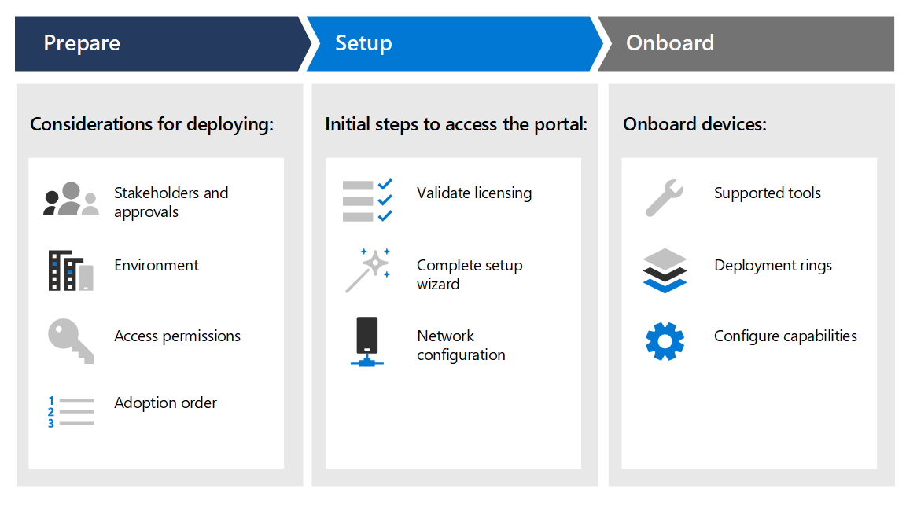

# Deployment phases

[!INCLUDE [Microsoft 365 Defender rebranding](../../includes/microsoft-defender.md)]

**Applies to:**
- [Microsoft Defender for Endpoint](https://go.microsoft.com/fwlink/p/?linkid=2146631)
- [Microsoft 365 Defender](https://go.microsoft.com/fwlink/?linkid=2118804)

>Want to experience Defender for Endpoint? [Sign up for a free trial.](https://www.microsoft.com/microsoft-365/windows/microsoft-defender-atp?ocid=docs-wdatp-assignaccess-abovefoldlink)

Learn how to deploy Microsoft Defender for Endpoint so that your enterprise can take advantage of preventative protection, post-breach detection, automated investigation, and response. 

This guide helps you work across stakeholders to prepare your environment and then onboard devices in a methodical way, moving from evaluation, to a meaningful pilot, to full deployment.

Each section corresponds to a separate article in this solution.

|Phase | Description | 
|:-------|:-----|
| [Phase 1: Prepare](prepare-deployment.md)| Learn about what you need to consider when deploying Defender for Endpoint such as stakeholder approvals, environment considerations, access permissions, and adoption order of capabilities. 
| [Phase 2: Setup](production-deployment.md)|  Get guidance on the initial steps you need to take so that you can access the portal such as validating licensing, completing the setup wizard, and network configuration. 
| [Phase 3: Onboard](onboarding.md) | Learn how to make use of deployment rings, supported onboarding tools based on the type of endpoint, and configuring available capabilities. 

After you've completed this guide, you'll be setup with the right access permissions, your endpoints will be onboarded and reporting sensor data to the service, and capabilities such as next-generation protection and attack surface reduction will be in place.

Regardless of the environment architecture and method of deployment you choose outlined in the [Plan deployment](deployment-strategy.md) guidance, this guide is going to support you in onboarding endpoints. 

## Key capabilities

While Microsoft Defender for Endpoint provides many capabilities, the primary purpose of this deployment guide is to get you started by onboarding devices. In addition to onboarding, this guidance gets you started with the following capabilities.

Capability | Description 
:---|:---
Endpoint detection and response | Endpoint detection and response capabilities are put in place to detect, investigate, and respond to intrusion attempts and active breaches.
Next-generation protection | To further reinforce the security perimeter of your network, Microsoft Defender for Endpoint uses next-generation protection designed to catch all types of emerging threats.
Attack surface reduction |  Provide the first line of defense in the stack. By ensuring configuration settings are properly set and exploit mitigation techniques are applied, these set of capabilities resist attacks and exploitation.

All these capabilities are available for Microsoft Defender for Endpoint license holders. For more information, see [Licensing requirements](minimum-requirements.md#licensing-requirements).

## Scope

### In scope

-   Use of Microsoft Endpoint Manager and Microsoft Endpoint Manager to onboard endpoints into the service and configure capabilities

-   Enabling Defender for Endpoint endpoint detection and response (EDR)  capabilities

-   Enabling Defender for Endpoint endpoint protection platform (EPP)
    capabilities

    -   Next-generation protection

    -   Attack surface reduction

### Out of scope

The following are out of scope of this deployment guide:

-   Configuration of third-party solutions that might integrate with Defender for Endpoint

-   Penetration testing in production environment

## See also
- [Phase 1: Prepare](prepare-deployment.md)
- [Phase 2: Set up](production-deployment.md)
- [Phase 3: Onboard](onboarding.md)
- [Plan deployment](deployment-strategy.md)