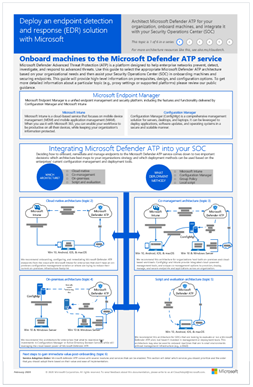

# Plan your Microsoft Defender ATP deployment strategy
Depending on the requirements of your environment, we've put together material to help guide you through the various options you can adopt to deploy Microsoft Defender ATP. 

You can deploy Microsoft Defender ATP using various management tools. In general the following management tools are supported:

- Group policy
- Microsoft Endpoint Configuration Manager
- Mobile Device Management tools
- Local script

## Microsoft Defender ATP deployment strategy

Depending on your environment, some tools are better suited for certain architectures.

|**Item**|**Description**|
|:-----|:-----|
|   [PDF](../../../../downloads/mdatp-deployment-strategy.pdf)  \| [Visio](https://github.com/MicrosoftDocs/windows-itpro-docs/blob/public/downloads/mdatp-deployment-strategy.vsdx) | The architectural material helps you plan your deployment for the following architectures: <ul><li> Cloud-native </li><li> Co-management </li><li> On-premise</li><li>Evaluation and local onboarding</li>

   
## Related topics
- [Deployment phases](deployment-phases.md)
