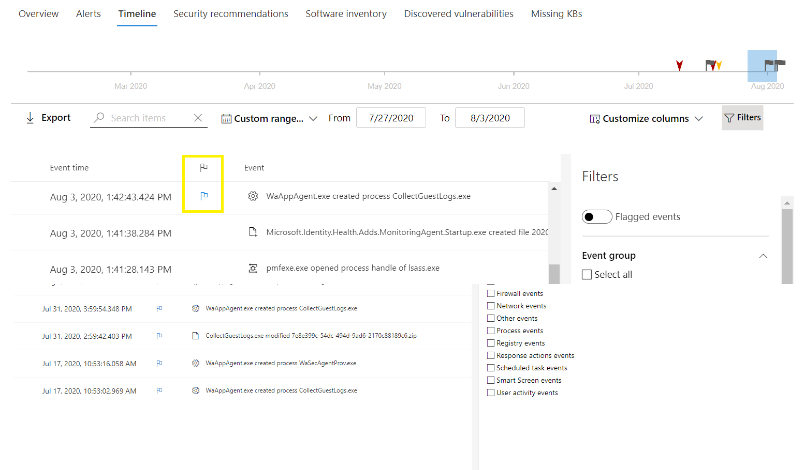
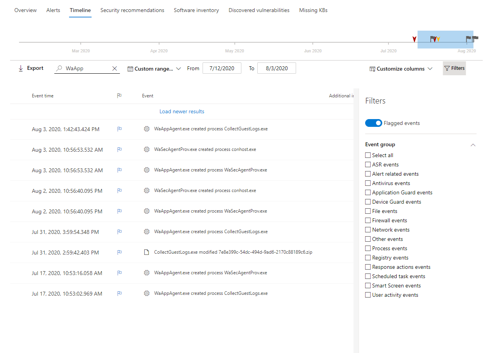

# Microsoft Defender for Endpoint device timeline event flags

[!INCLUDE [Microsoft 365 Defender rebranding](../../includes/microsoft-defender.md)]

**Applies to:** [Microsoft Defender for Endpoint](https://go.microsoft.com/fwlink/p/?linkid=2146631)

Event flags in the Defender for Endpoint device timeline help you filter and organize specific events when you're  investigate potential attacks.

The Defender for Endpoint device timeline provides a chronological view of the events and associated alerts observed on a device. This list of events provides full visibility into any events, files, and IP addresses observed on the device. The list can sometimes be lengthy. Device timeline event flags help you track events that could be related. 

After you've gone through a device timeline, you can sort, filter, and export the specific events that you flagged.

While navigating the device timeline, you can search and filter for specific events. You can set event flags by: 

- Highlighting the most important events 
- Marking events that requires deep dive 
- Building a clean breach timeline

## Flag an event
1. Find the event that you want to flag
2. Click the flag icon in the Flag column. 

## View flagged events  
1. In the timeline **Filters** section, enable **Flagged events**.
2. Click **Apply**. Only flagged events are displayed.
You can apply additional filters by clicking on the time bar. This will only show events prior to the flagged event.  

