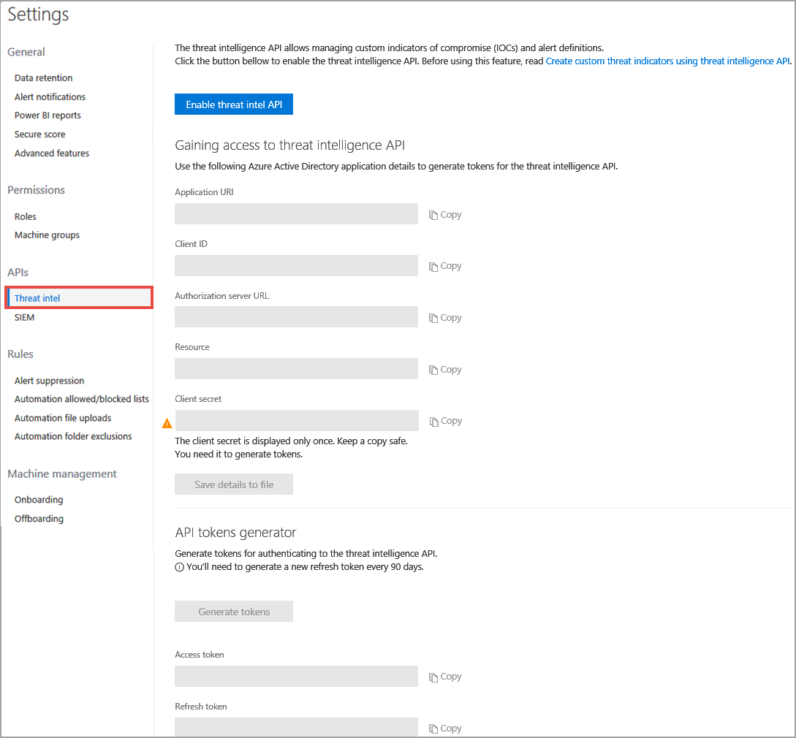

# Enable the custom threat intelligence API in Microsoft Defender ATP

**Applies to:**

- [Microsoft Defender Advanced Threat Protection (Microsoft Defender ATP)](https://go.microsoft.com/fwlink/p/?linkid=2069559)

>Want to experience Microsoft Defender ATP? [Sign up for a free trial.](https://www.microsoft.com/en-us/WindowsForBusiness/windows-atp?ocid=docs-wdatp-enablecustomti-abovefoldlink) 

Before you can create custom threat intelligence (TI) using REST API, you'll need to set up the custom threat intelligence application through Windows Defender Security Center.

1. In the navigation pane, select **Settings** >  **Threat intel**.

  

2. Select **Enable threat intel API**. This activates the **Azure Active Directory application** setup sections with pre-populated values.

3. Copy the individual values or select **Save details to file** to download a file that contains all the values.

  >[!WARNING]
  >The client secret is only displayed once. Make sure you keep a copy of it in a safe place.  
  For more information about getting a new secret see, [Learn how to get a new secret](troubleshoot-custom-ti-windows-defender-advanced-threat-protection.md#learn-how-to-get-a-new-client-secret).

4. Select **Generate tokens** to get an access and refresh token.

You’ll need to use the access token in the Authorization header when doing REST API calls.

## Related topics
- [Understand threat intelligence concepts](threat-indicator-concepts-windows-defender-advanced-threat-protection.md)
- [Create custom alerts using the threat intelligence API](custom-ti-api-windows-defender-advanced-threat-protection.md)
- [PowerShell code examples for the custom threat intelligence API](powershell-example-code-windows-defender-advanced-threat-protection.md)
- [Python code examples for the custom threat intelligence API](python-example-code-windows-defender-advanced-threat-protection.md)
- [Experiment with custom threat intelligence alerts](experiment-custom-ti-windows-defender-advanced-threat-protection.md)
- [Troubleshoot custom threat intelligence issues](troubleshoot-custom-ti-windows-defender-advanced-threat-protection.md)
