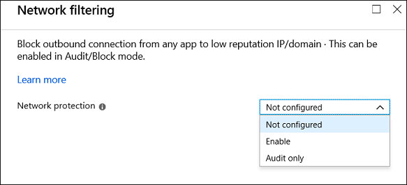

# Turning on network protection

**Applies to:**

* [Microsoft Defender Advanced Threat Protection (Microsoft Defender ATP)](https://go.microsoft.com/fwlink/p/?linkid=2069559)

[Network protection](network-protection.md) helps to prevent employees from using any application to access dangerous domains that may host phishing scams, exploits, and other malicious content on the internet. You can [audit network protection](evaluate-network-protection.md) in a test environment to view which apps would be blocked before you enable it.

## Check if network protection is enabled

Check if network protection has been enabled on a local device by using Registry editor.

1. Select the **Start** button in the task bar and type **regedit** to open Registry editor
1. Choose **HKEY_LOCAL_MACHINE** from the side menu
1. Navigate through the nested menus to **SOFTWARE** > **Policies** > **Microsoft** > **Windows Defender** > **Policy Manager**
1. Select **EnableNetworkProtection** to see the current state of network protection on the device

    * 0, or **Off**
    * 1, or **On**
    * 2, or **Audit** mode

## Enable network protection

Enable network protection by using any of these methods:

* [PowerShell](#powershell)
* [Microsoft Intune](#intune)
* [Mobile Device Management (MDM)](#mobile-device-management-mmd)
* [Microsoft Endpoint Configuration Manager](#microsoft-endpoint-configuration-manager)
* [Group Policy](#group-policy)

### PowerShell

1. Type **powershell** in the Start menu, right-click **Windows PowerShell** and select **Run as administrator**
2. Enter the following cmdlet:

    ```PowerShell
    Set-MpPreference -EnableNetworkProtection Enabled
    ```

3. Optional: Enable the feature in audit mode using the following cmdlet:

    ```PowerShell
    Set-MpPreference -EnableNetworkProtection AuditMode
    ```

    Use `Disabled` instead of `AuditMode` or `Enabled` to turn off the feature.

### Intune

1. Sign in to the [Azure portal](https://portal.azure.com) and open Intune.

2. Go to **Device configuration** > **Profiles** > **Create profile**.

3. Name the profile, choose **Windows 10 and later** and **Endpoint protection**.
   
    

4. Select **Configure** > **Windows Defender Exploit Guard** > **Network filtering** > **Enable**.  
   
    

5. Select **OK** to save each open section and **Create**.

6. Select the profile called **Assignments**, assign to **All Users & All Devices**, and **Save**.

### Mobile Device Management (MMD)

Use the [./Vendor/MSFT/Policy/Config/Defender/EnableNetworkProtection](https://docs.microsoft.com/windows/client-management/mdm/policy-csp-defender#defender-enablenetworkprotection) configuration service provider (CSP) to enable or disable network protection or enable audit mode.

## Microsoft Endpoint Configuration Manager

1. In Microsoft Endpoint Configuration Manager, go to **Assets and Compliance** > **Endpoint Protection** > **Windows Defender Exploit Guard**.

2. Then go to **Home** > **Create Exploit Guard Policy**.

3. Enter a name and a description, select **Network protection**, and then **Next**.

4. Choose whether to block or audit access to suspicious domains and select **Next**.

5. Review the settings and select **Next** to create the policy.

6. After the policy is created, **Close**.

### Group Policy

Use the following procedure to enable network protection on domain-joined computers or on a standalone computer.

1. On a standalone computer, go to **Start** and then type and select **Edit group policy**.

    *-Or-*

    On a domain-joined Group Policy management computer, open the [Group Policy Management Console](https://technet.microsoft.com/library/cc731212.aspx), right-click the Group Policy Object you want to configure and select **Edit**.

2. In the **Group Policy Management Editor**, go to **Computer configuration** and select **Administrative templates**.

3. Expand the tree to **Windows components** > **Microsoft Defender Antivirus** > **Windows Defender Exploit Guard** > **Network protection**.

4. Double-click the **Prevent users and apps from accessing dangerous websites** setting and set the option to **Enabled**. In the options section, you must specify one of the following options:
    * **Block** - Users can't access malicious IP addresses and domains
    * **Disable (Default)** - The Network protection feature won't work. Users won't be blocked from accessing malicious domains
    * **Audit Mode** - If a user visits a malicious IP address or domain, an event won't be recorded in the Windows event log. However, the user won't be blocked from visiting the address.

> [!IMPORTANT]
> To fully enable network protection, you must set the Group Policy option to **Enabled** and also select **Block** in the options drop-down menu.

Confirm network protection is enabled on a local computer by using Registry editor:

1. Select **Start** and type **regedit** to open **Registry Editor**.

2. Navigate to HKEY_LOCAL_MACHINE\SOFTWARE\Policies\Microsoft\Windows Defender\Windows Defender Exploit Guard\Network Protection

3. Select **EnableNetworkProtection** and confirm the value:
   * 0=Off
   * 1=On
   * 2=Audit

## See also

* [Network protection](network-protection.md)
* [Evaluate network protection](evaluate-network-protection.md)
* [Troubleshoot network protection](troubleshoot-np.md)
