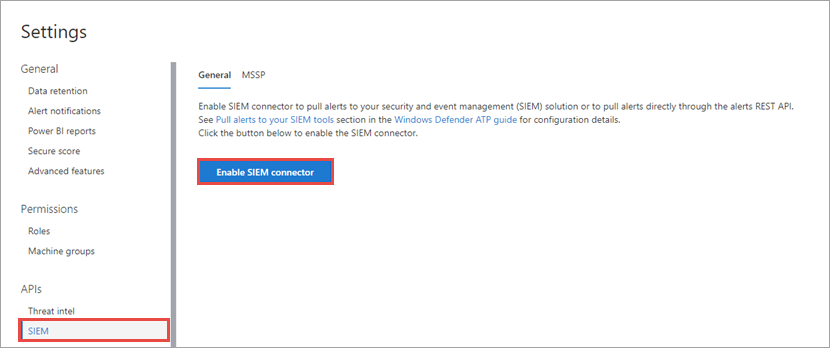
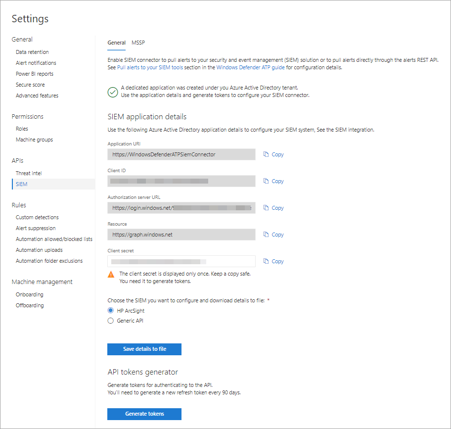

# Enable SIEM integration in Microsoft Defender ATP

**Applies to:**
- [Microsoft Defender Advanced Threat Protection (Microsoft Defender ATP)](https://go.microsoft.com/fwlink/p/?linkid=2069559)

>Want to experience Microsoft Defender ATP? [Sign up for a free trial.](https://www.microsoft.com/en-us/WindowsForBusiness/windows-atp?ocid=docs-wdatp-enablesiem-abovefoldlink) 

Enable security information and event management (SIEM) integration so you can pull alerts from Microsoft Defender Security Center using your SIEM solution or by connecting directly to the alerts REST API.

## Prerequisites
- The user who activates the setting must have permissions to create an app in Azure Active Directory (AAD). This is typically someone with a **Global administrator** role.
- During the initial activation, a pop-up screen is displayed for credentials to be entered. Make sure that you allow pop-ups for this site.

## Enabling SIEM integration 
1. In the navigation pane, select **Settings** > **SIEM**.

    

    >[!TIP]
    >If you encounter an error when trying to enable the SIEM connector application, check the pop-up blocker settings of your browser. It might be blocking the new window being opened when you enable the capability. 

2. Select **Enable SIEM integration**. This activates the **SIEM connector access details** section with pre-populated values and an application is created under you Azure Active Directory (AAD) tenant.

    > [!WARNING]
    >The client secret is only displayed once. Make sure you keep a copy of it in a safe place. 
     For more information about getting a new secret see, [Learn how to get a new secret](troubleshoot-custom-ti.md#learn-how-to-get-a-new-client-secret).

    

3. Choose the SIEM type you use in your organization.

   > [!NOTE]
   > If you select HP ArcSight, you'll need to save these two configuration files: 
   > - WDATP-connector.jsonparser.properties
   > - WDATP-connector.properties  

   If you want to connect directly to the alerts REST API through programmatic access, choose **Generic API**.

4. Copy the individual values or select **Save details to file** to download a file that contains all the values.

5. Select **Generate tokens** to get an access and refresh token.
  
   > [!NOTE]
   > You'll need to generate a new Refresh token every 90 days. 

You can now proceed with configuring your SIEM solution or connecting to the alerts REST API through programmatic access. You'll need to use the tokens when configuring your SIEM solution to allow it to receive alerts from Microsoft Defender Security Center.

## Integrate Microsoft Defender ATP with IBM QRadar 
You can configure IBM QRadar to collect alerts from Microsoft Defender ATP. For more information, see [IBM Knowledge Center](https://www.ibm.com/support/knowledgecenter/SS42VS_DSM/c_dsm_guide_MS_Win_Defender_ATP_overview.html?cp=SS42VS_7.3.1).

## Related topics
- [Configure Splunk to pull Microsoft Defender ATP alerts](configure-splunk.md)
- [Configure HP ArcSight to pull Microsoft Defender ATP alerts](configure-arcsight.md)
- [Microsoft Defender ATP alert API fields](api-portal-mapping.md)
- [Pull Microsoft Defender ATP alerts using REST API](pull-alerts-using-rest-api.md)
- [Troubleshoot SIEM tool integration issues](troubleshoot-siem.md)
