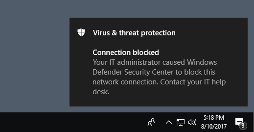

# Evaluate network protection

[!INCLUDE [Microsoft 365 Defender rebranding](../../includes/microsoft-defender.md)]


**Applies to:**

* [Microsoft Defender for Endpoint](https://go.microsoft.com/fwlink/p/?linkid=2146631)

[Network protection](network-protection.md) helps prevent employees from using any application to access dangerous domains that may host phishing scams, exploits, and other malicious content on the Internet.

This article helps you evaluate network protection by enabling the feature and guiding you to a testing site. The sites in this evaluation article aren't malicious. They're specially created websites that pretend to be malicious. The site will replicate the behavior that would happen if a user visited a malicious site or domain.

> [!TIP]
> You can also visit the Microsoft Defender Testground website at [demo.wd.microsoft.com](https://demo.wd.microsoft.com?ocid=cx-wddocs-testground) to see how other protection features work.

## Enable network protection in audit mode

Enable network protection in audit mode to see which IP addresses and domains would have been blocked. You can make sure it doesn't affect line-of-business apps, or get an idea of how often blocks occur.

1. Type **powershell** in the Start menu, right-click **Windows PowerShell** and select **Run as administrator**
2. Enter the following cmdlet:

    ```PowerShell
    Set-MpPreference -EnableNetworkProtection AuditMode
    ```

### Visit a (fake) malicious domain

1. Open Internet Explorer, Google Chrome, or any other browser of your choice.

1. Go to [https://smartscreentestratings2.net](https://smartscreentestratings2.net).

The network connection will be allowed and a test message will be displayed.



## Review network protection events in Windows Event Viewer

To review apps that would have been blocked, open Event Viewer and filter for Event ID 1125 in the Microsoft-Windows-Windows-Defender/Operational log. The following table lists all network protection events.

| Event ID | Provide/Source | Description |
|-|-|-|
|5007 | Windows Defender (Operational) | Event when settings are changed |
|1125 | Windows Defender (Operational) | Event when a network connection is audited |
|1126 | Windows Defender (Operational) | Event when a network connection is blocked |

## See also

* [Network protection](network-protection.md)
* [Enable network protection](enable-network-protection.md)
* [Troubleshoot network protection](troubleshoot-np.md)
