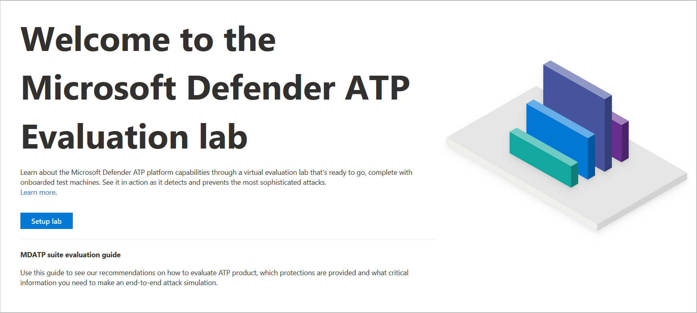
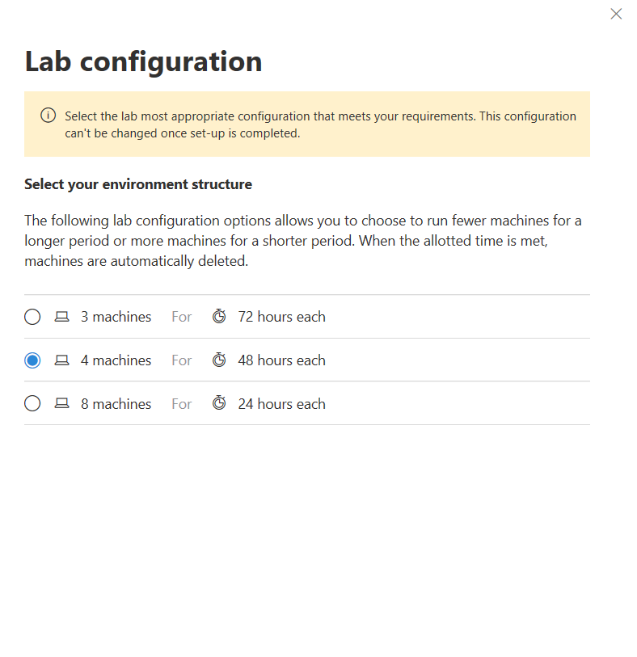
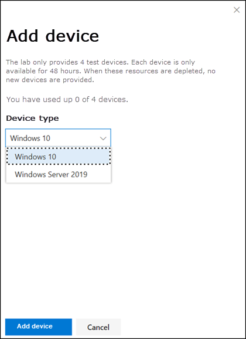
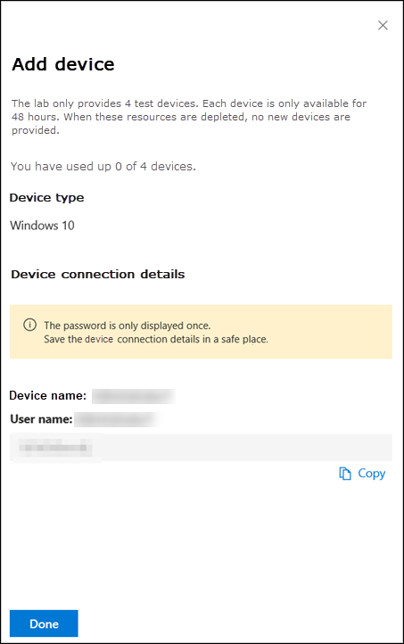
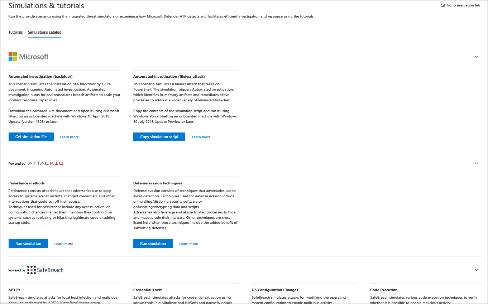
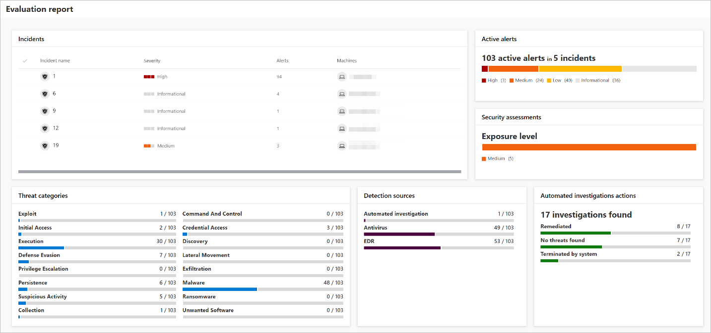
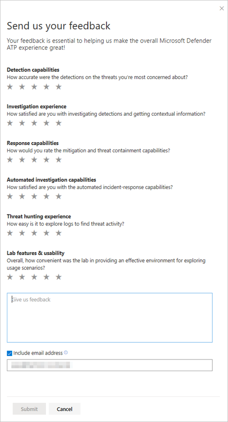

# Microsoft Defender ATP evaluation lab
**Applies to:**
- [Microsoft Defender Advanced Threat Protection (Windows Defender ATP)](https://go.microsoft.com/fwlink/p/?linkid=2069559)

Conducting a comprehensive security product evaluation can be a complex process requiring cumbersome environment and machine configuration before an end-to-end attack simulation can actually be done. Adding to the complexity is the challenge of tracking where the simulation activities, alerts, and results are reflected during the evaluation.

The Microsoft Defender ATP evaluation lab is designed to eliminate the complexities of machine and environment configuration so that you can  focus on evaluating the capabilities of the platform, running simulations, and seeing the prevention, detection, and remediation features in action.

With the simplified set-up experience, you can focus on running your own test scenarios and the pre-made simulations to see how Microsoft Defender ATP performs. 

You'll have full access to the powerful capabilities of the platform such as automated investigations, advanced hunting, and threat analytics, allowing you to test the comprehensive protection stack that Microsoft Defender ATP offers. 

You can add Windows 10 or Windows Server 2019 machines. These test machines come pre-configured to have the latest and greatest OS versions with the right security components in place and Office 2019 Standard installed.

You can also install threat simulators. Microsoft Defender ATP has partnered with industry leading threat simulation platforms to help you test out the Microsoft Defender ATP capabilities.  Install your preferred simulator, run scenarios within the evaluation lab, and instantly see how the platform performs. You'll also have convenient access to wide array of simulations which you can access and run from the simulations catalog.
    

## Before you begin
You'll need to fulfill the [licensing requirements](minimum-requirements.md#licensing-requirements) or have trial access to Microsoft Defender ATP to access the evaluation lab.

Want to experience Microsoft Defender ATP? [Sign up for a free trial.](https://www.microsoft.com/microsoft-365/windows/microsoft-defender-atp?ocid=docs-wdatp-main-abovefoldlink)

## Get started with the lab
You can access the lab from the menu. In the navigation menu, select **Evaluation and tutorials > Evaluation lab**.

>[!NOTE]
>- Each environment is provisioned with a limited set of test machines.
>- Depending the type of environment structure you select, machines will be available for the specified number of hours from the day of activation.
>- When you've used up the provisioned machines, no new machines are provided. A deleted machine does not refresh the available test machine count.
>- Given the limited resources, it’s advisable to use the machines carefully.

## Setup the evaluation lab

1. In the navigation pane, select **Evaluation and tutorials > Evaluation lab**, then select **Setup lab**.

    

2. Depending on your evaluation needs, you can choose to setup an environment with fewer machines for a longer period or more machines for a shorter period. Select your preferred lab configuration then select **Next**.

     

3. (Optional) You can choose to install threat simulators in the lab. 

    >[!IMPORTANT]
    >You'll first need to accept and provide consent to the terms and information sharing statements. 

4. Select the threat simulation agent you'd like to use and enter your details. You can also choose to install threat simulators at a later time. If you choose to install threat simulation agents during the lab setup, you'll enjoy the benefit of having them on the machines you add.  

5.  Review the summary and select **Setup Lab**.  

After the lab setup process is complete, you can add machines and run simulations. 

## Add machines
When you add a machine to your environment, Microsoft Defender ATP sets up a well-configured machine with connection details. You can add Windows 10 or Windows Server 2019 machines.

The machine will be configured with the most up-to-date version of the OS and Office 2019 Standard as well as other apps such as Java, Python, and SysIntenals. 

If you chose to add a threat simulator during the lab setup, all machines will have the threat simulator agent installed in the machines that you add.

The machine will automatically be onboarded to your tenant with the recommended Windows security components turned on and in audit mode - with no effort on your side. 

  The following security components are pre-configured in the test machines:

- [Attack Surface Reduction](https://docs.microsoft.com/windows/security/threat-protection/windows-defender-exploit-guard/attack-surface-reduction-exploit-guard)
- [Block at first sight](https://docs.microsoft.com/windows/security/threat-protection/windows-defender-antivirus/configure-block-at-first-sight-windows-defender-antivirus)
- [Controlled Folder Access](https://docs.microsoft.com/windows/security/threat-protection/windows-defender-exploit-guard/controlled-folders-exploit-guard)
- [Exploit Protection](https://docs.microsoft.com/windows/security/threat-protection/windows-defender-exploit-guard/enable-exploit-protection)
- [Network Protection](https://docs.microsoft.com/windows/security/threat-protection/windows-defender-exploit-guard/network-protection-exploit-guard)
- [Potentially unwanted application detection](https://docs.microsoft.com/windows/security/threat-protection/windows-defender-antivirus/detect-block-potentially-unwanted-apps-windows-defender-antivirus)
- [Cloud-delivered protection](https://docs.microsoft.com/windows/security/threat-protection/windows-defender-antivirus/utilize-microsoft-cloud-protection-windows-defender-antivirus)
- [Windows Defender SmartScreen](https://docs.microsoft.com/windows/security/threat-protection/windows-defender-smartscreen/windows-defender-smartscreen-overview)

>[!NOTE]
> Windows Defender Antivirus will be on (not in audit). If Windows Defender Antivirus blocks you from running your simulation, you may turn off real-time protection on the machine through Windows Security. For more information, see [Configure always-on protection](https://docs.microsoft.com/windows/security/threat-protection/windows-defender-antivirus/configure-real-time-protection-windows-defender-antivirus).

Automated investigation settings will be dependent on tenant settings. It will be configured to be semi-automated by default. For more information, see [Overview of Automated investigations](automated-investigations.md).

>[!NOTE]
>The connection to the test machines is done using RDP. Make sure that your firewall settings allow RDP connections.

1. From the dashboard, select **Add machine**. 

    

2. Choose the type of machine to add. You can choose to add Windows 10 or Windows Server 2019.

    

    >[!NOTE]
    >If something goes wrong with the machine creation process, you'll be notified and you'll need to submit a new request. If the machine creation fails, it will not be counted against the overall allowed quota. 

3. The connection details are displayed. Select **Copy** to save the password for the machine.

    >[!NOTE]
    >The password is only displayed once. Be sure to save it for later use.

    

4. Machine set up begins. This can take up to approximately 30 minutes. 

5. See the status of test machines, the risk and exposure levels, and the status of simulator installations by selecting the **Machines** tab. 

  >[!TIP]
  >In the **Simulator status** column, you can hover over the information icon to know the installation status of an agent.

## Simulate attack scenarios
Use the test machines to run your own attack simulations by connecting to them. 

You can simulate attack scenarios using:
- The ["Do It Yourself" attack scenarios](https://securitycenter.windows.com/tutorials)
- Threat simulators

You can also use [Advanced hunting](advanced-hunting-query-language.md) to query data and [Threat analytics](threat-analytics.md) to view reports about emerging threats.

### Do it yourself attack scenarios
If you are looking for a pre-made simulation, you can use our ["Do It Yourself" attack scenarios](https://securitycenter.windows.com/tutorials). These scripts are safe, documented, and easy to use. These scenarios will reflect Microsoft Defender ATP capabilities and walk you through investigation experience.

>[!NOTE]
>The connection to the test machines is done using RDP. Make sure that your firewall settings allow RDP connections.

1. Connect to your machine and run an attack simulation by selecting **Connect**. 

    

2. Save the RDP file and launch it by selecting **Connect**.

    

    >[!NOTE]
    >If you don't have a copy of the password saved during the initial setup, you can reset the password by selecting **Reset password** from the menu:
    >  
    > The machine will change it’s state to “Executing password reset", then you’ll be presented with your new password in a few minutes.

3. Enter the password that was displayed during the machine creation step. 

   

4. Run Do it yourself attack simulations on the machine. 

### Threat simulator scenarios
If you chose to install any of the supported threat simulators during the lab setup, you can run the built-in simulations on the evaluation lab machines. 

Running threat simulations using third-party platforms is a good way to evaluate Microsoft Defender ATP capabilities within the confines of a lab environment.

>[!NOTE]
>Before you can run simulations, ensure the following requirements are met:
>- Machines must be added  to the evaluation lab
>- Threat simulators must be installed in the evaluation lab

1. From the portal select **Run simulation**.

2. Select a threat simulator.

3. Choose a simulation or look through the simulation gallery to browse through the available simulations.

4. Select the devices where you'd like to run the simulation on.

5. Select **Run**.

6. View the progress of a simulation by selecting the **Simulations** tab. View the simulation state, active alerts, and other details. 

>INSERT IMAGE OF SIMULATIONS TAB HERE!!!! 

After running your simulations, we encourage you to walk through the lab progress bar and explore Microsoft Defender ATP features. See if the attack simulations you ran triggered an automated investigation and remediation, check out the evidence collected and analyzed by the feature.

Hunt for attack evidence through advanced hunting by using the rich query language and raw telemetry and check out some world-wide threats documented in Threat analytics.

## Simulation gallery
Microsoft Defender ATP has partnered with various threat simulation platforms to give you convenient access to test the capabilities of the platform right from the within the portal. 

View all the available simulations by going to  **Simulations and tutorials** > **Simulations catalog**  from the menu. 

A list of supported third-party threat simulation agents are listed, and specific types of simulations along with detailed descriptions are provided on the catalog. 

You can conveniently run any available simulation right from the catalog.  

## Evaluation report
The lab reports summarize the results of the simulations conducted on the machines. 

At a glance, you'll quickly be able to see:
- Incidents that were triggered
- Generated alerts
- Assessments on exposure level 
- Threat categories observed
- Detection sources
- Automated investigations

## Provide feedback
Your feedback helps us get better in protecting your environment from advanced attacks. Share your experience and impressions from product capabilities and evaluation results.

Let us know what you think, by selecting **Provide feedback**.

