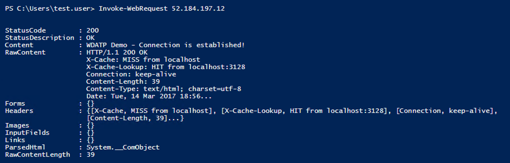

# Experiment with custom threat intelligence (TI) alerts (Deprecated)

**Applies to:**

- [Microsoft Defender Advanced Threat Protection (Microsoft Defender ATP)](https://go.microsoft.com/fwlink/p/?linkid=2069559)

>Want to experience Microsoft Defender ATP? [Sign up for a free trial.](https://www.microsoft.com/WindowsForBusiness/windows-atp?ocid=docs-wdatp-experimentcustomti-abovefoldlink) 

With the Microsoft Defender ATP threat intelligence API, you can create custom threat intelligence alerts that can help you keep track of possible attack activities in your organization.  

For more information about threat intelligence concepts, see [Understand threat intelligence concepts](threat-indicator-concepts.md).

This article demonstrates an end-to-end usage of the threat intelligence API to get you started in using the threat intelligence API.

You'll be guided through sample steps so you can experience how the threat intelligence API feature works. Sample steps include creating alerts definitions and indicators of compromise (IOCs), and examples of how triggered custom TI alerts look like.

## Step 1: Enable the threat intelligence API and obtain authentication details
To use the threat intelligence API feature, you'll need to enable the feature. For more information, see [Enable the custom threat intelligence application](enable-custom-ti.md).

This step is required to generate security credentials that you need to use while working with the API.

## Step 2: Create a sample alert definition and IOCs
This step will guide you in creating an alert definition and an IOC for a malicious IP.

1. Open a Windows PowerShell ISE.

2. Copy and paste the following PowerShell script. This script will upload a sample alert definition and IOC to Microsoft Defender ATP which you can use to generate an alert.

    NOTE:
    Make sure you replace the authUrl, clientId, and clientSecret values with your details which you saved in when you enabled the threat intelligence application.

    ~~~~
     $authUrl = 'Your Authorization URL'
      $clientId = 'Your Client ID'
      $clientSecret = 'Your Client Secret'

      Try
      {
          $tokenPayload = @{
              "resource" = 'https://graph.windows.net'
              "client_id" = $clientId
              "client_secret" = $clientSecret
              "grant_type"='client_credentials'}

          "Fetching an access token"
          $response = Invoke-RestMethod $authUrl -Method Post -Body $tokenPayload
          $token = $response.access_token
          "Token fetched successfully"

          $headers = @{
              "Content-Type" = "application/json"
              "Accept" = "application/json"
              "Authorization" = "Bearer {0}" -f $token }

          $apiBaseUrl = "https://ti.securitycenter.windows.com/V1.0/"

          $alertDefinitionPayload = @{
              "Name" = "Test Alert"
              "Severity" = "Medium"
              "InternalDescription" = "A test alert used to demonstrate the Microsoft Defender ATP TI API feature"
              "Title" = "Test alert."
              "UxDescription" = "This is a test alert based on a sample custom alert definition. This alert was triggered manually using a provided test command. It indicates that the Threat Intelligence API has been properly enabled."
              "RecommendedAction" = "No recommended action for this test alert."
              "Category" = "SuspiciousNetworkTraffic"
              "Enabled" = "true"}

          "Creating an Alert Definition"
          $alertDefinition =
              Invoke-RestMethod ("{0}AlertDefinitions" -f $apiBaseUrl) `
                  -Method Post -Headers $headers -Body ($alertDefinitionPayload | ConvertTo-Json)

          "Alert Definition created successfully"
          $alertDefinitionId = $alertDefinition.Id

          $iocPayload = @{
              "Type"="IpAddress"
              "Value"="52.184.197.12"
              "DetectionFunction"="Equals"
              "Enabled"="true"
              "AlertDefinition@odata.bind"="AlertDefinitions({0})" -f $alertDefinitionId }

          "Creating an Indicator of Compromise"
          $ioc =
              Invoke-RestMethod ("{0}IndicatorsOfCompromise" -f $apiBaseUrl) `
                   -Method Post -Headers $headers -Body ($iocPayload | ConvertTo-Json)
          "Indicator of Compromise created successfully"

          "All done!"
      }
      Catch
      {
          "Something went wrong! Got the following exception message: {0}" -f $_.Exception.Message
      }
      ~~~~

3. Run the script and verify that the operation succeeded in the results the window. Wait up to 20 minutes until the new or updated alert definition propagates to the detection engines.

    

    NOTE: 
    If you get the exception “The remote server returned an error: (407) Proxy Authentication Required", you need to add the proxy configuration by adding the following code to the PowerShell script:

    ~~~~
    $webclient=New-Object System.Net.WebClient
    $creds=Get-Credential
    $webclient.Proxy.Credentials=$creds
    ~~~~

## Step 3: Simulate a custom TI alert
This step will guide you in simulating an event in connection to a malicious IP that will trigger the Microsoft Defender ATP custom TI alert.

1. Open a Windows PowerShell ISE in the machine you onboarded to Microsoft Defender ATP.

2. Type `Invoke-WebRequest 52.184.197.12` in the editor and click **Run**. This call will generate a network communication event to a Microsoft's dedicated demo server that will raise an alert based on the custom alert definition.

    

## Step 4: Explore the custom alert in the portal
This step will guide you in exploring the custom alert in the portal.

1. Open [Microsoft Defender Security Center](http://securitycenter.windows.com/) on a browser.

2. Log in with your Microsoft Defender ATP credentials.

3. The dashboard should display the custom TI alert for the victim machine resulting from the simulated attack.

    

> [!NOTE]
> There is a latency time of approximately 20 minutes between the time a custom TI is introduced and when it becomes effective.

## Related topics
- [Understand threat intelligence concepts](threat-indicator-concepts.md)
- [Enable the custom threat intelligence API in Microsoft Defender ATP](enable-custom-ti.md)
- [Create custom alerts using the threat intelligence API](custom-ti-api.md)
- [PowerShell code examples for the custom threat intelligence API](powershell-example-code.md)
- [Python code examples for the custom threat intelligence API](python-example-code.md)
- [Troubleshoot custom threat intelligence issues](troubleshoot-custom-ti.md)
