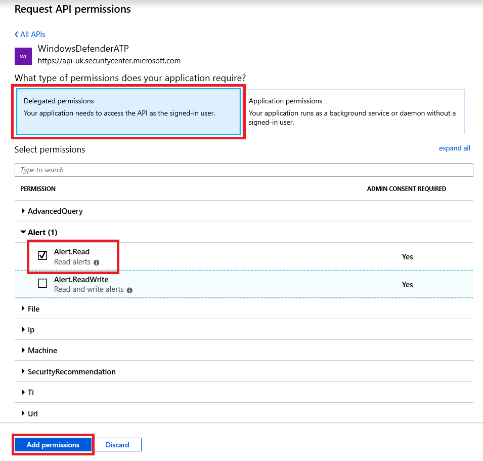

# Use Microsoft Defender for Endpoint APIs

[!INCLUDE [Microsoft 365 Defender rebranding](../../includes/microsoft-defender.md)]


**Applies to:**
- [Microsoft Defender for Endpoint](https://go.microsoft.com/fwlink/?linkid=2154037)

> Want to experience Microsoft Defender for Endpoint? [Sign up for a free trial.](https://www.microsoft.com/microsoft-365/windows/microsoft-defender-atp?ocid=docs-wdatp-exposedapis-abovefoldlink)

[!include[Microsoft Defender for Endpoint API URIs for US Government](../../includes/microsoft-defender-api-usgov.md)]

[!include[Improve request performance](../../includes/improve-request-performance.md)]

This page describes how to create an application to get programmatic access to Defender for Endpoint on behalf of a user.

If you need programmatic access Microsoft Defender for Endpoint without a user, refer to [Access Microsoft Defender for Endpoint with application context](exposed-apis-create-app-webapp.md).

If you are not sure which access you need, read the [Introduction page](apis-intro.md).

Microsoft Defender for Endpoint exposes much of its data and actions through a set of programmatic APIs. Those APIs will enable you to automate work flows and innovate based on Microsoft Defender for Endpoint capabilities. The API access requires OAuth2.0 authentication. For more information, see [OAuth 2.0 Authorization Code Flow](https://docs.microsoft.com/azure/active-directory/develop/active-directory-v2-protocols-oauth-code).

In general, you’ll need to take the following steps to use the APIs:
- Create an AAD application
- Get an access token using this application
- Use the token to access Defender for Endpoint API

This page explains how to create an AAD application, get an access token to Microsoft Defender for Endpoint and validate the token.

>[!NOTE]
> When accessing Microsoft Defender for Endpoint API on behalf of a user, you will need the correct Application permission and user permission.
> If you are not familiar with user permissions on Microsoft Defender for Endpoint, see [Manage portal access using role-based access control](rbac.md).

>[!TIP]
> If you have the permission to perform an action in the portal, you have the permission to perform the action in the API.

## Create an app

1. Log on to [Azure](https://portal.azure.com) with a user account that has the **Global Administrator** role.

2. Navigate to **Azure Active Directory** > **App registrations** > **New registration**. 

   

3. When the **Register an application** page appears, enter your application's registration information:

   - **Name** - Enter a meaningful application name that will be displayed to users of the app.
   - **Supported account types** - Select which accounts you would like your application to support.

       | Supported account types | Description |
       |-------------------------|-------------|
       | **Accounts in this organizational directory only** | Select this option if you're building a line-of-business (LOB) application. This option is not available if you're not registering the application in a directory.<br><br>This option maps to Azure AD only single-tenant.<br><br>This is the default option unless you're registering the app outside of a directory. In cases where the app is registered outside of a directory, the default is Azure AD multi-tenant and personal Microsoft accounts. |
       | **Accounts in any organizational directory** | Select this option if you would like to target all business and educational customers.<br><br>This option maps to an Azure AD only multi-tenant.<br><br>If you registered the app as Azure AD only single-tenant, you can update it to be Azure AD multi-tenant and back to single-tenant through the **Authentication** blade. |
       | **Accounts in any organizational directory and personal Microsoft accounts** | Select this option to target the widest set of customers.<br><br>This option maps to Azure AD multi-tenant and personal Microsoft accounts.<br><br>If you registered the app as Azure AD multi-tenant and personal Microsoft accounts, you cannot change this in the UI. Instead, you must use the application manifest editor to change the supported account types. |

   - **Redirect URI (optional)** - Select the type of app you're building, **Web** or **Public client (mobile & desktop)**, and then enter the redirect URI (or reply URL) for your application.
       - For web applications, provide the base URL of your app. For example, `http://localhost:31544` might be the URL for a web app running on your local machine. Users would use this URL to sign in to a web client application.
       - For public client applications, provide the URI used by Azure AD to return token responses. Enter a value specific to your application, such as `myapp://auth`.

     To see specific examples for web applications or native applications, check out our [quickstarts](/azure/active-directory/develop/#quickstarts).

     When finished, select **Register**.

4. Allow your Application to access Microsoft Defender for Endpoint and assign it 'Read alerts' permission:

    - On your application page, select **API Permissions** > **Add permission** > **APIs my organization uses** > type **WindowsDefenderATP** and select on **WindowsDefenderATP**.

    - **Note**: *WindowsDefenderATP* does not appear in the original list. Start writing its name in the text box to see it appear.

      

    - Choose **Delegated permissions** > **Alert.Read** > select **Add permissions**

      

    - **Important note**: Select the relevant permissions. Read alerts is only an example.

      For instance,

      - To [run advanced queries](run-advanced-query-api.md), select 'Run advanced queries' permission
      - To [isolate a device](isolate-machine.md), select 'Isolate machine' permission
      - To determine which permission you need, view the **Permissions** section in the API you are interested to call.

    - Select **Grant consent**

      **Note**: Every time you add permission you must select on **Grant consent** for the new permission to take effect.

      

6. Write down your application ID and your tenant ID:

   - On your application page, go to **Overview** and copy the following information:

   


## Get an access token

For more information on AAD tokens, see [Azure AD tutorial](https://docs.microsoft.com/azure/active-directory/develop/active-directory-v2-protocols-oauth-client-creds)

### Using C#

- Copy/Paste the below class in your application.
- Use **AcquireUserTokenAsync** method with your application ID, tenant ID, user name, and password to acquire a token.

    ```csharp
    namespace WindowsDefenderATP
    {
        using System.Net.Http;
        using System.Text;
        using System.Threading.Tasks;
        using Newtonsoft.Json.Linq;

        public static class WindowsDefenderATPUtils
        {
            private const string Authority = "https://login.microsoftonline.com";

            private const string WdatpResourceId = "https://api.securitycenter.microsoft.com";

            public static async Task<string> AcquireUserTokenAsync(string username, string password, string appId, string tenantId)
            {
                using (var httpClient = new HttpClient())
                {
                    var urlEncodedBody = $"resource={WdatpResourceId}&client_id={appId}&grant_type=password&username={username}&password={password}";

                    var stringContent = new StringContent(urlEncodedBody, Encoding.UTF8, "application/x-www-form-urlencoded");

                    using (var response = await httpClient.PostAsync($"{Authority}/{tenantId}/oauth2/token", stringContent).ConfigureAwait(false))
                    {
                        response.EnsureSuccessStatusCode();

                        var json = await response.Content.ReadAsStringAsync().ConfigureAwait(false);

                        var jObject = JObject.Parse(json);

                        return jObject["access_token"].Value<string>();
                    }
                }
            }
        }
    }
    ```

## Validate the token

Verify to make sure you got a correct token:
- Copy/paste into [JWT](https://jwt.ms) the token you got in the previous step in order to decode it
- Validate you get a 'scp' claim with the desired app permissions
- In the screenshot below you can see a decoded token acquired from the app in the tutorial:


## Use the token to access Microsoft Defender for Endpoint API

- Choose the API you want to use - [Supported Microsoft Defender for Endpoint APIs](exposed-apis-list.md)
- Set the Authorization header in the HTTP request you send to "Bearer {token}" (Bearer is the Authorization scheme)
- The Expiration time of the token is 1 hour (you can send more than one request with the same token)

- Example of sending a request to get a list of alerts **using C#** 

    ```csharp
    var httpClient = new HttpClient();

    var request = new HttpRequestMessage(HttpMethod.Get, "https://api.securitycenter.microsoft.com/api/alerts");

    request.Headers.Authorization = new AuthenticationHeaderValue("Bearer", token);

    var response = httpClient.SendAsync(request).GetAwaiter().GetResult();

    // Do something useful with the response
    ```

## See also
- [Microsoft Defender for Endpoint APIs](exposed-apis-list.md)
- [Access Microsoft Defender for Endpoint with application context](exposed-apis-create-app-webapp.md)
