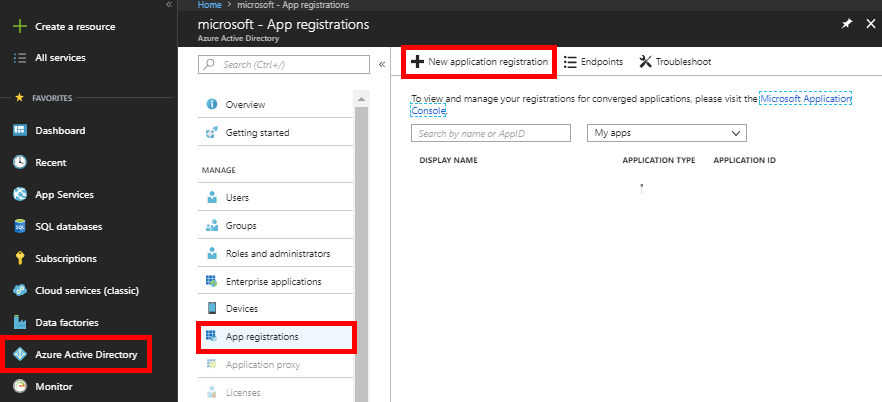
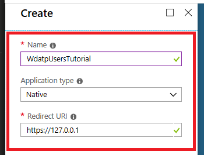
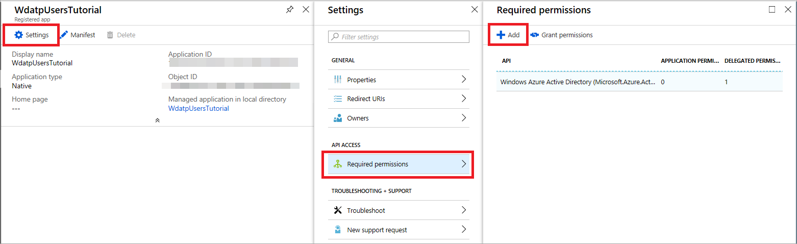
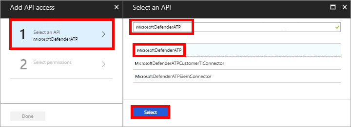
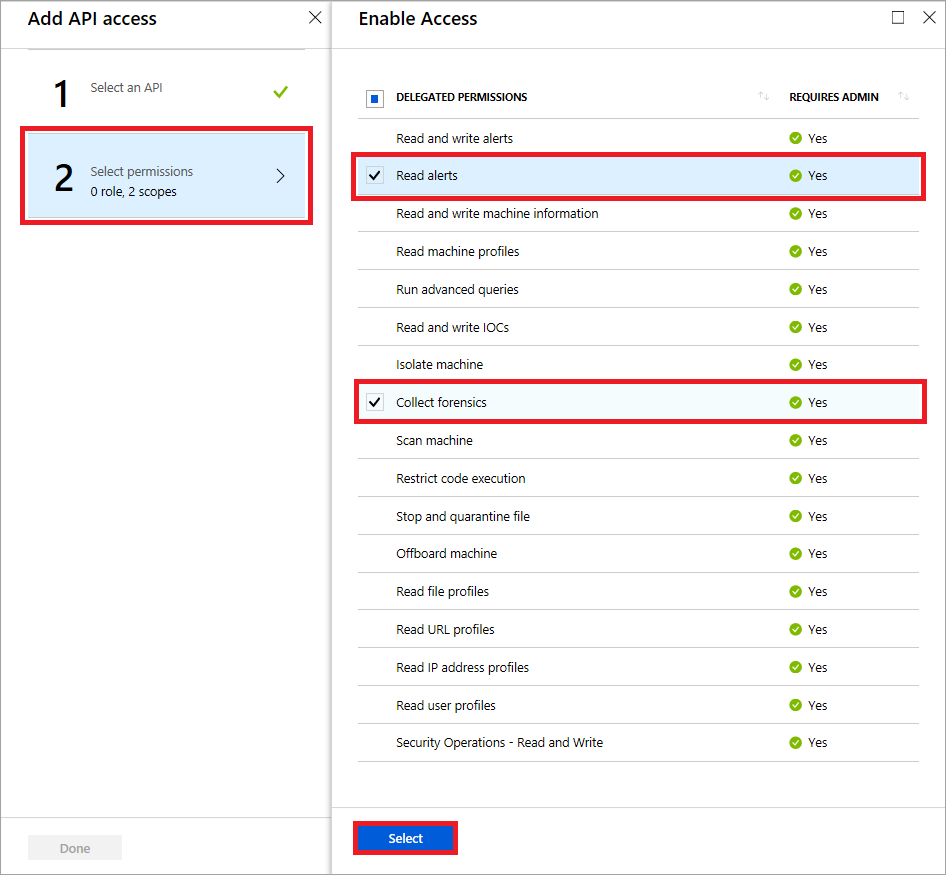
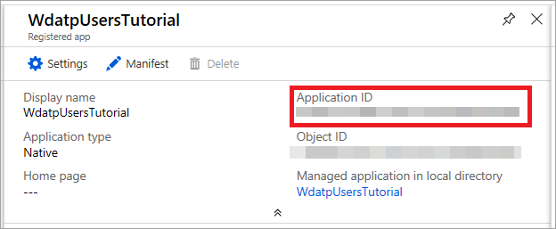

# Use Microsoft Defender ATP APIs

**Applies to:**
- [Microsoft Defender Advanced Threat Protection (Microsoft Defender ATP)](https://go.microsoft.com/fwlink/p/?linkid=2069559)

> Want to experience Microsoft Defender ATP? [Sign up for a free trial.](https://www.microsoft.com/en-us/WindowsForBusiness/windows-atp?ocid=docs-wdatp-exposedapis-abovefoldlink)

This page describes how to create an application to get programmatic access to Microsoft Defender ATP on behalf of a user.

If you need programmatic access Microsoft Defender ATP without a user, refer to [Access Microsoft Defender ATP with application context](exposed-apis-create-app-webapp.md).

If you are not sure which access you need, read the [Introduction page](apis-intro.md).

Microsoft Defender ATP exposes much of its data and actions through a set of programmatic APIs. Those APIs will enable you to automate work flows and innovate based on Microsoft Defender ATP capabilities. The API access requires OAuth2.0 authentication. For more information, see [OAuth 2.0 Authorization Code Flow](https://docs.microsoft.com/en-us/azure/active-directory/develop/active-directory-v2-protocols-oauth-code).

In general, you’ll need to take the following steps to use the APIs:
- Create an AAD application
- Get an access token using this application
- Use the token to access Microsoft Defender ATP API

This page explains how to create an AAD application, get an access token to Microsoft Defender ATP and validate the token.

>[!NOTE]
> When accessing Microsoft Defender ATP API on behalf of a user, you will need the correct App permission and user permission.
> If you are not familiar with user permissions on Microsoft Defender ATP, see [Manage portal access using role-based access control](rbac.md).

>[!TIP]
> If you have the permission to perform an action in the portal, you have the permission to perform the action in the API.

## Create an app

1.	Log on to [Azure](https://portal.azure.com) with user that has Global Administrator role.

2.	Navigate to **Azure Active Directory** > **App registrations** > **New application registration**. 

    

3.	In the Create window, enter the following information then click **Create**.

    

    - **Name:** -Your app name-
    - **Application type:** Native
    - **Redirect URI:** `https://127.0.0.1`


4.	Click **Settings** > **Required permissions** > **Add**.

    

5.	Click **Select an API** > **WindowsDefenderATP**, then click **Select**.
	
	**Note**: WindowsDefenderATP does not appear in the original list. You need to start writing its name in the text box to see it appear.

    

6. Click **Select permissions** > **Check the desired permissions** > **Select**.
	
	>[!IMPORTANT]
    >You need to select the relevant permissions. 'Read alerts' and 'Collect forensics' are only an example.
	For instance,

    - To [run advanced queries](run-advanced-query-api.md), select 'Run advanced queries' permission
    - To [isolate a machine](isolate-machine.md), select 'Isolate machine' permission

       To determine which permission you need, look at the **Permissions** section in the API you are interested to call.

    


7. Click **Done**

    

8. Click **Grant permissions**

	In order to add the new selected permissions to the app, the Admin's tenant must press on the **Grant permissions** button.

	If in the future you will want to add more permission to the app, you will need to press on the **Grant permissions** button again so the changes will take effect.

	

9. Write down your application ID.
    
	


## Get an access token

For more details on AAD token, refer to [AAD tutorial](https://docs.microsoft.com/en-us/azure/active-directory/develop/active-directory-v2-protocols-oauth-client-creds)

### Using C#

- Copy/Paste the below class in your application.
- Use **AcquireUserTokenAsync** method with the your application ID, tenant ID, user name and password to acquire a token.

	```
	namespace WindowsDefenderATP
	{
		using System.Net.Http;
		using System.Text;
		using System.Threading.Tasks;
		using Newtonsoft.Json.Linq;

		public static class WindowsDefenderATPUtils
		{
			private const string Authority = "https://login.windows.net";

			private const string WdatpResourceId = "https://api.securitycenter.windows.com";

			public static async Task<string> AcquireUserTokenAsync(string username, string password, string appId, string tenantId)
			{
				using (var httpClient = new HttpClient())
				{
					var urlEncodedBody = $"resource={WdatpResourceId}&client_id={appId}&grant_type=password&username={username}&password={password}";

					var stringContent = new StringContent(urlEncodedBody, Encoding.UTF8, "application/x-www-form-urlencoded");

					using (var response = await httpClient.PostAsync($"{Authority}/{tenantId}/oauth2/token", stringContent).ConfigureAwait(false))
					{
						response.EnsureSuccessStatusCode();

						var json = await response.Content.ReadAsStringAsync().ConfigureAwait(false);

						var jObject = JObject.Parse(json);

						return jObject["access_token"].Value<string>();
					}
				}
			}
		}
	}
	```

## Validate the token

Sanity check to make sure you got a correct token:
- Copy/paste into [JWT](https://jwt.ms) the token you got in the previous step in order to decode it
- Validate you get a 'scp' claim with the desired app permissions
- In the screenshot below you can see a decoded token acquired from the app in the tutorial:


## Use the token to access Microsoft Defender ATP API

- Choose the API you want to use - [Supported Microsoft Defender ATP APIs](exposed-apis-list.md)
- Set the Authorization header in the HTTP request you send to "Bearer {token}" (Bearer is the Authorization scheme)
- The Expiration time of the token is 1 hour (you can send more then one request with the same token)

- Example of sending a request to get a list of alerts **using C#** 
	```
	var httpClient = new HttpClient();

	var request = new HttpRequestMessage(HttpMethod.Get, "https://api.securitycenter.windows.com/api/alerts");

	request.Headers.Authorization = new AuthenticationHeaderValue("Bearer", token);

	var response = httpClient.SendAsync(request).GetAwaiter().GetResult();

	// Do something useful with the response
	```

## Related topics
- [Microsoft Defender ATP APIs](exposed-apis-list.md)
- [Access Microsoft Defender ATP with application context](exposed-apis-create-app-webapp.md)
