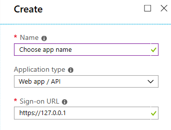
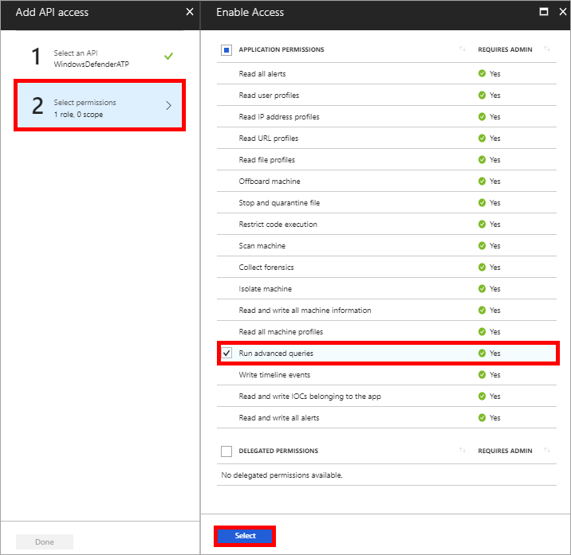
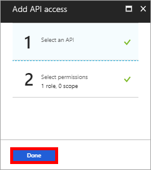
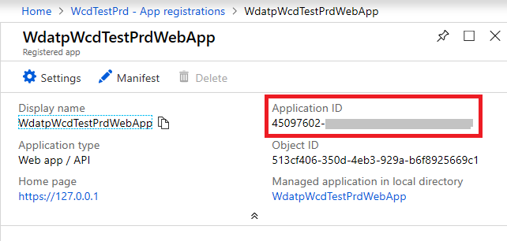
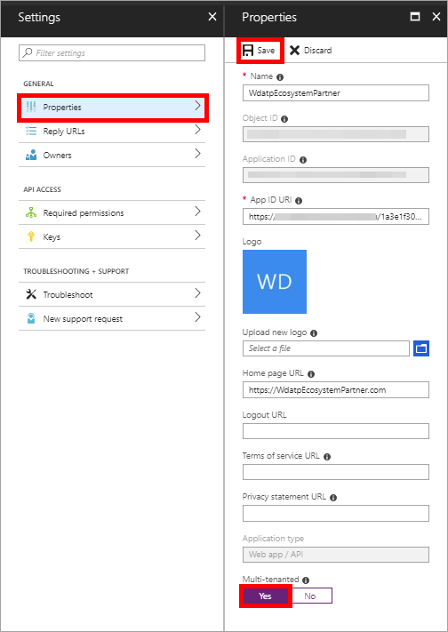

# Create an app to access Microsoft Defender ATP without a user

**Applies to:**

- [Microsoft Defender Advanced Threat Protection (Microsoft Defender ATP)](https://go.microsoft.com/fwlink/p/?linkid=2069559)

> Want to experience Microsoft Defender ATP? [Sign up for a free trial.](https://www.microsoft.com/en-us/WindowsForBusiness/windows-atp?ocid=docs-wdatp-exposedapis-abovefoldlink)

This page describes how to create an application to get programmatic access to Microsoft Defender ATP without a user.

If you need programmatic access Microsoft Defender ATP on behalf of a user, see [Get access with user context](exposed-apis-create-app-nativeapp.md)

If you are not sure which access you need, see [Get started](apis-intro.md).

Microsoft Defender ATP exposes much of its data and actions through a set of programmatic APIs. Those APIs will help you automate workflows and innovate based on Microsoft Defender ATP capabilities. The API access requires OAuth2.0 authentication. For more information, see [OAuth 2.0 Authorization Code Flow](https://docs.microsoft.com/azure/active-directory/develop/active-directory-v2-protocols-oauth-code).

In general, you’ll need to take the following steps to use the APIs:
- Create an AAD application
- Get an access token using this application
- Use the token to access Microsoft Defender ATP API

This page explains how to create an AAD application, get an access token to Microsoft Defender ATP and validate the token.

## Create an app

1. Log on to [Azure](https://portal.azure.com) with user that has Global Administrator role.

2. Navigate to **Azure Active Directory** > **App registrations** > **New application registration**. 

   

3. In the Create window, enter the following information then click **Create**.

   

   - **Name:** Choose your own name. 
   - **Application type:** Web app / API
   - **Redirect URI:** `https://127.0.0.1`

4. Click **Settings** > **Required permissions** > **Add**.

   

5. Click **Select an API** > **WindowsDefenderATP**, then click **Select**.

   **Note**: WindowsDefenderATP does not appear in the original list. You need to start writing its name in the text box to see it appear.

   

6. Click **Select permissions** > **Check the desired permissions** > **Select**.

    **Important note**: You need to select the relevant permissions. 'Run advanced queries' is only an example!

    For instance,

   - To [run advanced queries](run-advanced-query-api.md), select 'Run advanced queries' permission
   - To [isolate a machine](isolate-machine.md), select 'Isolate machine' permission
   - To determine which permission you need, please look at the **Permissions** section in the API you are interested to call.

     

7. Click **Done**

    

8. Click **Grant permissions**

    In order to add the new selected permissions to the app, the Admin's tenant must press on the **Grant permissions** button.

    If in the future you will want to add more permission to the app, you will need to press on the **Grant permissions** button again so the changes will take effect.

    

9. Click **Keys**, type a key name and click **Save**.

    **Important**: After you save, **copy the key value**. You won't be able to retrieve after you leave!

    

10. Write down your application ID.

    

11. **For Microsoft Defender ATP Partners only** - Set your application to be multi-tenanted

    This is **required** for 3rd party apps (for example, if you create an application that is intended to run in multiple customers tenant).

    This is **not required** if you create a service that you want to run in your tenant only (for example, if you create an application for your own usage that will only interact with your own data)

    Click **Properties** > **Yes** > **Save**.

    

    - Application consent for your multi-tenant App:

    You need your application to be approved in each tenant where you intend to use it. This is because your application interacts with Microsoft Defender ATP application on behalf of your customer.

    You (or your customer if you are writing a 3rd party application) need to click the consent link and approve your application. The consent should be done with a user who has admin privileges in the active directory.

    Consent link is of the form: 

    ```
    https://login.microsoftonline.com/common/oauth2/authorize?prompt=consent&client_id=00000000-0000-0000-0000-000000000000&response_type=code&sso_reload=true
    ```

    where 00000000-0000-0000-0000-000000000000 should be replaced with your Azure application ID


- **Done!** You have successfully registered an application! 
- See examples below for token acquisition and validation.

## Get an access token examples:

For more details on AAD token, refer to [AAD tutorial](https://docs.microsoft.com/azure/active-directory/develop/active-directory-v2-protocols-oauth-client-creds)

### Using PowerShell

```
# That code gets the App Context Token and save it to a file named "Latest-token.txt" under the current directory
# Paste below your Tenant ID, App ID and App Secret (App key).

$tenantId = '' ### Paste your tenant ID here
$appId = '' ### Paste your app ID here
$appSecret = '' ### Paste your app key here

$resourceAppIdUri = 'https://api.securitycenter.windows.com'
$oAuthUri = "https://login.windows.net/$TenantId/oauth2/token"
$authBody = [Ordered] @{
    resource = "$resourceAppIdUri"
    client_id = "$appId"
    client_secret = "$appSecret"
    grant_type = 'client_credentials'
}
$authResponse = Invoke-RestMethod -Method Post -Uri $oAuthUri -Body $authBody -ErrorAction Stop
$token = $authResponse.access_token
Out-File -FilePath "./Latest-token.txt" -InputObject $token
return $token
```

### Using C#:

>The below code was tested with nuget Microsoft.IdentityModel.Clients.ActiveDirectory 3.19.8

- Create a new Console Application
- Install Nuget [Microsoft.IdentityModel.Clients.ActiveDirectory](https://www.nuget.org/packages/Microsoft.IdentityModel.Clients.ActiveDirectory/)
- Add the below using

    ```
    using Microsoft.IdentityModel.Clients.ActiveDirectory;
    ```

- Copy/Paste the below code in your application (do not forget to update the 3 variables: ```tenantId, appId, appSecret```)

    ```
    string tenantId = "00000000-0000-0000-0000-000000000000"; // Paste your own tenant ID here
    string appId = "11111111-1111-1111-1111-111111111111"; // Paste your own app ID here
    string appSecret = "22222222-2222-2222-2222-222222222222"; // Paste your own app secret here for a test, and then store it in a safe place! 

    const string authority = "https://login.windows.net";
    const string wdatpResourceId = "https://api.securitycenter.windows.com";

    AuthenticationContext auth = new AuthenticationContext($"{authority}/{tenantId}/");
    ClientCredential clientCredential = new ClientCredential(appId, appSecret);
    AuthenticationResult authenticationResult = auth.AcquireTokenAsync(wdatpResourceId, clientCredential).GetAwaiter().GetResult();
    string token = authenticationResult.AccessToken;
    ```


### Using Python

Refer to [Get token using Python](run-advanced-query-sample-python.md#get-token)

### Using Curl

> [!NOTE]
> The below procedure supposed Curl for Windows is already installed on your computer

- Open a command window
- Set CLIENT_ID to your Azure application ID
- Set CLIENT_SECRET to your Azure application secret
- Set TENANT_ID to the Azure tenant ID of the customer that wants to use your application to access Microsoft Defender ATP application
- Run the below command:

```
curl -i -X POST -H "Content-Type:application/x-www-form-urlencoded" -d "grant_type=client_credentials" -d "client_id=%CLIENT_ID%" -d "scope=https://securitycenter.onmicrosoft.com/windowsatpservice/.default" -d "client_secret=%CLIENT_SECRET%" "https://login.microsoftonline.com/%TENANT_ID%/oauth2/v2.0/token" -k
```

You will get an answer of the form:

```
{"token_type":"Bearer","expires_in":3599,"ext_expires_in":0,"access_token":"eyJ0eXAiOiJKV1QiLCJhbGciOiJSUzI1NiIsIn <truncated> aWReH7P0s0tjTBX8wGWqJUdDA"}
```

## Validate the token

Sanity check to make sure you got a correct token:
- Copy/paste into [JWT](https://jwt.ms) the token you get in the previous step in order to decode it
- Validate you get a 'roles' claim with the desired permissions
- In the screenshot below you can see a decoded token acquired from an app with permissions to all of Microsoft Defender ATP's roles:


## Use the token to access Microsoft Defender ATP API

- Choose the API you want to use, for more information, see [Supported Microsoft Defender ATP APIs](exposed-apis-list.md)
- Set the Authorization header in the Http request you send to "Bearer {token}" (Bearer is the Authorization scheme)
- The Expiration time of the token is 1 hour (you can send more then one request with the same token)

- Example of sending a request to get a list of alerts **using C#** 
    ```
    var httpClient = new HttpClient();

    var request = new HttpRequestMessage(HttpMethod.Get, "https://api.securitycenter.windows.com/api/alerts");

    request.Headers.Authorization = new AuthenticationHeaderValue("Bearer", token);

    var response = httpClient.SendAsync(request).GetAwaiter().GetResult();

    // Do something useful with the response
    ```

## Related topics
- [Supported Microsoft Defender ATP APIs](exposed-apis-list.md)
- [Access Microsoft Defender ATP on behalf of a user](exposed-apis-create-app-nativeapp.md)
