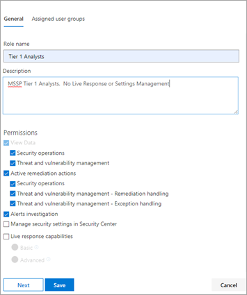
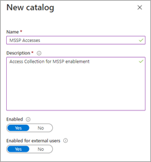
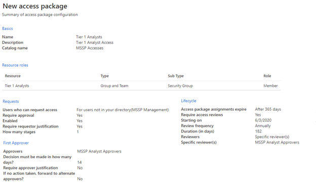
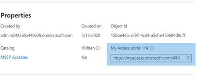

---
title: Grant access to managed security service provider (MSSP)
description: Take the necessary steps to configure the MSSP integration with Microsoft Defender ATP 
keywords: managed security service provider, mssp, configure, integration
search.product: eADQiWindows 10XVcnh
search.appverid: met150
ms.prod: w10
ms.mktglfcycl: deploy
ms.sitesec: library
ms.pagetype: security
ms.author: macapara
author: mjcaparas
ms.localizationpriority: medium
manager: dansimp
audience: ITPro
ms.collection: M365-security-compliance 
ms.topic: article
---

# Grant managed security service provider (MSSP) access

**Applies to:**

- [Microsoft Defender Advanced Threat Protection (Microsoft Defender ATP)](https://go.microsoft.com/fwlink/p/?linkid=2069559)

>Want to experience Microsoft Defender ATP? [Sign up for a free trial.](https://www.microsoft.com/microsoft-365/windows/microsoft-defender-atp?ocid=docs-mssp-support-abovefoldlink)

To implement a multi-tenant delegated access solution take the following steps:

1. Enable [role-based access control](rbac.md) in Microsoft Defender ATP and connect with Active Directory (AD) groups.

2. Configure [Governance Access Packages](https://docs.microsoft.com/azure/active-directory/governance/identity-governance-overview) for access request and provisioning.

3. Manage access requests and audits in [Microsoft Myaccess](https://docs.microsoft.com/azure/active-directory/governance/entitlement-management-request-approve).

## Enable role-based access controls in Microsoft Defender ATP

1. **Create access groups for MSSP resources in Customer AAD: Groups**

    These groups will be linked to the Roles you create in Microsoft Defender ATP. To do so, in the customer AD tenant, create 3 groups:  

    - Tier 1 Analyst 
    - Tier 2 Analyst 
    - MSSP Analyst Approvers  

2. Create Microsoft Defender ATP roles for appropriate access levels in Customer Micorosft Defender ATP.

    To enable RBAC in the customer Microsoft Defender Security Center, access **Settings > Permissions > Roles** and "Turn on roles", from a user account with Global Administrator or Security Administrator rights.

    

    Then, create RBAC roles to meet MSSP SOC Tier needs. Link these roles to the created user groups via “Assigned user groups”.

    Two possible roles:

    - **Tier 1 Analysts**  
      Perform all actions except for live response and manage security settings.

    - **Tier 2 Analysts**  
      Tier 1 capabilities with the addition to [ive response](live-response.md)

    For more information, see [Use role-based access control](rbac.md).

## Configure Governance Access Packages

1.	**Add MSSP as Connected Organization in Customer AAD: Identity Governance**
    
    Adding the MSSP as a connected organization will allow the MSSP to request and have accesses provisioned. 

    To do so, in the customer AD tenant, access Identity Governance: Connected organization. Add a new organization and search for your MSSP Analyst tenant via Tenant ID or Domain. It is recommended to create a separate AD tenant for your MSSP Analysts.

2. **Create a resource catalog in Customer AAD: Identity Governance**

    Resource catalogs are a logical collection of access packages, created in the customer AD tenant.

    To do so, in the customer AD tenant,  access Identity Governance: Catalogs, and add **New Catalog**. In our example, we will call it **MSSP Accesses**. 

    

    Further more information, see [Create a catalog of resources](https://docs.microsoft.com/azure/active-directory/governance/entitlement-management-catalog-create).

3. **Create access packages for MSSP resources Customer AAD: Identity Governance**

    Access packages are the collection of rights and accesses that a requestor will be granted upon approval. 

    To do so, in the customer AD tenant, access Identity Governance: Access Packages, and add **New Access Package**. Create an access package for the MSSP approvers and each analyst tier. For example, the following Tier 1 Analyst configuration creates an access package that:

    - Requires a member of the AD group **MSSP Analyst Approvers** to authorize new requests
    - Has annual access reviews, where the SOC analysts can request an access extension
    - Can only be requested by users in the MSSP SOC Tenant
    - Access auto expires after 365 days

    

    For more information, see [Create a new access package](https://docs.microsoft.com/azure/active-directory/governance/entitlement-management-access-package-create).

4. **Provide access request link to MSSP resources from Customer AAD: Identity Governance**

    The My Access portal link is used by MSSP SOC analysts to request access via the access packages created. The link is durable, meaning the same link may be used over time for new analysts. The analyst request goes into a queue for approval by the **MSSP Analyst Approvers**.

    

    The link is located on the overview page of each access package.

## Manage access 

1. Review and authorize access requests in Customer and/or MSSP myaccess.

    Access requests are managed in the customer My Access, by members of the MSSP Analyst Approvers group.

    To do so, access the customer’s myaccess using: 
    `https://myaccess.microsoft.com/@<Customer Domain >`. 

    Example:  `https://myaccess.microsoft.com/@M365x440XXX.onmicrosoft.com#/`   
2. Approve or deny requests in the **Approvals** section of the UI.

    At this point, analyst access has been provisioned, and each analyst should be able to access the customer’s Microsoft Defender Security Center: `https://securitycenter.Microsoft.com/?tid=<CustomerTenantId>`

## Related topics
- [Access the MSSP customer portal](access-mssp-portal.md)
- [Configure alert notifications](configure-mssp-notifications.md)
- [Fetch alerts from customer tenant](fetch-alerts-mssp.md)

 

