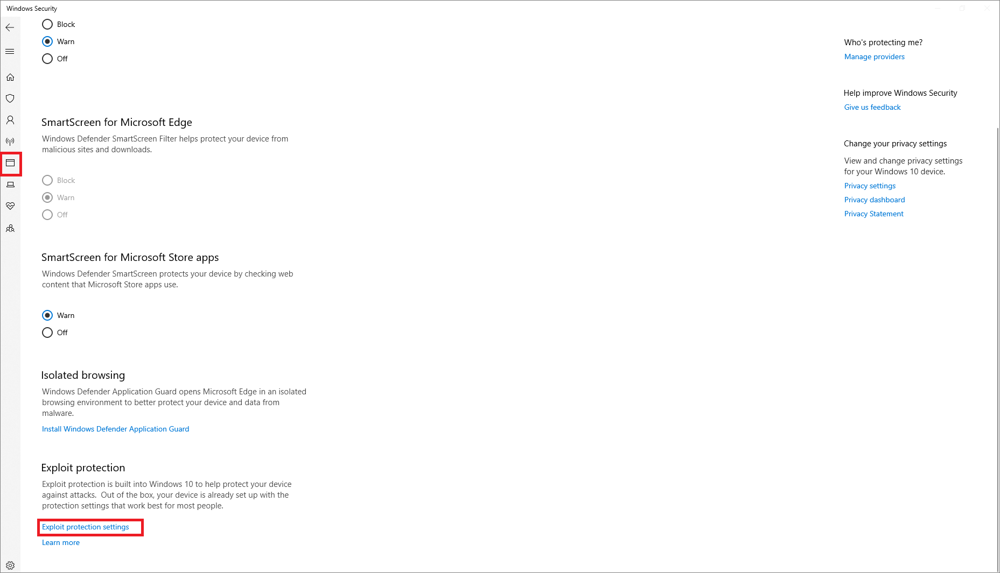
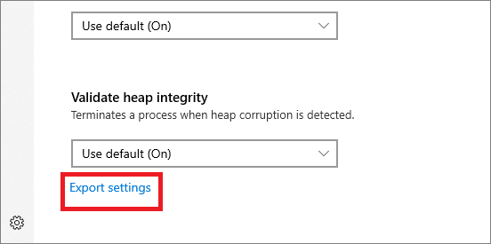
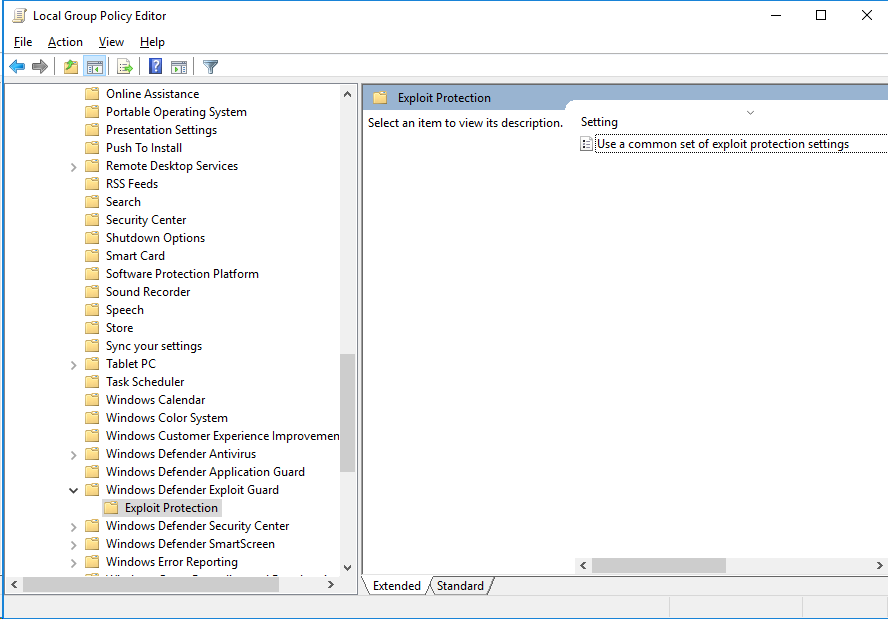

# Import, export, and deploy exploit protection configurations

**Applies to:**

* [Microsoft Defender Advanced Threat Protection (Microsoft Defender ATP)](microsoft-defender-advanced-threat-protection.md)

Exploit protection helps protect devices from malware that use exploits to spread and infect. It consists of a number of mitigations that can be applied at either the operating system level, or at the individual app level.

You use the Windows Security app or PowerShell to create a set of mitigations (known as a configuration). You can then export this configuration as an XML file and share it with multiple devices on your network. Then, they all have the same set of mitigation settings.

The [Evaluation Package](https://demo.wd.microsoft.com/Page/EP) contains a sample configuration file (name *ProcessMitigation.xml* (Selfhost v4) you can use to see how the XML structure looks. The sample file also contains settings that have been converted from an [Enhanced Mitigation Experience Toolkit (no longer supported)](https://support.microsoft.com/en-us/help/2458544/the-enhanced-mitigation-experience-toolkit) configuration. You can open the file in a text editor (such as Notepad) or import it directly into exploit protection and review the settings in the Windows Security app.

## Create and export a configuration file

Before you export a configuration file, you need to ensure you have the correct settings. First, configure exploit protection on a single, dedicated device. See [Customize exploit protection](customize-exploit-protection.md) for more information about configuring mitigations.

When you've configured exploit protection to your desired state (including both system-level and app-level mitigations), you can export the file using either the Windows Security app or PowerShell.

### Use the Windows Security app to export a configuration file

1. Open the Windows Security app by selecting the shield icon in the task bar. Or, search the start menu for **Defender**.

2. Select the **App & browser control** tile (or the app icon on the left menu bar) and then select **Exploit protection settings**:

    

3. At the bottom of the **Exploit protection** section, select **Export settings**. Choose the location and name of the XML file where you want the configuration to be saved.

    > [!IMPORTANT]
    > If you want to use Default configuration, use the settings "On by default" instead of "Use Default (On)" to get the settings exported correctly on the XML file.

    

    > [!NOTE]
    > When you export the settings, all settings for both app-level and system-level mitigations are saved. This means you don't need to export a file from both the **System settings** and **Program settings** sections—either section will export all settings.

### Use PowerShell to export a configuration file

1. Type **powershell** in the Start menu, right-click **Windows PowerShell** and select **Run as administrator**.
2. Enter the following cmdlet:

    ```PowerShell
    Get-ProcessMitigation -RegistryConfigFilePath filename.xml
    ```

    Change `filename` to any name or location of your choosing.

    Example command:

    `Get-ProcessMitigation -RegistryConfigFilePath C:\ExploitConfigfile.xml`

> [!IMPORTANT]
> When you deploy the configuration using Group Policy, all devices that will use the configuration must be able to access the configuration file. Ensure you place the file in a shared location.

## Import a configuration file

You can import an exploit protection configuration file that you've previously created. You can only use PowerShell to import the configuration file.

After importing, the settings will be instantly applied and can be reviewed in the Windows Security app.

### Use PowerShell to import a configuration file

1. Type **powershell** in the Start menu, right-click **Windows PowerShell** and select **Run as administrator**.
2. Enter the following cmdlet:

    ```PowerShell
    Set-ProcessMitigation -PolicyFilePath filename.xml
    ```

    Change `filename` to the location and name of the exploit protection XML file.

    Example command:

    `Set-ProcessMitigation -PolicyFilePath C:\ExploitConfigfile.xml`

> [!IMPORTANT]
>
> Ensure you import a configuration file that is created specifically for exploit protection.

## Manage or deploy a configuration

You can use Group Policy to deploy the configuration you've created to multiple devices in your network.

> [!IMPORTANT]
> When you deploy the configuration using Group Policy, all devices that will use the configuration must be able to access the configuration XML file. Ensure you place the file in a shared location.

### Use Group Policy to distribute the configuration

1. On your Group Policy management device, open the [Group Policy Management Console](https://docs.microsoft.com/previous-versions/windows/desktop/gpmc/group-policy-management-console-portal), right-click the Group Policy Object you want to configure and **Edit**.

2. In the **Group Policy Management Editor**, go to **Computer configuration** and select **Administrative templates**.

3. Expand the tree to **Windows components** > **Windows Defender Exploit Guard** > **Exploit protection**.

    

4. Double-click **Use a common set of Exploit protection settings** and set the option to **Enabled**.

5. In the **Options:** section, enter the location and file name of the Exploit protection configuration file that you want to use, such as in the following examples:

    * `C:\MitigationSettings\Config.XML`
    * `\\Server\Share\Config.xml`
    * `https://localhost:8080/Config.xml`
    * `C:\ExploitConfigfile.xml`

6. Select **OK** and [Deploy the updated GPO as you normally do](https://docs.microsoft.com/windows/win32/srvnodes/group-policy).

## See also

- [Protect devices from exploits](exploit-protection.md)
- [Evaluate exploit protection](evaluate-exploit-protection.md)
- [Enable exploit protection](enable-exploit-protection.md)
- [Configure and audit exploit protection mitigations](customize-exploit-protection.md)
