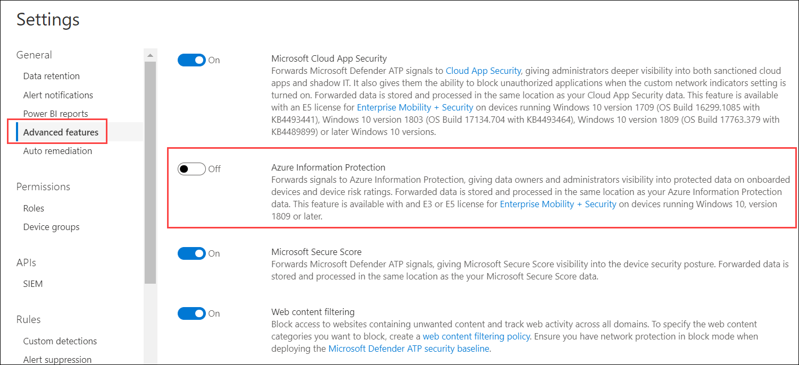
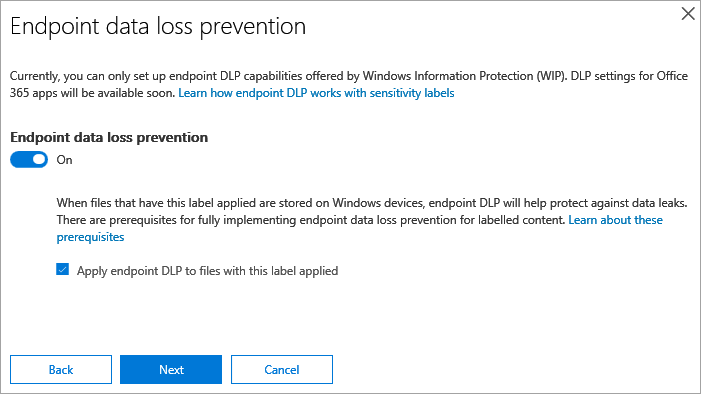

# Information protection in Windows overview
**Applies to:**
- [Microsoft Defender Advanced Threat Protection (Microsoft Defender ATP)](https://go.microsoft.com/fwlink/p/?linkid=2069559)

[!include[Prerelease information](prerelease.md)]

Information protection is an integral part of Microsoft 365 Enterprise suite, providing intelligent protection to keep sensitive data secure while enabling productivity in the workplace.


Microsoft Defender ATP is seamlessly integrated in Microsoft Threat Protection to provide a complete and comprehensive data loss prevention (DLP) solution for Windows devices. This solution is delivered and managed as part of the unified Microsoft 365 information protection suite. 

>[!TIP]
> Read our blog post about how [Microsoft Defender ATP integrates with Microsoft Information Protection to discover, protect, and monitor sensitive data on Windows devices](https://cloudblogs.microsoft.com/microsoftsecure/2019/01/17/windows-defender-atp-integrates-with-microsoft-information-protection-to-discover-protect-and-monitor-sensitive-data-on-windows-devices/).


Microsoft Defender ATP applies two methods to discover and protect data:
- **Data discovery** - Identify sensitive data on Windows devices at risk
- **Data protection** - Windows Information Protection (WIP) as outcome of Azure Information Protection label


## Data discovery 
Microsoft Defender ATP automatically discovers files with sensitivity labels on Windows devices when the feature is enabled. You can enable the Azure Information Protection integration feature from Microsoft Defender Security Center. For more information, see [Configure advanced features](advanced-features.md#azure-information-protection).




After enabling the Azure Information Protection integration, data discovery signals are immediately forwarded to Azure Information Protection from the device. When a labeled file is created or modified on a Windows device, Microsoft Defender ATP automatically reports the signal to Azure Information Protection.

The reported signals can be viewed on the Azure Information Protection - Data discovery dashboard.

### Azure Information Protection - Data discovery dashboard 
This dashboard presents a summarized discovery information of data discovered by both Microsoft Defender ATP and Azure Information Protection. Data from Microsoft Defender ATP is marked with Location Type - Endpoint. 


Notice the Device Risk column on the right, this device risk is derived directly from Microsoft Defender ATP, indicating the risk level of the security device where the file was discovered, based on the active security threats detected by Microsoft Defender ATP.

Clicking the device risk level will redirect you to the device page in Microsoft Defender ATP, where you can get a comprehensive view of the device security status and its active alerts. 


>[!NOTE]
>Microsoft Defender ATP does not currently report the Information Types. 

### Log Analytics 
Data discovery based on Microsoft Defender ATP is also available in [Azure Log Analytics](https://docs.microsoft.com/azure/log-analytics/log-analytics-overview), where you can perform complex queries over the raw data.

For more information on Azure Information Protection analytics, see [Central reporting for Azure Information Protection](https://docs.microsoft.com/azure/information-protection/reports-aip). 

Open Azure Log Analytics in Azure Portal and open a query builder (standard or classic). 

To view Microsoft Defender ATP data, perform a query that contains: 


```
InformationProtectionLogs_CL 
| where Workload_s == "Windows Defender" 
```

**Prerequisites:**
- Customers must have a subscription for Azure Information Protection.
- Enable Azure Information Protection integration in Microsoft Defender Security Center: 
    - Go to **Settings** in Microsoft Defender Security Center, click on **Advanced Settings** under **General**.


## Data protection 
For data to be protected, they must first be identified through labels. Sensitivity labels are created in Office Security and Compliance (SCC). Microsoft Defender ATP then uses the labels to identify endpoints that need Windows Information Protection (WIP) applied on them.


When you create sensitivity labels, you can set the information protection functionalities that will be applied on the file. The setting that applies to Microsoft Defender ATP is the Data loss prevention. You'll need to turn on the Data loss prevention and select Enable Windows end point protection (DLP for devices). 




Once, the policy is set and published, Microsoft Defender ATP automatically enables WIP for labeled files. When a labeled file is created or modified on a Windows device, Microsoft Defender ATP automatically detects it and enables WIP on that file if its label corresponds with Office Security and Compliance (SCC) policy. 

This functionality expands the coverage of WIP to protect files based on their label, regardless of their origin. 

For more information, see [Configure information protection in Windows](information-protection-in-windows-config.md).


## Related topics
- [How Windows Information Protection protects files with a sensitivity label](https://docs.microsoft.com/windows/security/information-protection/windows-information-protection/how-wip-works-with-labels)