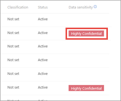
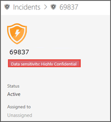
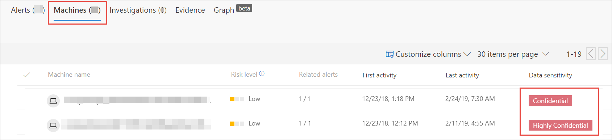

# Use sensitivity labels to prioritize incident response  

**Applies to:**

- [Microsoft Defender Advanced Threat Protection (Microsoft Defender ATP)](https://go.microsoft.com/fwlink/p/?linkid=2069559)

A typical advanced persistent threat lifecycle involves data exfiltration. In a security incident, it's important to have the ability to prioritize investigations where sensitive files may be jeopardy so that corporate data and information are protected.

Microsoft Defender ATP helps to make the prioritization of security incidents much simplier with the use of sensitivity labels. Sensitivity labels quickly identify incidents that may involve machines with sensitive information such as confidential information. 

## Investigate incidents that involve sensitive data
Learn how to use data sensitivity labels to prioritize incident investigation.

1. In Microsoft Defender Security Center, select **Incidents**. 

2. Scroll to the right to see the **Data sensitivity** column. This column reflects sensitivity labels that have been observed on machines related to the incidents providing an indication of whether sensitive files may be impacted by the incident.

    

3. Open the incident page to further investigate.

    

4. Select the **Machines** tab to identify machines storing files with sensitivity labels.

    

5. Select the machines that store sensitive data and search through the timeline to identify which files may be impacted then take appropriate action to ensure that data is protected. 

>[!NOTE] 
> The event side pane now provides additional insight to the WIP and AIP protection status.  

>[!TIP]
>These data points are also exposed through the ‘FileCreationEvents’ in advanced hunting, allowing advanced queries and schedule detection to take into account sensitivity labels and file protection status. 