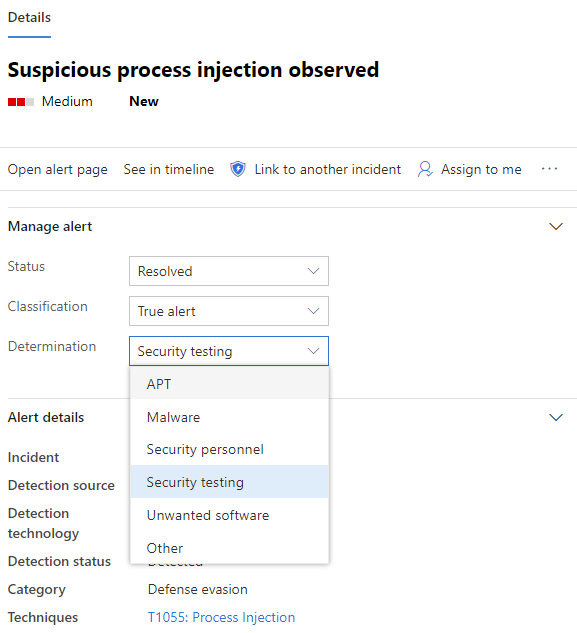
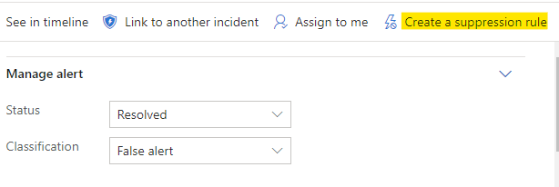

# Investigate alerts in Microsoft Defender for Endpoint

[!INCLUDE [Microsoft 365 Defender rebranding](../../includes/microsoft-defender.md)]

**Applies to:**
- [Microsoft Defender for Endpoint](https://go.microsoft.com/fwlink/p/?linkid=2146631)
- [Microsoft 365 Defender](https://go.microsoft.com/fwlink/?linkid=2118804)

>Want to experience Defender for Endpoint? [Sign up for a free trial.](https://www.microsoft.com/microsoft-365/windows/microsoft-defender-atp?ocid=docs-wdatp-investigatealerts-abovefoldlink) 

Investigate alerts that are affecting your network, understand what they mean, and how to resolve them.

Select an alert from the alerts queue to go to alert page. This view contains the alert title, the affected assets, the details side pane, and the alert story.

From the alert page, begin your investigation by selecting the affected assets or any of the entities under the alert story tree view. The details pane automatically populates with further information about what you selected. To see what kind of information you can view here, read [Review alerts in Microsoft Defender for Endpoint](https://docs.microsoft.com/windows/security/threat-protection/microsoft-defender-atp/review-alerts).

## Investigate using the alert story

The alert story details why the alert was triggered, related events that happened before and after, as well as other related entities.

Entities are clickable and every entity that isn't an alert is expandable using the expand icon on the right side of that entity's card. The entity in focus will be indicated by a blue stripe to the left side of that entity's card, with the alert in the title being in focus at first.

Expand entities to view details at a glance. Selecting an entity will switch the context of the details pane to this entity, and will allow you to review further information, as well as manage that entity. Selecting *...* to the right of the entity card will reveal all actions available for that entity. These same actions appear in the details pane when that entity is in focus.

> [!NOTE]
> The alert story section may contain more than one alert, with additional alerts related to the same execution tree appearing before or after the alert you've selected.

## Take action from the details pane

Once you've selected an entity of interest, the details pane will change to display information about the selected entity type, historic information when it's available, and offer controls to **take action** on this entity directly from the alert page.

Once you're done investigating, go back to the alert you started with, mark the alert's status as **Resolved** and classify it as either **False alert** or **True alert**. Classifying alerts helps tune this capability to provide more true alerts and less false alerts.

If you classify it as a true alert, you can also select a determination, as shown in the image below.

If you are experiencing a false alert with a line-of-business application, create a suppression rule to avoid this type of alert in the future.

> [!TIP]
> If you're experiencing any issues not described above, use the 🙂 button to provide feedback or open a support ticket.

## Related topics
- [View and organize the Microsoft Defender for Endpoint Alerts queue](alerts-queue.md)
- [Manage Microsoft Defender for Endpoint alerts](manage-alerts.md)
- [Investigate a file associated with a Defender for Endpoint alert](investigate-files.md)
- [Investigate devices in the Defender for Endpoint Devices list](investigate-machines.md)
- [Investigate an IP address associated with a Defender for Endpoint alert](investigate-ip.md)
- [Investigate a domain associated with a Defender for Endpoint alert](investigate-domain.md)
- [Investigate a user account in Defender for Endpoint](investigate-user.md)

