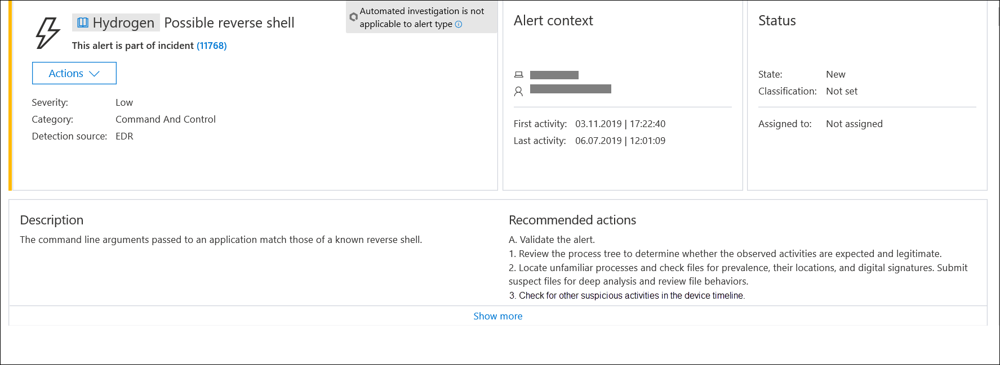
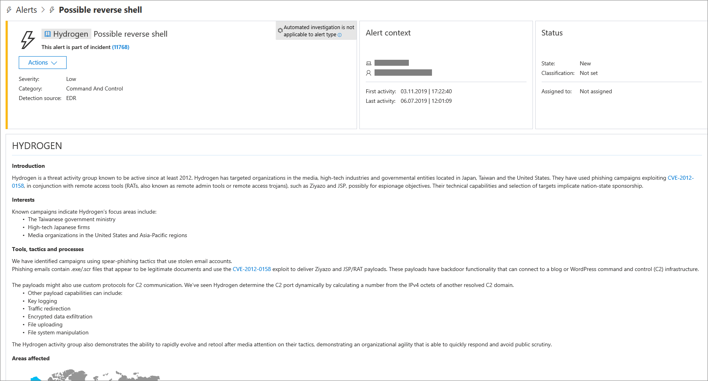
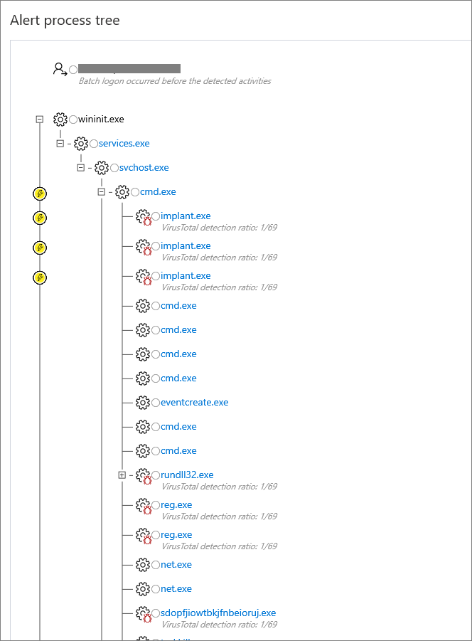
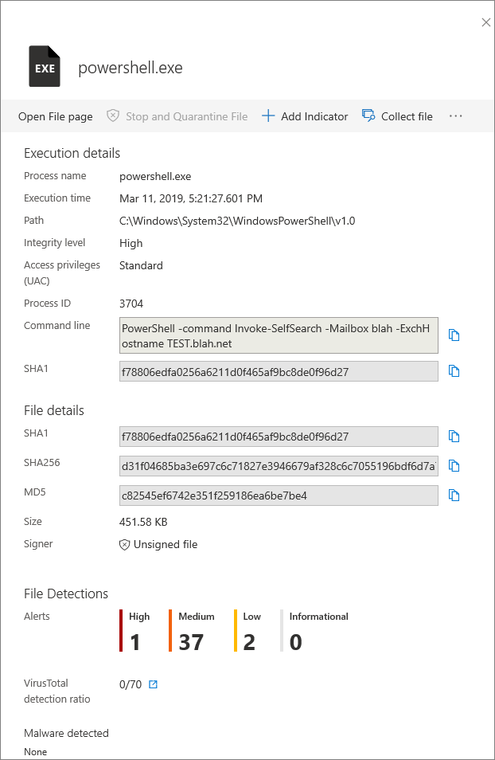
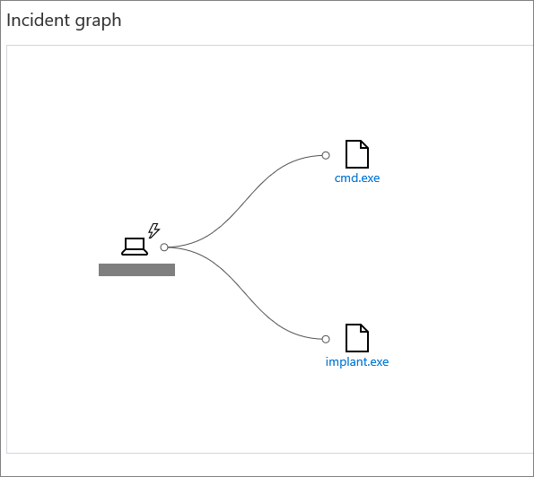
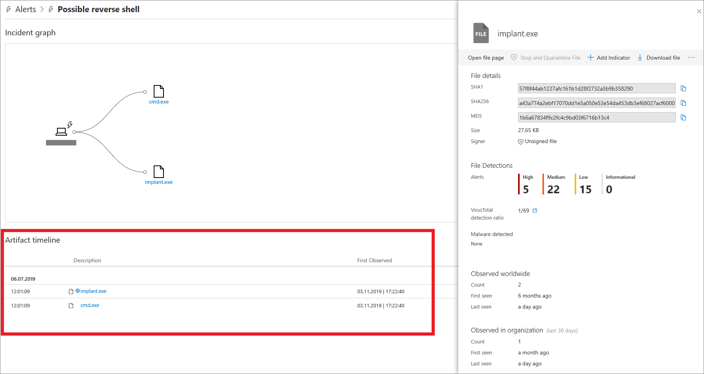

# Investigate Microsoft Defender Advanced Threat Protection alerts

**Applies to:**

- [Microsoft Defender Advanced Threat Protection (Microsoft Defender ATP)](https://go.microsoft.com/fwlink/p/?linkid=2069559)

>Want to experience Microsoft Defender ATP? [Sign up for a free trial.](https://www.microsoft.com/WindowsForBusiness/windows-atp?ocid=docs-wdatp-investigatealerts-abovefoldlink) 

Investigate alerts that are affecting your network, understand what they mean, and how to resolve them.

Click an alert to see the alert details view and the various tiles that provide information about the alert.

You can also manage an alert and see alert metadata along with other information that can help you make better decisions on how to approach them. You'll also see a status of the automated investigation on the upper right corner. Clicking on the link will take you to the Automated investigations view. For more information, see [Automated investigations](automated-investigations.md).

The alert context tile shows the where, who, and when context of the alert. As with other pages, you can click on the icon beside the name or user account to bring up the machine or user details pane. The alert details view also has a status tile that shows the status of the alert in the queue. You'll also see a description and a set of recommended actions which you can expand.

For more information about managing alerts, see [Manage alerts](manage-alerts.md).

The alert details page also shows the alert process tree, an incident graph, and an artifact timeline.

You can click on the machine link from the alert view to navigate to the machine. The alert will be highlighted automatically, and the timeline will display the appearance of the alert and its evidence in the **Machine timeline**. If the alert appeared more than once on the machine, the latest occurrence will be displayed in the **Machine timeline**.

Alerts attributed to an adversary or actor display a colored tile with the actor's name.

Click on the actor's name to see the threat intelligence profile of the actor, including a brief overview of the actor, their interests or targets, their tools, tactics, and processes (TTPs), and areas where they've been observed worldwide. You will also see a set of recommended actions to take.

Some actor profiles include a link to download a more comprehensive threat intelligence report.

The detailed alert profile helps you understand who the attackers are, who they target, what techniques, tools, and procedures (TTPs) they use, which geolocations they are active in, and finally, what recommended actions you may take. In many cases, you can download a more detailed Threat Intelligence report about this attacker or campaign for offline reading.

## Alert process tree
The **Alert process tree** takes alert triage and investigation to the next level, displaying the aggregated alert and surrounding evidence that occurred within the same execution context and time period. This rich triage and investigation context is available on the alert page.

The **Alert process tree** expands to display the execution path of the alert and related evidence that occurred around the same period. Items marked with a thunderbolt icon should be given priority during investigation.

>[!NOTE]
>The alert process tree might not be available in some alerts.

Clicking in the circle immediately to the left of the indicator displays its details.

The alert details pane helps you take a deeper look at the details about the alert. It displays rich information about the execution details, file details, detections, observed worldwide, observed in organization, and other details taken from the entity's page –  while remaining on the alert page, so you never leave the current context of your investigation.  

## Incident graph
The **Incident Graph**  provides a visual representation of the organizational footprint of the alert and its evidence: where the evidence that triggered the alert was observed on other machines. It provides a graphical mapping from the original machine and evidence expanding to show other machines in the organization where the triggering evidence was also observed.

The **Incident Graph** supports expansion by File, Process, command line, or Destination IP Address, as appropriate.

The **Incident Graph** expansion by destination IP Address, shows the organizational footprint of communications with this IP Address without having to change context by navigating to the IP Address page.

You can click the full circles on the incident graph to expand the nodes and view the expansion to other machines where the matching criteria were observed.

## Artifact timeline
The **Artifact timeline** feature provides an additional view of the evidence that triggered the alert on the machine, and shows the date and time the evidence triggering the alert was observed, as well as the first time it was observed on the machine. This can help in understanding if the evidence was first observed at the time of the alert, or whether it was observed on the machine earlier - without triggering an alert.

Selecting an alert detail brings up the **Details pane** where you'll be able to see more information about the alert such as file details, detections, instances of it observed worldwide, and in the organization.

## Related topics
- [View and organize the Microsoft Defender Advanced Threat Protection Alerts queue](alerts-queue.md)
- [Manage Microsoft Defender Advanced Threat Protection alerts](manage-alerts.md)
- [Investigate a file associated with a Microsoft Defender ATP alert](investigate-files.md)
- [Investigate machines in the Microsoft Defender ATP Machines list](investigate-machines.md)
- [Investigate an IP address associated with a Microsoft Defender ATP alert](investigate-ip.md)
- [Investigate a domain associated with a Microsoft Defender ATP alert](investigate-domain.md)
- [Investigate a user account in Microsoft Defender ATP](investigate-user.md)

