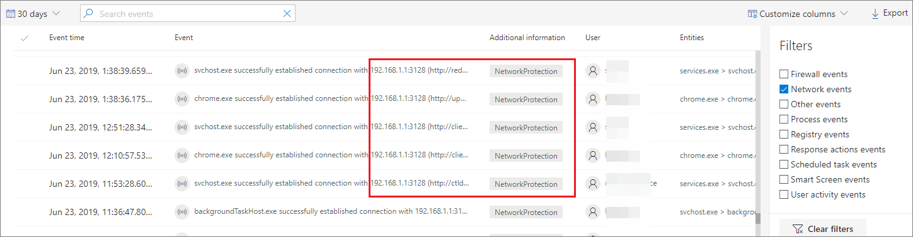
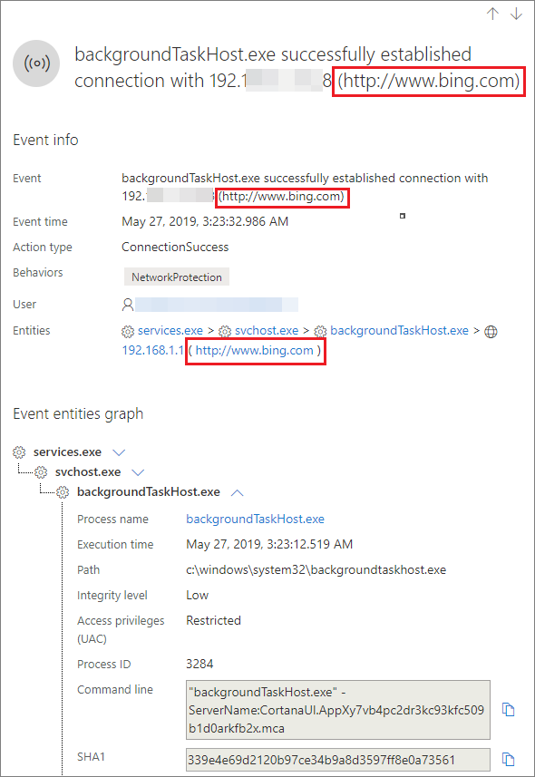
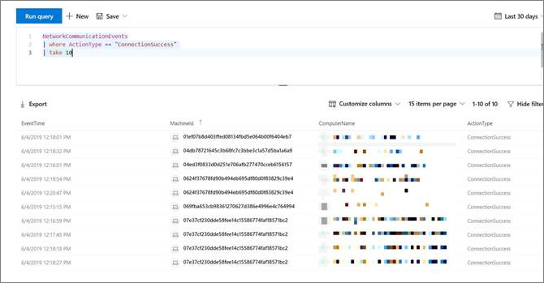

# Investigate connection events that occur behind forward proxies

**Applies to:**

- [Microsoft Defender Advanced Threat Protection (Microsoft Defender ATP)](https://go.microsoft.com/fwlink/p/?linkid=2069559)

>Want to experience Microsoft Defender ATP? [Sign up for a free trial.](https://www.microsoft.com/en-us/WindowsForBusiness/windows-atp?ocid=docs-wdatp-investigatemachines-abovefoldlink)

Microsoft Defender ATP supports network connection monitoring from different levels of the network stack. A challenging case is when the network uses a forward proxy as a gateway to the Internet.

The proxy acts as if it was the target endpoint.  In these cases, simple network connection monitors will audit the connections with the proxy which is correct but has lower investigation value. 

Microsoft Defender ATP supports advanced HTTP level monitoring through network protection. When turned on, a new type of event is surfaced which exposes the real target domain names.

## Use network protection to monitor network connection behind a firewall
Monitoring network connection behind a forward proxy is possible due to additional network events that originate from network protection. To see them on a machine timeline, turn network protection on (at the minimum in audit mode). 

Network protection can be controlled using the following modes:

- **Block** <br> Users or apps will be blocked from connecting to dangerous domains. You will be able to see this activity in Windows Defender Security Center.
- **Audit** <br> Users or apps will not be blocked from connecting to dangerous domains. However, you will still see this activity in Microsoft Defender Security Center.


If you turn network protection off, users or apps will not be blocked from connecting to dangerous domains. You will not see any network activity in Microsoft Defender Security Center.

If you do not configure it, network blocking will be turned off by default.

For more information, see [Enable network protection](https://docs.microsoft.com/windows/security/threat-protection/windows-defender-exploit-guard/enable-network-protection)

## Investigation impact
When network protection is turned on, you'll see that on a machine's timeline the IP address will keep representing the proxy, while the real target address shows up.



Additional events triggered by the network protection layer are now available to surface the real domain names even behind a proxy.

Event's information:



## Hunt for connection events using advanced hunting 
All new connection events are available for you to hunt on through advanced hunting as well. Since these events are connection events, you can find them under the NetworkCommunicationEvents table under the ‘ConnecionSuccess’ action type.

Using this simple query will show you all the relevant events:

```
NetworkCommunicationEvents
| where ActionType == "ConnectionSuccess" 
| take 10
```



You can also filter out  events that are related to connection to the proxy itself. 

Use the following query to filter out the connections to the proxy:

```
NetworkCommunicationEvents
| where ActionType == "ConnectionSuccess" and RemoteIP != "ProxyIP"  
| take 10
```


## Related topics
- [Applying network protection with GP - policy CSP](https://docs.microsoft.com/windows/client-management/mdm/policy-csp-defender#defender-enablenetworkprotection)
- [Protect your network](https://docs.microsoft.comwindows/security/threat-protection/windows-defender-exploit-guard/network-protection-exploit-guard)