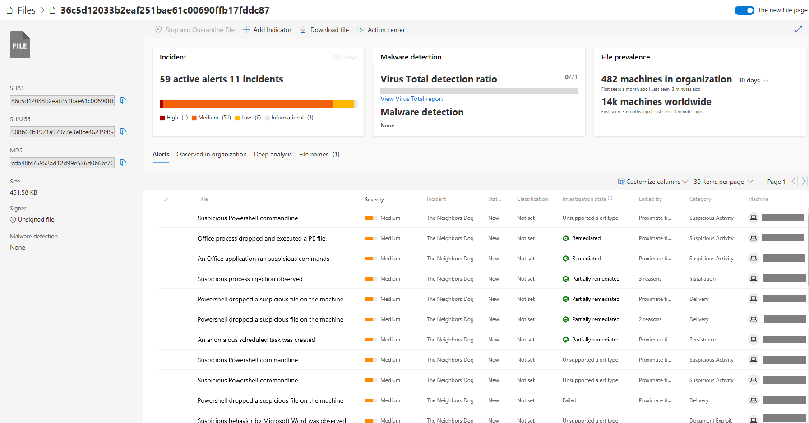
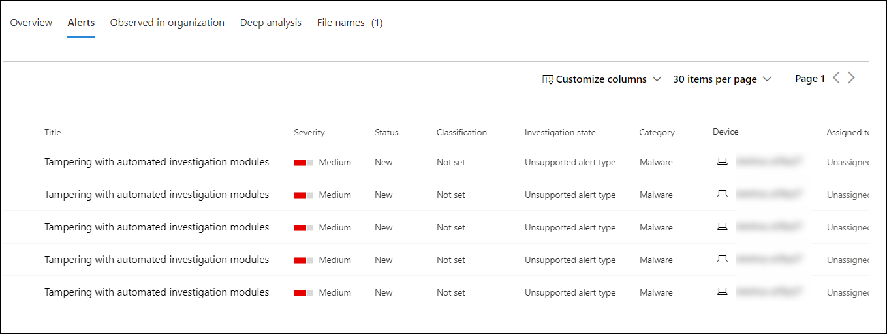

# Investigate a file associated with a Microsoft Defender ATP alert

**Applies to:**

- [Microsoft Defender Advanced Threat Protection (Microsoft Defender ATP)](https://go.microsoft.com/fwlink/p/?linkid=2069559)

[!include[Prerelease information](prerelease.md)]

>Want to experience Microsoft Defender ATP? [Sign up for a free trial.](https://www.microsoft.com/WindowsForBusiness/windows-atp?ocid=docs-wdatp-investigatefiles-abovefoldlink)

Investigate the details of a file associated with a specific alert, behavior, or event to help determine if the file exhibits malicious activities, identify the attack motivation, and understand the potential scope of the breach.

There are many ways to access the detailed profile page of a specific file. For example, you can  use the search feature, click on a link from the **Alert process tree**, **Incident graph**, **Artifact timeline**, or select an event listed in the **Machine timeline**.

Once on the detailed profile page, you can switch between the new and old page layouts by toggling **new File page**. The rest of this article describes the newer page layout.

You can get information from the following sections in the file view:

- File details, Malware detection, File prevalence
- Deep analysis
- Alerts
- Observed in organization
- Deep analysis
- File names

You can also take action on a file from this page.

## File actions

Along the top of the profile page, above the file information cards. Actions you can perform here include:

- Stop and quarantine
- Add/edit indicator
- Download file
- Consult a threat expert
- Action center

For more information on these actions, see [Take response action on a file](respond-file-alerts.md).

## File details, Malware detection, and File prevalence

The file details, incident, malware detection, and file prevalence cards display various attributes about the file.

You'll see details such as the file’s MD5, the Virus Total detection ratio, and Windows Defender AV detection if available, and the file’s prevalence, both worldwide and within your organizations.

## Alerts

The **Alerts** tab provides a list of alerts that are associated with the file. This list covers much of the same information as the Alerts queue, except for the machine group, if any, the affected machine belongs to. You can choose what kind of information is shown by selecting **Customize columns** from the toolbar above the column headers.

## Observed in organization

The **Observed in organization** tab allows you to specify a date range to see which devices have been observed with the file.

>[!NOTE]
>This tab will show a maximum number of 100 machines. To see _all_ devices with the file, export the tab to a CSV file, by selecting **Export** from the action menu above the tab's column headers.

Use the slider or the range selector to quickly specify a time period that you want to check for events involving the file. You can specify a time window as small as a single day. This will allow you to see only files that communicated with that IP Address at that time, drastically reducing unnecessary scrolling and searching.

## Deep analysis

The **Deep analysis** tab allows you to [submit the file for deep analysis](respond-file-alerts.md#deep-analysis), to uncover more details about the file's behavior, as well as the effect it is having within your organizations. After you submit the file, the deep analysis report will appear in this tab once results are available. If deep analysis did not find anything, the report will be empty and the results space will remain blank.

## File names

The **File names** tab lists all names the file has been observed to use, within your organizations.

## Related topics

- [View and organize the Microsoft Defender Advanced Threat Protection Alerts queue](alerts-queue.md)
- [Manage Microsoft Defender Advanced Threat Protection alerts](manage-alerts.md)
- [Investigate Microsoft Defender Advanced Threat Protection alerts](investigate-alerts.md)
- [Investigate machines in the Microsoft Defender ATP Machines list](investigate-machines.md)
- [Investigate an IP address associated with a Microsoft Defender ATP alert](investigate-ip.md)
- [Investigate a domain associated with a Microsoft Defender ATP alert](investigate-domain.md)
- [Investigate a user account in Microsoft Defender ATP](investigate-user.md)
- [Take response actions on a file](respond-file-alerts.md)
