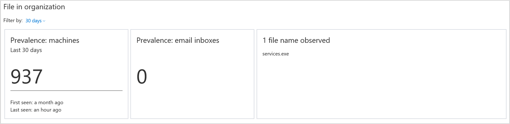

# Investigate a file associated with a Microsoft Defender ATP alert

**Applies to:**

- [Microsoft Defender Advanced Threat Protection (Microsoft Defender ATP)](https://go.microsoft.com/fwlink/p/?linkid=2069559)

>Want to experience Microsoft Defender ATP? [Sign up for a free trial.](https://www.microsoft.com/en-us/WindowsForBusiness/windows-atp?ocid=docs-wdatp-investigatefiles-abovefoldlink) 

Investigate the details of a file associated with a specific alert, behavior, or event to help determine if the file exhibits malicious activities, identify the attack motivation, and understand the potential scope of the breach.

You can investigate files by using the search feature, clicking on a link from the **Alert process tree**, **Incident graph**, **Artifact timeline**, or from an event listed in the **Machine timeline**.

You can get information from the following sections in the file view:

- File details, Malware detection, Prevalence worldwide
- Deep analysis
- Alerts related to this file
- File in organization
- Most recent observed machines with file

## File worldwide and Deep analysis
The file details, malware detection, and prevalence worldwide sections display various attributes about the file. You’ll see actions you can take on the file. For more information on how to take action on a file, see [Take response action on a file](respond-file-alerts.md).

You'll see details such as the file’s MD5, the VirusTotal detection ratio and Windows Defender AV detection if available, and the file’s prevalence worldwide. You'll also be able to [submit a file for deep analysis](respond-file-alerts.md#deep-analysis).

## Alerts related to this file
The **Alerts related to this file** section provides a list of alerts that are associated with the file. This list is a simplified version of the Alerts queue, and shows the date when the last activity was detected, a short description of the alert, the user associated with the alert, the alert's severity, the alert's status in the queue, and who is addressing the alert.

## File in organization
The **File in organization** section provides details on the prevalence of the file, prevalence in email inboxes and the name observed in the organization.

## Most recent observed machines with the file
The **Most recent observed machines with the file** section allows you to specify a date range to see which machines have been observed with the file.

This allows for greater accuracy in defining entities to display such as if and when an entity was observed in the organization. For example, if you’re trying to identify the origin of a network communication to a certain IP Address within a 10-minute period on a given date, you can specify that exact time interval, and see only files that communicated with that IP Address at that time, drastically reducing unnecessary scrolling and searching.

## Related topics
- [View and organize the Microsoft Defender Advanced Threat Protection Alerts queue](alerts-queue.md)
- [Manage Microsoft Defender Advanced Threat Protection alerts](manage-alerts.md)
- [Investigate Microsoft Defender Advanced Threat Protection alerts](investigate-alerts.md)
- [Investigate machines in the Microsoft Defender ATP Machines list](investigate-machines.md)
- [Investigate an IP address associated with a Microsoft Defender ATP alert](investigate-ip.md)
- [Investigate a domain associated with a Microsoft Defender ATP alert](investigate-domain.md)
- [Investigate a user account in Microsoft Defender ATP](investigate-user.md)