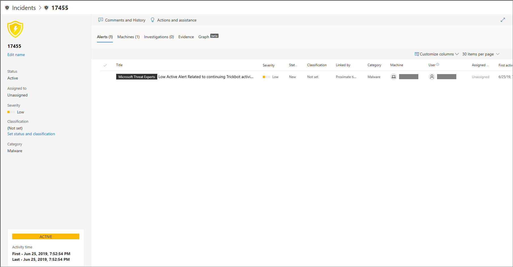
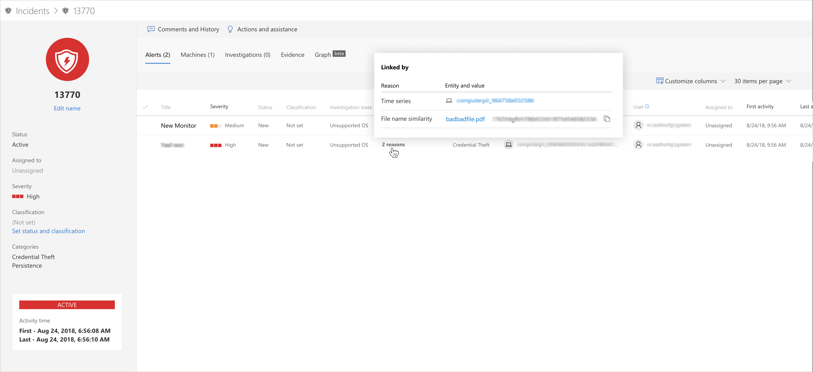
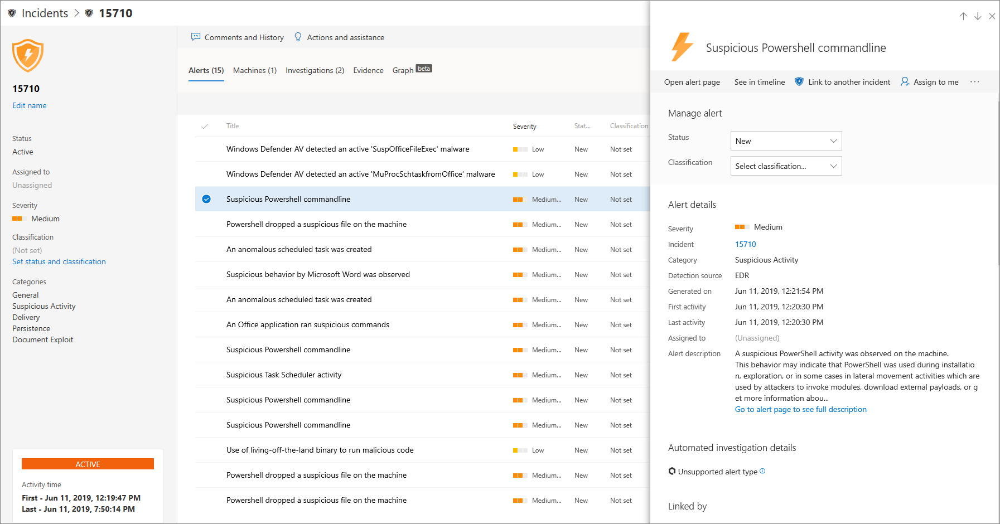
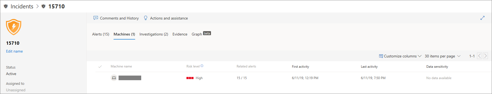
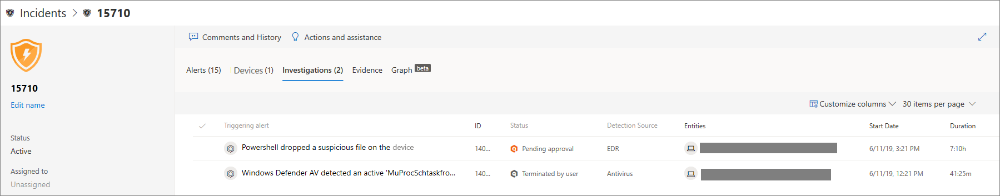
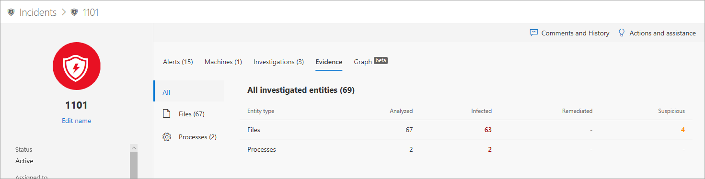
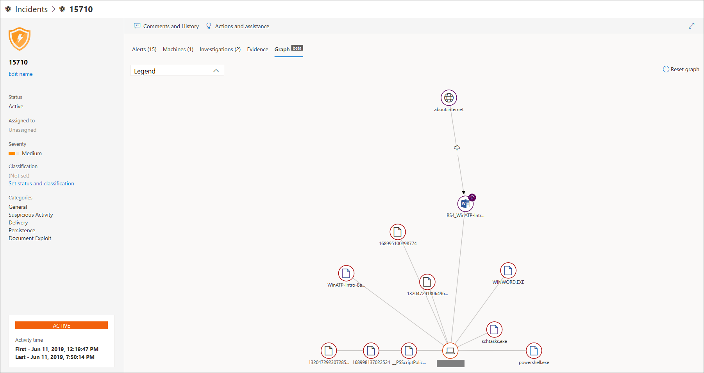
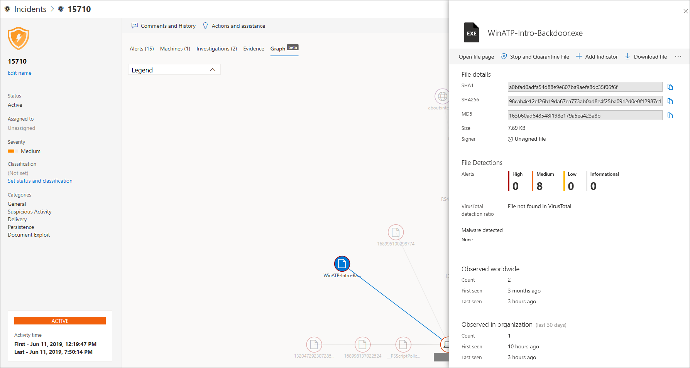

# Investigate incidents in Microsoft Defender ATP

**Applies to:**
- [Microsoft Defender Advanced Threat Protection (Microsoft Defender ATP)](https://go.microsoft.com/fwlink/p/?linkid=2069559)

Investigate incidents that affect your network, understand what they mean, and collate evidence to resolve them. 

## Analyze incident details 
Click an incident to see the **Incident pane**. Select **Open incident page** to see the incident details and related information (alerts, machines, investigations, evidence, graph). 

### Alerts
You can investigate the alerts and see how they were linked together in an incident. 
Alerts are grouped into incidents based on the following reasons:
- Automated investigation - The automated investigation triggered the linked alert while investigating the original alert 
- File characteristics - The files associated with the alert have similar characteristics
- Manual association - A user manually linked the alerts
- Proximate time - The alerts were triggered on the same machine within a certain timeframe
- Same file - The files associated with the alert are exactly the same
- Same URL - The URL that triggered the alert is exactly the same

You can also manage an alert and see alert metadata along with other information. For more information, see [Investigate alerts](investigate-alerts.md). 

### Machines
You can also investigate the machines that are part of, or related to, a given incident. For more information, see [Investigate machines](investigate-machines.md).

### Investigations
Select **Investigations** to see all the automatic investigations launched by the system in response to the incident alerts.

## Going through the evidence
Microsoft Defender Advanced Threat Protection automatically investigates all the incidents' supported events and suspicious entities in the alerts, providing you with auto-response and information about the important files, processes, services, and more. This helps quickly detect and block potential threats in the incident. 
Each of the analyzed entities will be marked as infected, remediated, or suspicious. 

## Visualizing associated cybersecurity threats 
Microsoft Defender Advanced Threat Protection aggregates the threat information into an incident so you can see the patterns and correlations coming in from various data points. You can view such correlation through the incident graph.

### Incident graph
The **Graph** tells the story of the cybersecurity attack. For example, it shows you what was the entry point, which indicator of compromise or activity was observed on which machine. etc.

You can click the circles on the incident graph to view the details of the malicious files, associated file detections, how many instances has there been worldwide, whether it’s been observed in your organization, if so, how many instances.

## Related topics
- [Incidents queue](incidents-queue.md)
- [View and organize the Incidents queue](view-incidents-queue.md)
- [Manage incidents](manage-incidents.md)

