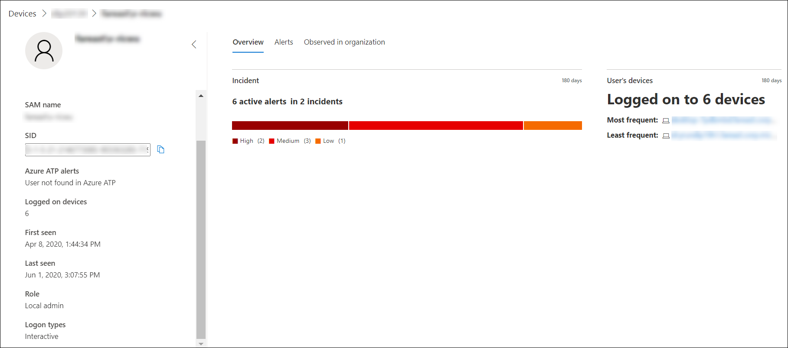

# Investigate a user account in Microsoft Defender ATP

[!INCLUDE [Microsoft 365 Defender rebranding](../../includes/microsoft-defender.md)]

**Applies to:**

- [Microsoft Defender Advanced Threat Protection (Microsoft Defender ATP)](https://go.microsoft.com/fwlink/p/?linkid=2069559)

>Want to experience Microsoft Defender ATP? [Sign up for a free trial.](https://www.microsoft.com/microsoft-365/windows/microsoft-defender-atp?ocid=docs-wdatp-investigatgeuser-abovefoldlink)

## Investigate user account entities

Identify user accounts with the most active alerts (displayed on dashboard as "Users at risk") and investigate cases of potential compromised credentials, or pivot on the associated user account when investigating an alert or device to identify possible lateral movement between devices with that user account.

You can find user account information in the following views:

- Dashboard
- Alert queue
- Device details page

A clickable user account link is available in these views, that will take you to the user account details page where more details about the user account are shown.

When you investigate a user account entity, you'll see:

- User account details, Azure Advanced Threat Protection (Azure ATP) alerts, and logged on devices, role, logon type, and other details
- Overview of the incidents and user's devices
- Alerts related to this user
- Observed in organization (devices logged on to)

### User details

The **User details** pane on left provides information about the user, such as related open incidents, active alerts, SAM name, SID, Azure ATP alerts, number of devices the user is logged on to, when the user was first and last seen, role, and logon types. Depending on the integration features you've enabled, you'll see other details. For example, if you enable the Skype for business integration, you'll be able to contact the user from the portal. The **Azure ATP alerts** section contains a link that will take you to the Azure ATP page, if you have enabled the Azure ATP feature, and there are alerts related to the user. The Azure ATP page will provide more information about the alerts.

>[!NOTE]
>You'll need to enable the integration on both Azure ATP and Microsoft Defender ATP to use this feature. In Microsoft Defender ATP, you can enable this feature in advanced features. For more information on how to enable advanced features, see [Turn on advanced features](advanced-features.md).

The Overview, Alerts, and Observed in organization are different tabs that display various attributes about the user account.

### Overview

The **Overview** tab shows the incidents details and a list of the devices that the user has logged on to. You can expand these to see details of the log-on events for each device.

### Alerts

The **Alerts** tab provides a list of alerts that are associated with the user account. This list is a filtered view of the [Alert queue](alerts-queue.md), and shows alerts where the user context is the selected user account, the date when the last activity was detected, a short description of the alert, the device associated with the alert, the alert's severity, the alert's status in the queue, and who is assigned the alert.

### Observed in organization

The **Observed in organization** tab allows you to specify a date range to see a list of devices where this user was observed logged on to, the most frequent and least frequent logged on user account for each of these devices, and total observed users on each device.

Selecting an item on the Observed in organization table will expand the item, revealing more details about the device. Directly selecting a link within an item will send you to the corresponding page.

## Search for specific user accounts

1. Select **User** from the **Search bar** drop-down menu.
2. Enter the user account in the **Search** field.
3. Click the search icon or press **Enter**.

A list of users matching the query text is displayed. You'll see the user account's domain and name, when the user account was last seen, and the total number of devices it was observed logged on to in the last 30 days.

You can filter the results by the following time periods:

- 1 day
- 3 days
- 7 days
- 30 days
- 6 months

## Related topics

- [View and organize the Microsoft Defender Advanced Threat Protection Alerts queue](alerts-queue.md)
- [Manage Microsoft Defender Advanced Threat Protection alerts](manage-alerts.md)
- [Investigate Microsoft Defender Advanced Threat Protection alerts](investigate-alerts.md)
- [Investigate a file associated with a Microsoft Defender ATP alert](investigate-files.md)
- [Investigate devices in the Microsoft Defender ATP Devices list](investigate-machines.md)
- [Investigate an IP address associated with a Microsoft Defender ATP alert](investigate-ip.md)
- [Investigate a domain associated with a Microsoft Defender ATP alert](investigate-domain.md)
