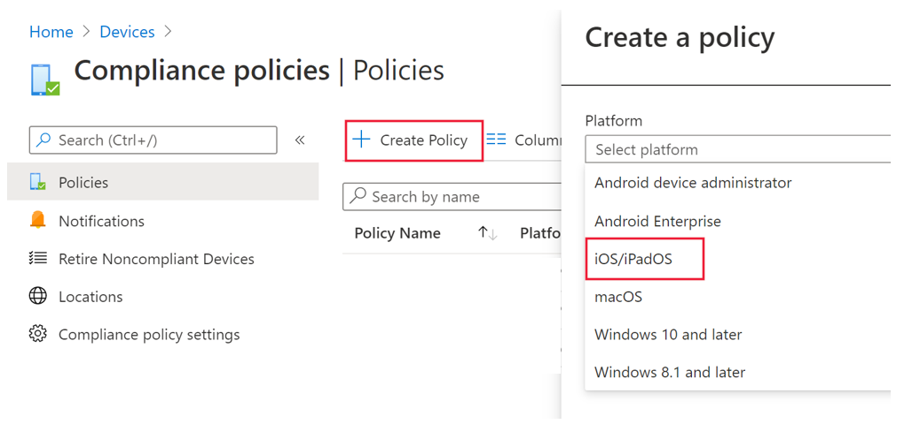
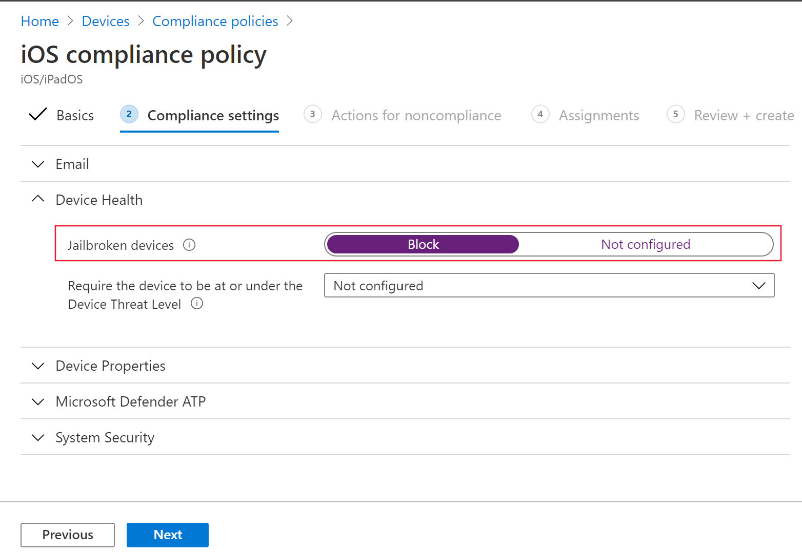
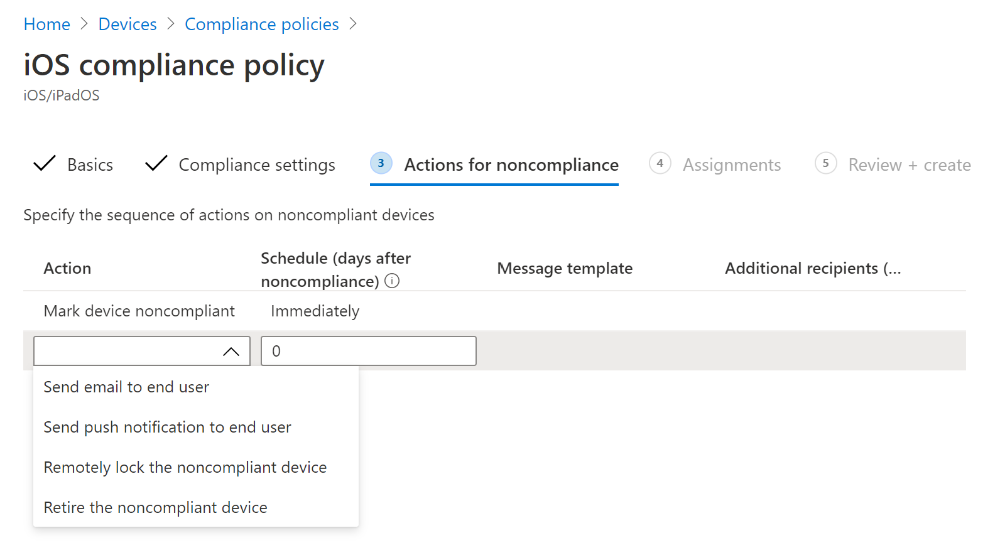
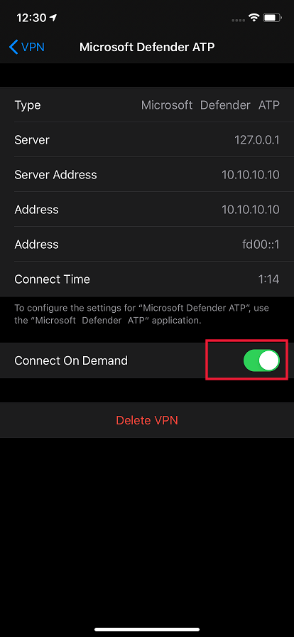

# Configure Microsoft Defender for Endpoint for iOS features

[!INCLUDE [Microsoft 365 Defender rebranding](../../includes/microsoft-defender.md)]

> [!NOTE]
> Defender for Endpoint for iOS would use a VPN in order to provide the Web Protection feature. This is not a regular VPN and is a local/self-looping VPN that does not take traffic outside the device.

## Configure compliance policy against jailbroken devices

To protect corporate data from being accessed on jailbroken iOS devices, we recommend that you set up the following compliance policy on Intune.

> [!NOTE]
> At this time Microsoft Defender for Endpoint for iOS does not provide protection against jailbreak scenarios. If used on a jailbroken device, then in specific scenarios data that is used by the application like your corporate email id and corporate profile picture (if available) can be exposed locally

Follow the steps below to create a compliance policy against jailbroken devices.

1. In [Microsoft Endpoint Manager admin center](https://go.microsoft.com/fwlink/?linkid=2109431), go to **Devices** -> **Compliance policies** -> click on **Create Policy**. Select "iOS/iPadOS" as platform and click **Create**.

    > [!div class="mx-imgBorder"]
    > 

1. Specify a name of the policy, example "Compliance Policy for Jailbreak".
1. In the compliance settings page, click to expand **Device Health** section and click **Block** for **Jailbroken devices** field.

    > [!div class="mx-imgBorder"]
    > 

1. In the *Action for noncompliance* section, select the actions as per your requirements and click **Next**.

    > [!div class="mx-imgBorder"]
    > 

1. In the *Assignments* section, select the user groups that you want to include for this policy and then click **Next**.
1. In the **Review+Create** section, verify that all the information entered is correct and then select **Create**.

## Configure custom indicators

Defender for Endpoint for iOS enables admins to configure custom indicators on iOS devices as well. Refer to [Manage indicators](https://docs.microsoft.com/windows/security/threat-protection/microsoft-defender-atp/manage-indicators) on how to configure custom indicators.

> [!NOTE]
> Defender for Endpoint for iOS supports creating custom indicators only for IP addresses and URLs/domains.

## Web Protection and VPN

By default, Defender for Endpoint for iOS includes and enables the web protection feature. [Web protection](web-protection-overview.md) helps to secure devices against web threats and protect users from phishing attacks. Defender for Endpoint for iOS uses a VPN in order to provide this protection. Please note this is a local VPN and unlike traditional VPN, network traffic is not sent outside the device.

While enabled by default, there might be some cases that require you to disable VPN. For example, you want to run some apps that do not work when a VPN is configured. In such cases, you can choose to disable VPN from the app on the device by following the steps below:

1. On your iOS device, open the **Settings** app, click or tap **General** and then **VPN**.
1. Click or tap the "i" button for Microsoft Defender ATP.
1. Toggle off **Connect On Demand** to disable VPN.

    > [!div class="mx-imgBorder"]
    > 

> [!NOTE]
> Web Protection will not be available when VPN is disabled. To re-enable Web Protection, open the Microsoft Defender for Endpoint app on the device and click or tap **Start VPN**.

### Co-existence of multiple VPN profiles

Apple iOS does not support multiple device-wide VPNs to be active simultaneously. While multiple VPN profiles can exist on the device, only one VPN can be active at a time.

## Report unsafe site

Phishing websites impersonate trustworthy websites for the purpose of obtaining your personal or financial information. Visit the [Provide feedback about network protection](https://www.microsoft.com/wdsi/filesubmission/exploitguard/networkprotection) page if you want to report a website that could be a phishing site.
