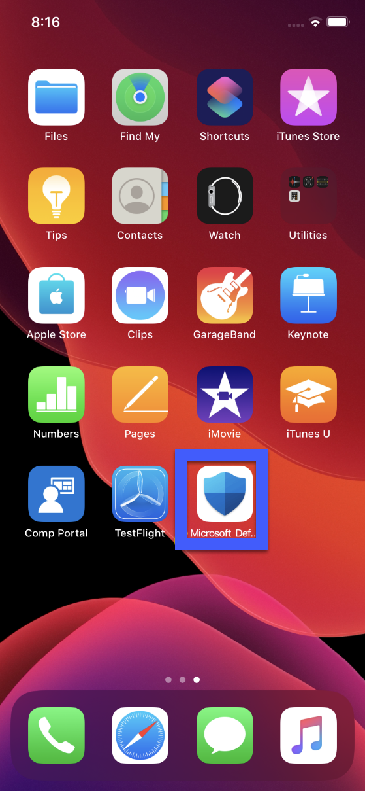
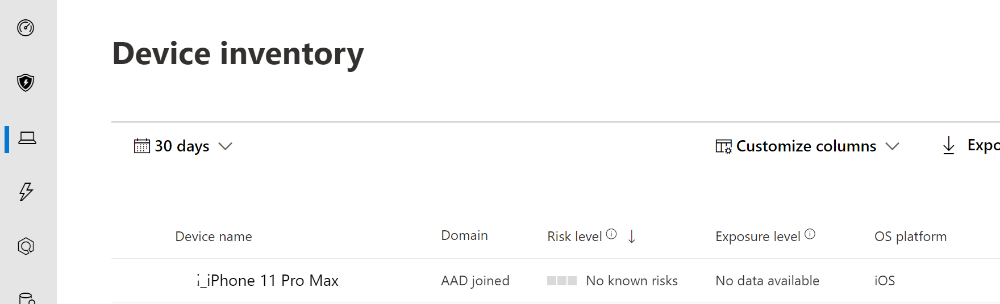

# App-based deployment for Microsoft Defender ATP for iOS

> [!IMPORTANT]
> **PUBLIC PREVIEW EDITION**
> 
> This documentation is for a pre-release solution. The guidelines and the solution are subject to change between now and its general availability.
> 
> As with any pre-release solution, remember to exercise caution when determining the target population for your deployments.

During Public Preview, Microsoft Defender ATP for iOS will be available on
TestFlight (Apple’s Beta testing platform). End-users can directly deploy the
app from TestFlight.

Deployment devices need to be enrolled on Intune Company portal. Refer to
[Enroll your
device](https://docs.microsoft.com/en-us/mem/intune/enrollment/ios-enroll) to
learn more about Intune device enrollment

## Before you begin

-   Ensure you have access to [Microsoft Endpoint manager admin
    center](https://go.microsoft.com/fwlink/?linkid=2109431).

-   Ensure iOS enrollment is done for your users. Users need to have MDATP
    license assigned in order to use MDATP for iOS. Refer [Assign licenses to
    users](https://docs.microsoft.com/azure/active-directory/users-groups-roles/licensing-groups-assign)
    for instructions on how to assign licenses

>[!NOTE]
>During Public Preview Microsoft Defender ATP for iOS will be available on TestFlight. In GA, Microsoft Defender ATP will be available on the Apple App store. 

## Deployment steps

To install Microsoft Defender ATP for iOS, end-users can visit
<https://aka.ms/defenderios> on their iOS devices. This link will open the
TestFlight application on their device or prompt them to install TestFlight. On
the TestFlight app, follow the onscreen instructions to install Microsoft
Defender ATP.

## Complete onboarding and check status

1.  Once Microsoft Defender ATP for iOS has been installed on the device, you
    will see the app icon

    

2.  Tap the Microsoft Defender ATP app icon and follow the on-screen
    instructions to complete the onboarding steps. The details include end-user
    acceptance of iOS permissions required by Microsoft Defender ATP for iOS.

3.  Upon successful onboarding, the device will start showing up on the Devices
    list in Microsoft Defender Security Center.

    

## Next Steps

[Configure Microsoft Defender ATP for iOS features](ios-configure-features.md)
