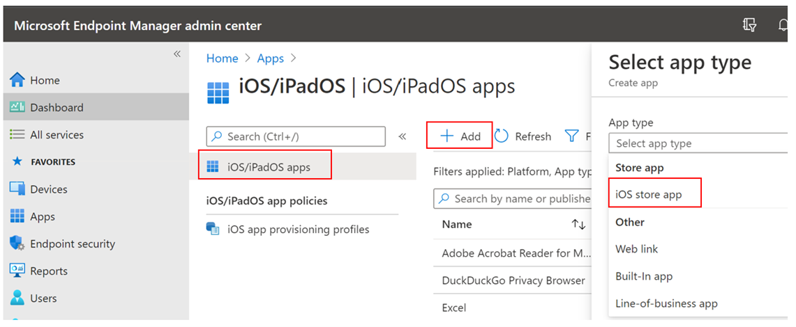
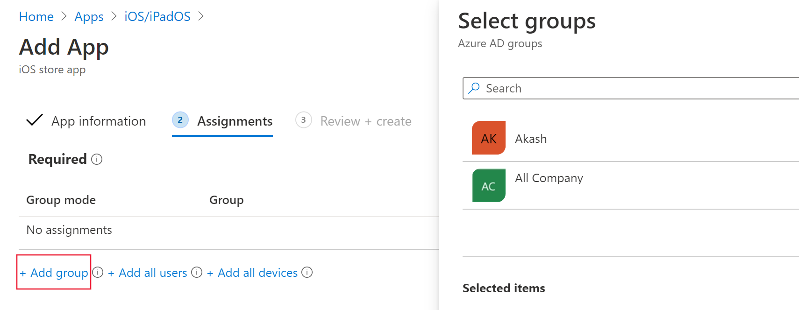
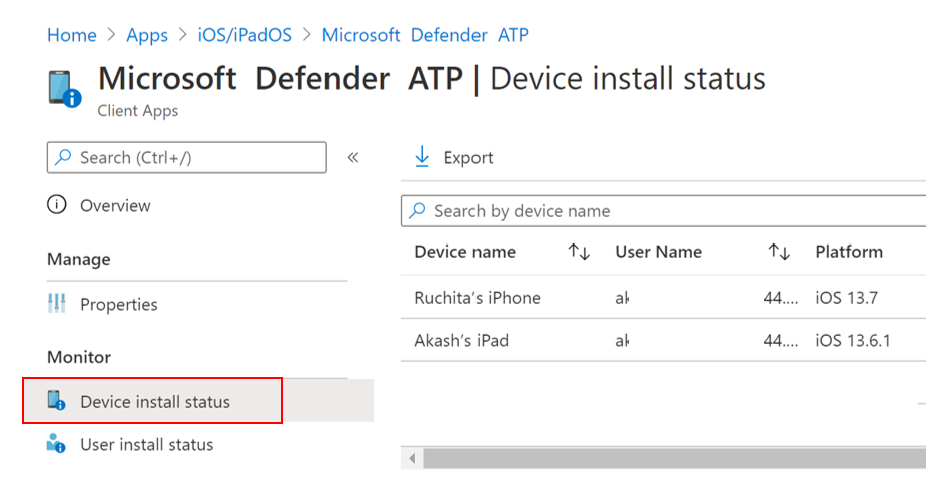
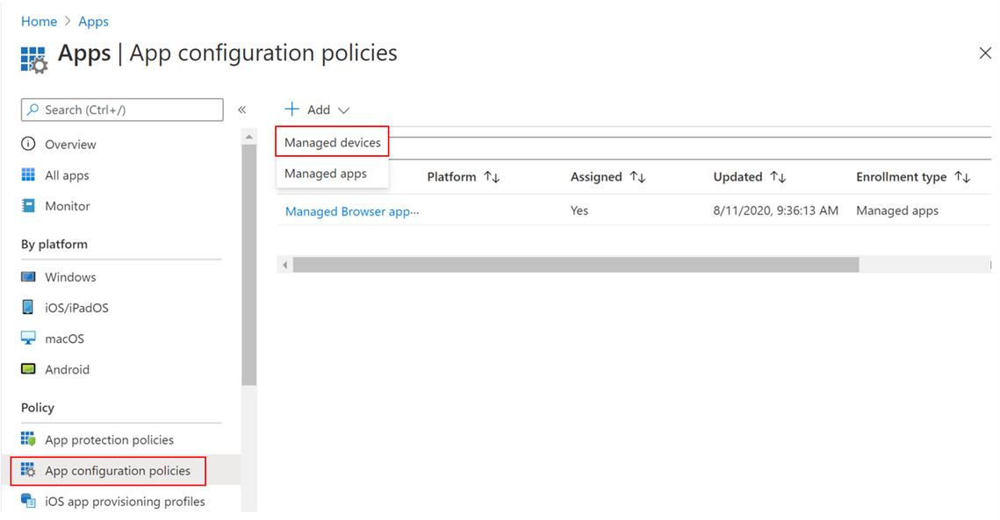
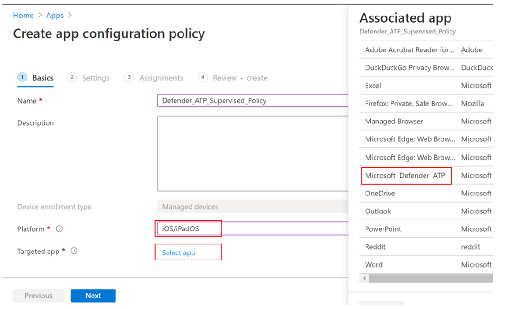
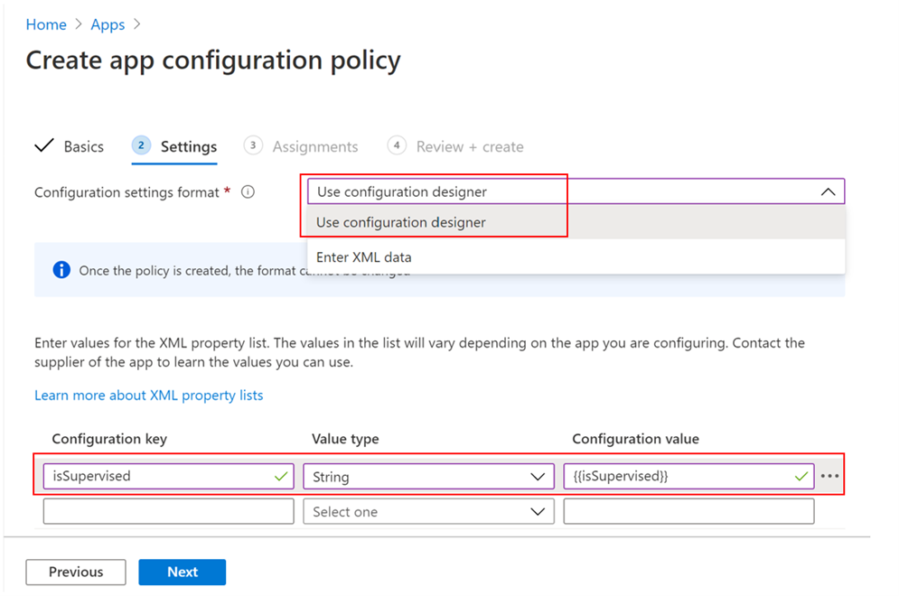
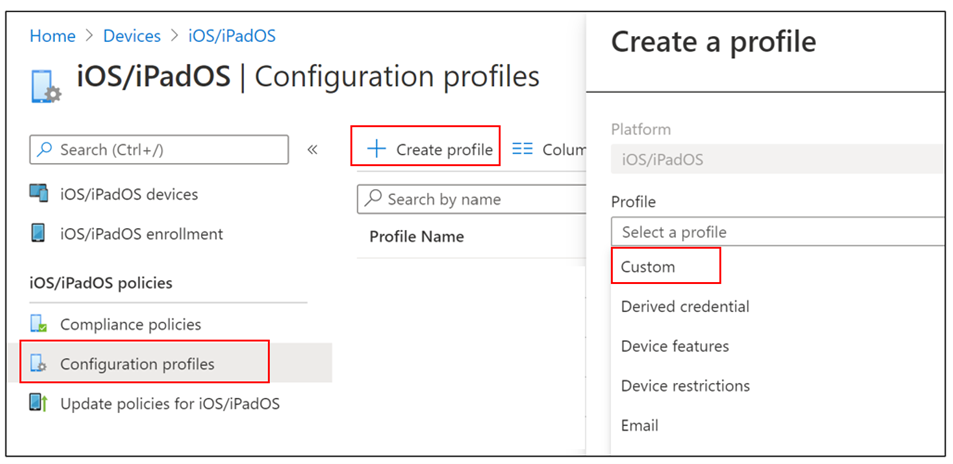

# Deploy Microsoft Defender for Endpoint for iOS

[!INCLUDE [Microsoft 365 Defender rebranding](../../includes/microsoft-defender.md)]

**Applies to:**
- [Microsoft Defender for Endpoint](https://go.microsoft.com/fwlink/p/?linkid=2146631)
- [Microsoft 365 Defender](https://go.microsoft.com/fwlink/?linkid=2118804)

> Want to experience Defender for Endpoint? [Sign up for a free trial.](https://www.microsoft.com/microsoft-365/windows/microsoft-defender-atp?ocid=docs-wdatp-investigateip-abovefoldlink)

This topic describes deploying Defender for Endpoint for iOS on Intune Company Portal enrolled devices. For more information about Intune device enrollment, see [Enroll iOS/iPadOS devices in Intune](https://docs.microsoft.com/mem/intune/enrollment/ios-enroll).

## Before you begin

- Ensure you have access to [Microsoft Endpoint manager admin center](https://go.microsoft.com/fwlink/?linkid=2109431).

- Ensure iOS enrollment is done for your users. Users need to have a Defender for Endpoint license assigned in order to use Defender for Endpoint for iOS. Refer to [Assign licenses to users](https://docs.microsoft.com/azure/active-directory/users-groups-roles/licensing-groups-assign) for instructions on how to assign licenses.

> [!NOTE]
> Microsoft Defender ATP (Microsoft Defender for Endpoint) for iOS is now available in the [Apple App Store](https://aka.ms/mdatpiosappstore).

## Deployment steps

Deploy Defender for Endpoint for iOS via Intune Company Portal.

### Add iOS store app

1. In [Microsoft Endpoint manager admin center](https://go.microsoft.com/fwlink/?linkid=2109431), go to **Apps** -> **iOS/iPadOS** -> **Add** -> **iOS store app** and click **Select**.

    > [!div class="mx-imgBorder"]
    > 

1. On the Add app page, click on **Search the App Store** and type **Microsoft Defender ATP** in the search bar. In the search results section, click on *Microsoft Defender ATP* and click **Select**.

1. Select **iOS 11.0** as the Minimum operating system. Review the rest of information about the app and click **Next**.

1. In the *Assignments* section, go to the **Required** section and select **Add group**. You can then choose the user group(s) that you would like to target Defender for Endpoint for iOS app. Click **Select** and then **Next**.

    > [!NOTE]
    > The selected user group should consist of Intune enrolled users.

    > [!div class="mx-imgBorder"]
    > 

1. In the *Review + Create* section, verify that all the information entered is correct and then select **Create**. In a few moments, the Defender for Endpoint app should be created successfully, and a notification should show up at the top-right corner of the page.

1. In the app information page that is displayed, in the **Monitor** section, select **Device install status** to verify that the device installation has completed successfully.

    > [!div class="mx-imgBorder"]
    > 

## Complete onboarding and check status

1. Once Defender for Endpoint for iOS has been installed on the device, you
    will see the app icon.

    

2. Tap the Defender for Endpoint app icon and follow the on-screen instructions to complete the onboarding steps. The details include end-user acceptance of iOS permissions required by Defender for Endpoint for iOS.

3. Upon successful onboarding, the device will start showing up on the Devices list in Microsoft Defender Security Center.

    > [!div class="mx-imgBorder"]
    > 

## Configure Microsoft Defender for Endpoint for Supervised Mode

The Microsoft Defender for Endpoint for iOS app has specialized ability on supervised iOS/iPadOS devices, given the increased management capabilities provided by the platform on these types of devices. To take advantage of these capabilities, the Defender for Endpoint app needs to know if a device is in Supervised Mode.

### Configure Supervised Mode via Intune

Intune allows you to configure the Defender for iOS app through an App Configuration policy.

   > [!NOTE]
   > This app configuration policy for supervised devices is applicable only to managed devices and should be targeted for all managed iOS devices as a best practice.

1. Sign in to the [Microsoft Endpoint Manager admin center](https://go.microsoft.com/fwlink/?linkid=2109431) and go to **Apps** > **App configuration policies** > **Add**. Click on **Managed devices**.

    > [!div class="mx-imgBorder"]
    > 

1. In the *Create app configuration policy* page, provide the following information:
    - Policy Name
    - Platform: Select iOS/iPadOS
    - Targeted app: Select **Microsoft Defender ATP** from the list

    > [!div class="mx-imgBorder"]
    > 

1. In the next screen, select **Use configuration designer** as the format. Specify the following property:
    - Configuration Key: issupervised
    - Value type: String
    - Configuration Value: {{issupervised}}
    
    > [!div class="mx-imgBorder"]
    > 

1. Click **Next** to open the **Scope tags** page. Scope tags are optional. Click **Next** to continue.

1. On the **Assignments** page, select the groups that will receive this profile. For this scenario, it is best practice to target **All Devices**. For more information on assigning profiles, see [Assign user and device profiles](https://docs.microsoft.com/mem/intune/configuration/device-profile-assign).

   When deploying to user groups, a user must sign in to a device before the policy applies.

   Click **Next**.

1. On the **Review + create** page, when you're done, choose **Create**. The new profile is displayed in the list of configuration profiles.

1. Next, for enhanced Anti-phishing capabilities, you can deploy a custom profile on the supervised iOS devices. Follow the steps below:
    - Download the config profile from [https://aka.ms/mdatpiossupervisedprofile](https://aka.ms/mdatpiossupervisedprofile)
    - Navigate to **Devices** -> **iOS/iPadOS** -> **Configuration profiles** -> **Create Profile**

    > [!div class="mx-imgBorder"]
    > 

    - Provide a name of the profile. When prompted to import a Configuration profile file, select the one downloaded above.
    - In the **Assignment** section, select the device group to which you want to apply this profile. As a best practice, this should be applied to all managed iOS devices. Click **Next**.
    - On the **Review + create** page, when you're done, choose **Create**. The new profile is displayed in the list of configuration profiles.

## Next Steps

[Configure Defender for Endpoint for iOS features](ios-configure-features.md)
