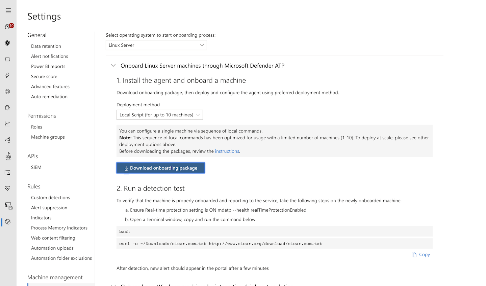

# Deploy Microsoft Defender ATP for Linux manually

**Applies to:**

- [Microsoft Defender Advanced Threat Protection (Microsoft Defender ATP) for Linux](microsoft-defender-atp-linux.md)

This article describes how to deploy Microsoft Defender ATP for Linux manually. A successful deployment requires the completion of all of the following tasks:

- [Configure the Linux software repository](#configure-the-linux-software-repository)
- [Application installation](#application-installation)
- [Download the onboarding package](#download-the-onboarding-package)
- [Client configuration](#client-configuration)

## Prerequisites and system requirements

Before you get started, see [Microsoft Defender ATP for Linux](microsoft-defender-atp-linux.md) for a description of prerequisites and system requirements for the current software version.

## Configure the Linux software repository

Microsoft Defender ATP for Linux can be deployed from one of the following channels (denoted below as *[channel]*): *insiders-fast*, *insiders-slow*, or *prod*. Each of these channels corresponds to a Linux software repository. Instructions for configuring your device to use one of these repositories are provided below.

The choice of the channel determines the type and frequency of updates that are offered to your device. Devices in *insiders-fast* are the first ones to receive updates and new features, followed later by *insiders-slow* and lastly by *prod*.

In order to preview new features and provide early feedback, it is recommended that you configure some devices in your enterprise to use either *insiders-fast* or *insiders-slow*.

> [!WARNING]
> Switching the channel after the initial installation requires the product to be reinstalled. To switch the product channel: uninstall the existing package, re-configure your device to use the new channel, and follow the steps in this document to install the package from the new location.

### RHEL and variants (CentOS and Oracle Linux)

- Note your distribution and version, and identify the closest entry for it under `https://packages.microsoft.com/config/`.

    In the below commands, replace *[distro]* and *[version]* with the information you've identified:

    > [!NOTE]
    > In case of Oracle Linux, replace *[distro]* with “rhel”.

    ```bash
    sudo yum-config-manager --add-repo=https://packages.microsoft.com/config/[distro]/[version]/[channel].repo
    ```

    For example, if you are running CentOS 7 and wish to deploy MDATP for Linux from the *insiders-fast* channel:

    ```bash
    sudo yum-config-manager --add-repo=https://packages.microsoft.com/config/centos/7/insiders-fast.repo
    ```

- Install the Microsoft GPG public key:

    ```bash
    curl https://packages.microsoft.com/keys/microsoft.asc > microsoft.asc
    ```

    ```bash
    sudo rpm --import microsoft.asc
    ```

- Install `yum-utils` if it is not already installed:

    ```bash
    sudo yum install yum-utils
    ```

- Download and make usable all the metadata for the currently enabled yum repositories:

    ```bash
    yum makecache
    ```

### SLES and variants

- Note your distribution and version, and identify the closest entry for it under `https://packages.microsoft.com/config/`.

    In the following commands, replace *[distro]* and *[version]* with the information you've identified:

    ```bash
    sudo zypper addrepo -c -f -n microsoft-[channel] https://packages.microsoft.com/config/[distro]/[version]/[channel].repo
    ```

    For example, if you are running SLES 12 and wish to deploy MDATP for Linux from the *insiders-fast* channel:

    ```bash
    sudo zypper addrepo -c -f -n microsoft-insiders-fast https://packages.microsoft.com/config/sles/12/insiders-fast.repo
    ```

- Install the Microsoft GPG public key:

    ```bash
    curl https://packages.microsoft.com/keys/microsoft.asc > microsoft.asc
    ```

    ```bash
    rpm --import microsoft.asc
    ```

### Ubuntu and Debian systems

- Install `curl` if it is not already installed:

    ```bash
    sudo apt-get install curl
    ```

- Install `libplist-utils` if it is not already installed:

    ```bash
    sudo apt-get install libplist-utils
    ```

- Note your distribution and version, and identify the closest entry for it under `https://packages.microsoft.com/config`.

    In the below command, replace *[distro]* and *[version]* with the information you've identified:

    ```bash
    curl -o microsoft.list https://packages.microsoft.com/config/[distro]/[version]/[channel].list
    ```

    For example, if you are running Ubuntu 18.04 and wish to deploy MDATP for Linux from the *insiders-fast* channel:

    ```bash
    curl -o microsoft.list https://packages.microsoft.com/config/ubuntu/18.04/insiders-fast.list
    ```

- Install the repository configuration:

    ```bash
    sudo mv ./microsoft.list /etc/apt/sources.list.d/microsoft-[channel].list
    ```

- Install the gpg package if not already installed:

    ```bash
    sudo apt-get install gpg
    ```

- Install the Microsoft GPG public key:

    ```bash
    curl https://packages.microsoft.com/keys/microsoft.asc | sudo apt-key add -
    ```

- Install the https driver if it's not already present:

    ```bash
    sudo apt-get install apt-transport-https
    ```

- Update the repository metadata:

    ```bash
    sudo apt-get update
    ```

## Application installation

- RHEL and variants (CentOS and Oracle Linux):

    ```bash
    sudo yum install mdatp
    ```

- SLES and variants:

    ```bash
    sudo zypper install mdatp
    ```

- Ubuntu and Debian system:

    ```bash
    sudo apt-get install mdatp
    ```

## Download the onboarding package

Download the onboarding package from Microsoft Defender Security Center:

1. In Microsoft Defender Security Center, go to **Settings > Machine Management > Onboarding**.
2. In the first drop-down menu, select **Linux Server** as the operating system. In the second drop-down menu, select **Local Script (for up to 10 machines)** as the deployment method.
3. Select **Download onboarding package**. Save the file as WindowsDefenderATPOnboardingPackage.zip.

    

4. From a command prompt, verify that you have the file.
    Extract the contents of the archive:

    ```bash
    ls -l
    ```

    `total 8`
    `-rw-r--r-- 1 test  staff  5752 Feb 18 11:22 WindowsDefenderATPOnboardingPackage.zip`

    ```bash
    unzip WindowsDefenderATPOnboardingPackage.zip
    ```

    `Archive:  WindowsDefenderATPOnboardingPackage.zip`
    `inflating: WindowsDefenderATPOnboarding.py`

## Client configuration

1. Copy WindowsDefenderATPOnboarding.py to the target machine.

    Initially the client machine is not associated with an organization. Note that the *orgId* attribute is blank:

    ```bash
    mdatp --health orgId
    ```

2. Run WindowsDefenderATPOnboarding.py, and note that, in order to run this command, you must have `python` installed on the device:

    ```bash
    sudo python WindowsDefenderATPOnboarding.py
    ```

3. Verify that the machine is now associated with your organization and reports a valid organization identifier:

    ```bash
    mdatp --health orgId
    ```

4. A few minutes after you complete the installation, you can see the status by running the following command. A return value of `1` denotes that the product is functioning as expected:

    ```bash
    mdatp --health healthy
    ```

    > [!IMPORTANT]
    > When the product starts for the first time, it downloads the latest antimalware definitions. Depending on your Internet connection, this can take up to a few minutes. During this time the above command returns a value of `0`.<br>
    > Please note that you may also need to configure a proxy after completing the initial installation. See [Configure Microsoft Defender ATP for Linux for static proxy discovery: Post-installation configuration](https://docs.microsoft.com/windows/security/threat-protection/microsoft-defender-atp/linux-static-proxy-configuration#post-installation-configuration).

5. Run a detection test to verify that the machine is properly onboarded and reporting to the service. Perform the following steps on the newly onboarded machine:

    - Ensure that real-time protection is enabled (denoted by a result of `1` from running the following command):

        ```bash
        mdatp --health realTimeProtectionEnabled
        ```

    - Open a Terminal window. Copy and execute the following command:

        ``` bash
        curl -o ~/Downloads/eicar.com.txt https://www.eicar.org/download/eicar.com.txt
        ```

    - The file should have been quarantined by Microsoft Defender ATP for Linux. Use the following command to list all the detected threats:

        ```bash
        mdatp --threat --list --pretty
        ```

## Log installation issues

See [Log installation issues](linux-resources.md#log-installation-issues) for more information on how to find the automatically generated log that is created by the installer when an error occurs.

## Uninstallation

See [Uninstall](linux-resources.md#uninstall) for details on how to remove Microsoft Defender ATP for Linux from client devices.
