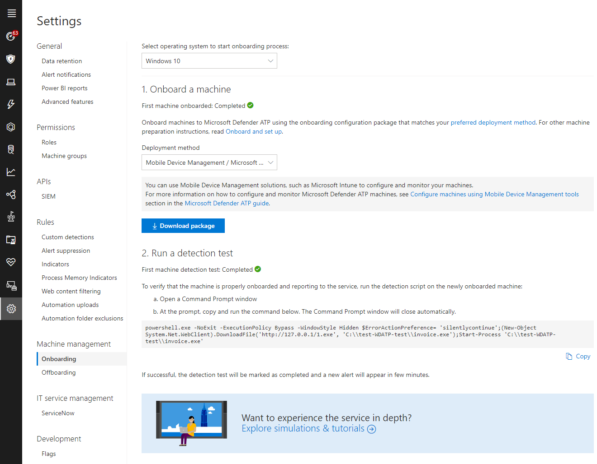

# Manual deployment

**Applies to:**

- [Microsoft Defender Advanced Threat Protection (Microsoft Defender ATP) for Linux](microsoft-defender-atp-linux.md)

This topic describes how to deploy Microsoft Defender ATP for Linux manually. A successful deployment requires the completion of all of the following steps:

- [Configure Microsoft's Linux Software Repository](#configure-microsoft's-linux-software-repository)
- [Download onboarding packages](#download-onboarding-package)
- [Application installation](#application-installation)
- [Client configuration](#client-configuration)

## Prerequisites and system requirements

Before you get started, see [the main Microsoft Defender ATP for Linux page](microsoft-defender-atp-linux.md) for a description of prerequisites and system requirements for the current software version.

## Configure Microsoft's Linux Software Repository

### RHEL and variants (CentOS and Oracle EL)

- Note your distribution and version and identify the closest entry for it under `https://packages.microsoft.com/config/`

    In the below commands, replace *[distro]* and *[version]* with the information identified in the previous step:

    > [!NOTE] In case of Oracle EL and CentOS 8, use [distro] as “rhel”.

    ```bash
    $ sudo yum-config-manager --add-repo=https://packages.microsoft.com/config/[distro]/[version]/insiders-fast.repo 
    ```

    For example, if you are running CentOS 7:  

    ```bash
    $ sudo yum-config-manager --add-repo=https://packages.microsoft.com/config/centos/7/insiders-fast.repo 
    ```

- Install the Microsoft GPG public key:

    ```bash
    $ curl https://packages.microsoft.com/keys/microsoft.asc > microsoft.asc
    $ sudo rpm --import microsoft.asc
    ```

- Download and make usable all the metadata for the currently enabled yum repositories: 

    ```bash
    $ yum makecache
    ```

### SLES and variants

- Note your distribution and version and identify the closest entry for it under `https://packages.microsoft.com/config/`

    In the below commands, replace *[distro]* and *[version]* with the information identified in the previous step.

    ```bash
    $ sudo zypper addrepo -c -f -n microsoft-insiders-fast https://packages.microsoft.com/config/[distro]/[version]/insiders-fast.repo 
    ```

    For example, if you are running SLES 12:  

    ```bash
    $ sudo zypper addrepo -c -f -n microsoft-insiders-fast https://packages.microsoft.com/config/sles/12/insiders-fast.repo
    ```

- Install the Microsoft GPG public key:

    ```bash
    $ curl https://packages.microsoft.com/keys/microsoft.asc > microsoft.asc
    $ rpm --import microsoft.asc
    ```

### Ubuntu and Debian systems

- Install `‘curl’` if not already installed:

    ```bash
    $ sudo apt-get install curl
    ```

- Note your distribution and version and identify the closest entry for it under `https://packages.microsoft.com/config`

    In the below command, replace *[distro]* and *[version]* with the information identified in the previous step:

    ```bash
    $ curl -o microsoft.list https://packages.microsoft.com/config/[distro]/[version]/insiders-fast.list
    ```

    For example, if you are running Ubuntu 18.04:

    ```bash
    $ curl -o microsoft.list https://packages.microsoft.com/config/ubuntu/18.04/insiders-fast.list 
    ```

- Install the repository configuration:

    ```bash
    $ sudo mv ./microsoft.list /etc/apt/sources.list.d/microsoft-insiders-fast.list
    ```

- Install the gpg package if not already installed:

    ```bash
    $ sudo apt-get install gpg
    ```

- Install the Microsoft GPG public key:

    ```bash
    $ curl https://packages.microsoft.com/keys/microsoft.asc | gpg --dearmor > microsoft.gpg
    $ sudo mv microsoft.gpg /etc/apt/trusted.gpg.d/

    ```

- Install the https driver in case not already present:

    ```bash
    $ sudo apt-get install apt-transport-https
    ```

- Update the repository metadata

    ```bash
    $ sudo apt-get update
    ```

## Application installation

- RHEL and variants (CentOS and Oracle EL)

    ```bash
    sudo yum install mdatp
    ```

- SLES and variants

    ```bash
    sudo zypper install mdatp
    ```

- Ubuntu and Debian system

    ```bash
    sudo apt-get install -t insiders-fast mdatp
    ```

## Download onboarding package

Download the onboarding package from Microsoft Defender Security Center:

1. In Microsoft Defender Security Center, go to **Settings > Machine Management > Onboarding**.
2. In the first drop down, set operating system to **Windows 10** and in second drop down, Deployment method to **Mobile Device Management / Microsoft Intune**.
3. Click on **Download package**. Save it as WindowsDefenderATPOnboardingPackage.zip.

    

4. From a command prompt, verify that you have the file.
    Extract the contents of the .zip file and create mdatp_onboard.json file as follows:
  
    ```bash
    $ ls -l
    total 8
    -rw-r--r-- 1 test  staff  6287 Oct 21 11:22 WindowsDefenderATPOnboardingPackage.zip
    $ unzip -p WindowsDefenderATPOnboardingPackage.zip | python -c 'import sys,json;data={"onboardingInfo":"\n".join(sys.stdin.readlines())};print(json.dumps(data));' >mdatp_onboard.json
    ```

## Client configuration

1. Copy WindowsDefenderATPOnboarding.py to the machine where you deploy Microsoft Defender ATP for Linux.

    The client machine is not associated with orgId. Note that the *orgId* attribute is blank.

    ```bash
    $ mdatp --health orgId
    ```

2. Copy the mdatp_onboard.json created in earlier step to /etc/opt/microsoft/mdatp_onboard.json

    ```bash
    $ sudo cp mdatp.json /etc/opt/microsoft/mdatp/mdatp_onboard.json
    ```

3. Verify that the machine is now associated with your organization and reports a valid *orgId*:

    ```bash
    $ mdatp --health orgId
    E6875323-A6C0-4C60-87AD-114BBE7439B8
    ```

4. A few minutes following the completion of the installation, you can see the status by running the following command. A return value of `'1'` denotes that the product is functioning as expected.

    ```bash
    $ mdatp --health healthy
    1
    ```

5. Run a detection test
To verify that the machine is properly onboarded and reporting to the service, take the following steps on the newly onboarded machine:

    - Ensure Real-time protection setting is ON ```mdatp --health realTimeProtectionEnabled```
    - Open a Terminal window
Copy and run the command below:

    ``` bash
    curl -o ~/Downloads/eicar.com.txt http://www.eicar.org/download/eicar.com.txt
    ```

6. The file should have been quarantined by Microsoft Defender ATP for Linux. Use the following command to list all the detected threats:

    ```bash
    $ mdatp --threat --list --pretty
    ```

## Logging installation issues

See [Logging installation issues](linux-resources.md#logging-installation-issues) for more information on how to find the automatically generated log that is created by the installer when an error occurs.

## Uninstallation

See [Uninstalling](linux-resources.md#uninstalling) for details on how to remove Microsoft Defender ATP for Linux from client devices.
