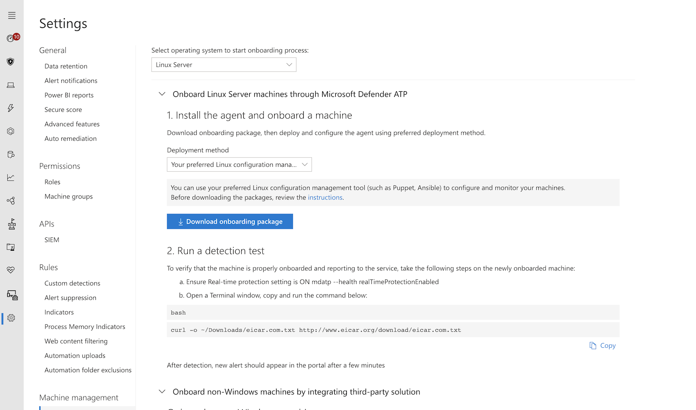

# Install Microsoft Defender ATP for Linux with Ansible

**Applies to:**

- [Microsoft Defender Advanced Threat Protection (Microsoft Defender ATP) for Linux](microsoft-defender-atp-linux.md)

This topic describes how to install Microsoft Defender ATP for Linux using Ansible. A successful installation requires the completion of all of the following tasks:

- [Download the onboarding package](#download-the-onboarding-package)
- [Create Ansible YAML files](#create-ansible-yaml-files)
- [Deployment](#deployment)
- [References](#references)

## Prerequisites and system requirements

Before you get started, please see [the main Microsoft Defender ATP for Linux page](microsoft-defender-atp-linux.md) for a description of prerequisites and system requirements for the current software version.

- Ansible needs to be installed on at least on one computer (we will call it master).
- Passwordless SSH must be configured for the root user between the master and all clients.
- The following software must be installed on all clients:
  - Python-apt
  - Curl
  - Unzip

- All host must be listed in the following format in the `/etc/ansible/hosts` file:
    
    ```bash
    [servers]
    host1 ansible_ssh_host=10.171.134.39
    host2 ansible_ssh_host=51.143.50.51
    ```

- Ping test:

    ```bash
    $ ansible -m ping all
    ```

## Download the onboarding package

Download the onboarding package from Microsoft Defender Security Center:

1. In Microsoft Defender Security Center, go to **Settings > Machine Management > Onboarding**.
2. In the first drop-down menu, select **Linux Server** as the operating system. In the second drop-down menu, select **Your preferred Linux configuration management tool** as the deployment method.
3. Select **Download onboarding package**. Save the file as WindowsDefenderATPOnboardingPackage.zip.

    

4. From a command prompt, verify that you have the file. Extract the contents of the archive:
  
    ```bash
    $ ls -l
    total 8
    -rw-r--r-- 1 test  staff  4984 Feb 18 11:22 WindowsDefenderATPOnboardingPackage.zip
    $ unzip WindowsDefenderATPOnboardingPackage.zip
    Archive:  WindowsDefenderATPOnboardingPackage.zip
    inflating: mdatp_onboard.json
    ```

## Create Ansible YAML files

Create subtask or role files that contribute to an actual task. Create the below files under the `/etc/ansible/roles` directory.

- Copy the onboarding package to all client machines:

    ```bash
    $ cat /etc/ansible/roles/copy_onboarding_pkg.yml
    - name: Copy the zip file
        copy:
            src:  /root/WindowsDefenderATPOnboardingPackage.zip
            dest: /root/WindowsDefenderATPOnboardingPackage.zip
            owner: root
            group: root
            mode: '0644'
    ```

- Create a `setup.sh` script that operates on the onboarding file:

    ```bash
    $ cat /root/setup.sh

    #!/bin/bash

    # Unzip the archive and create the onboarding file
    mkdir -p /etc/opt/microsoft/mdatp/
    unzip WindowsDefenderATPOnboardingPackage.zip
    cp mdatp_onboard.json /etc/opt/microsoft/mdatp/mdatp_onboard.json

    # get the GPG key
    curl https://packages.microsoft.com/keys/microsoft.asc | gpg --dearmor > microsoft.gpg
    sudo mv microsoft.gpg /etc/apt/trusted.gpg.d/
    ```

- Create the onboarding file:

    ```bash
    $ cat setup_blob.yml
    - name: Copy the setup script file
        copy:
            src: /root/setup.sh
            dest: /root/setup.sh
            owner: root
            group: root
            mode: '0744'

    - name: Run a script to create the onboarding file
        script: /root/setup.sh
    ```

- Add the Microsoft Defender ATP repository and key.

    Microsoft Defender ATP for Linux can be deployed from one of the following channels (denoted below as *[channel]*): *insider-fast* or *prod*. Each of these channels corresponds to a Linux software repository.

    The choice of the channel determines the type and frequency of updates that are offered to your device. Devices in *insider-fast* can try out new features before devices in *prod*.

    In order to preview new features and provide early feedback, it is recommended that you configure some devices in your enterprise to use the *insider-fast* channel.

    Note your distribution and version and identify the closest entry for it under `https://packages.microsoft.com/config/`.

    In the below commands, replace *[distro]* and *[version]* with the information you've identified.

    > [!NOTE]
    > In case of Oracle EL and CentOS 8, replace *[distro]* with “rhel”.

    - For apt-based distributions use the following YAML file:

        ```bash
        $ cat add_apt_repo.yml
        - name: Add Microsoft repository for MDATP
            apt_repository:
                repo: deb [arch=arm64,armhf,amd64] https://packages.microsoft.com/[distro]/[version]/prod [channel] main
                update_cache: yes
                state: present
                filename: microsoft-[channel].list

        - name: Add Microsoft APT key
                apt_key:
                    keyserver: https://packages.microsoft.com/
                    id: BC528686B50D79E339D3721CEB3E94ADBE1229C
        ```

    - For yum-based distributions use the following YAML file:

        ```bash
        $ cat add_yum_repo.yml
        - name: Add  Microsoft repository for MDATP
            yum_repository:
                name: packages-microsoft-com-prod-[channel]
                description: Microsoft Defender ATP
                file: microsoft-[channel]
                baseurl: https://packages.microsoft.com/[distro]/[version]/[channel]/
                gpgcheck: yes
                enabled: Yes
        ```

- Create the actual install/uninstall YAML files under `/etc/ansible/playbooks`.

    - For apt-based distributions use the following YAML file:

        ```bash
        $ cat install_mdatp.yml
        - hosts: servers
            tasks:
                - include: ../roles/download_copy_blob.yml
                - include: ../roles/setup_blob.yml
                - include: ../roles/add_apt_repo.yml
                - apt:
                    name: mdatp
                    state: latest
                    update_cache: yes
        ```

        ```bash
        $ cat uninstall_mdatp.yml
        - hosts: servers
        tasks:
            - apt:
                name: mdatp
                state: absent
        ```

    - For yum-based distributions use the following YAML file:

        ```bash
        $ cat install_mdatp_yum.yml
        - hosts: servers
        tasks:
            - include: ../roles/download_copy_blob.yml
            - include: ../roles/setup_blob.yml
            - include: ../roles/add_yum_repo.yml
            - yum:
                name: mdatp
                state: latest
                enablerepo: packages-microsoft-com-prod-[channel]
        ```

        ```bash
        $ cat uninstall_mdatp_yum.yml
        - hosts: servers
        tasks:
            - yum:
                name: mdatp
                state: absent
        ```

## Deployment

Now run the tasks files under `/etc/ansible/playbooks/`.

- Installation:

    ```bash
    $ ansible-playbook /etc/ansible/playbooks/install_mdatp.yml -i /etc/ansible/hosts
    ```

- Validation/configuration:

    ```bash
    $ ansible -m shell -a 'mdatp --connectivity-test' all
    $ ansible -m shell -a 'mdatp --health' all
    ```

- Uninstallation:

    ```bash
    $ ansible-playbook /etc/ansible/playbooks/uninstall_mdatp.yml -i /etc/ansible/hosts
    ```

## Log installation issues

See [Logging installation issues](linux-resources.md#logging-installation-issues) for more information on how to find the automatically generated log that is created by the installer when an error occurs.

## References

- [Add or remove YUM repositories](https://docs.ansible.com/ansible/2.3/yum_repository_module.html)

- [Manage packages with the yum package manager](https://docs.ansible.com/ansible/latest/modules/yum_module.html)

- [Add and remove APT repositories](https://docs.ansible.com/ansible/latest/modules/apt_repository_module.html)

- [Manage apt-packages](https://docs.ansible.com/ansible/latest/modules/apt_module.html)
