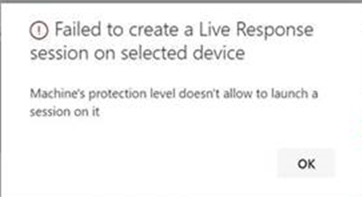

# Investigate entities on devices using live response

[!INCLUDE [Microsoft 365 Defender rebranding](../../includes/microsoft-defender.md)]

**Applies to:**
- [Microsoft Defender for Endpoint](https://go.microsoft.com/fwlink/p/?linkid=2146631)
- [Microsoft 365 Defender](https://go.microsoft.com/fwlink/?linkid=2118804)


> Want to experience Defender for Endpoint? [Sign up for a free trial.](https://www.microsoft.com/microsoft-365/windows/microsoft-defender-atp?ocid=docs-wdatp-investigateip-abovefoldlink)

Live response gives security operations teams instantaneous access to a device (also referred to as a machine) using a remote shell connection. This gives you the power to do in-depth investigative work and take immediate response actions to promptly contain identified threats—in real time. 

Live response is designed to enhance investigations by enabling your security operations team to collect forensic data, run scripts, send suspicious entities for analysis, remediate threats, and proactively hunt for emerging threats.<br/><br/>

> [!VIDEO https://www.microsoft.com/videoplayer/embed/RE4qLUW]

With live response, analysts can do all of the following tasks:
- Run basic and advanced commands to do investigative work on a device.
- Download files such as malware samples and outcomes of PowerShell scripts.
- Download files in the background (new!).
- Upload a PowerShell script or executable to the library and run it on a device from a tenant level.
- Take or undo remediation actions.

## Before you begin

Before you can initiate a session on a device, make sure you fulfill the following requirements:

- **Verify that you're running a supported version of Windows**. <br/>
Devices must be running one of the following versions of Windows

  - **Windows 10**
    - [Version 1909](https://docs.microsoft.com/windows/whats-new/whats-new-windows-10-version-1909) or later  
    - [Version 1903](https://docs.microsoft.com/windows/whats-new/whats-new-windows-10-version-1903) with [KB4515384](https://support.microsoft.com/en-us/help/4515384/windows-10-update-kb4515384)
    - [Version 1809 (RS 5)](https://docs.microsoft.com/windows/whats-new/whats-new-windows-10-version-1809) with [with KB4537818](https://support.microsoft.com/help/4537818/windows-10-update-kb4537818)
    - [Version 1803 (RS 4)](https://docs.microsoft.com/windows/whats-new/whats-new-windows-10-version-1803) with [KB4537795](https://support.microsoft.com/help/4537795/windows-10-update-kb4537795)
    - [Version 1709 (RS 3)](https://docs.microsoft.com/windows/whats-new/whats-new-windows-10-version-1709) with [KB4537816](https://support.microsoft.com/help/4537816/windows-10-update-kb4537816)
  
  - **Windows Server 2019 - Only applicable for Public preview**
    - Version 1903 or (with [KB4515384](https://support.microsoft.com/en-us/help/4515384/windows-10-update-kb4515384)) later 
    - Version 1809 (with [KB4537818](https://support.microsoft.com/en-us/help/4537818/windows-10-update-kb4537818))

- **Enable live response from the advanced settings page**.<br>
You'll need to enable the live response capability in the [Advanced features settings](advanced-features.md) page.

    >[!NOTE]
    >Only users with manage security or global admin roles can edit these settings.

- **Enable live response for servers from the advanced settings page** (recommended).<br>

    >[!NOTE]
    >Only users with manage security or global admin roles can edit these settings.
    
- **Ensure that the device has an Automation Remediation level assigned to it**.<br>
You'll need to enable, at least, the minimum Remediation Level for a given Device Group. Otherwise you won't be able to establish a Live Response session to a member of that group.

    You'll receive the following error:

    

- **Enable live response unsigned script execution** (optional). <br>

    >[!WARNING]
    >Allowing the use of unsigned scripts may increase your exposure to threats.
 
  Running unsigned scripts is not recommended as it can increase your exposure to threats. If you must use them however, you'll need to enable the setting in the [Advanced features settings](advanced-features.md) page.
    
- **Ensure that you have the appropriate permissions**.<br>
    Only users who have been provisioned with the appropriate permissions can initiate a session. For more information on role assignments, see [Create and manage roles](user-roles.md). 

    > [!IMPORTANT]
    > The option to upload a file to the library is only available to those with the appropriate RBAC permissions. The button is greyed out for users with only delegated permissions.

    Depending on the role that's been granted to you, you can run basic or advanced live response commands. Users permissions are controlled by RBAC custom role. 

## Live response dashboard overview
When you initiate a live response session on a device, a dashboard opens. The dashboard provides information about the session such as the following: 

- Who created the session
- When the session started
- The duration of the session

The dashboard also gives you access to:
- Disconnect session
- Upload files to the library 
- Command console
- Command log


## Initiate a live response session on a device 

1. Sign in to Microsoft Defender Security Center.

2. Navigate to the devices list page and select a device to investigate. The devices page opens.

3. Launch the live response session by selecting **Initiate live response session**. A command console is displayed. Wait while the session connects to the device.

4. Use the built-in commands to do investigative work. For more information, see [Live response commands](#live-response-commands).

5. After completing your investigation, select **Disconnect session**, then select **Confirm**.

## Live response commands

Depending on the role that's been granted to you, you can run basic or advanced live response commands. User permissions are controlled by RBAC custom roles. For more information on role assignments, see [Create and manage roles](user-roles.md). 


>[!NOTE]
>Live response is a cloud-based interactive shell, as such, specific command experience may vary in response time depending on network quality and system load between the end user and the target device.

### Basic commands

The following commands are available for user roles that are granted the ability to run **basic** live response commands. For more information on role assignments, see [Create and manage roles](user-roles.md). 

| Command | Description |
|---|---|--- |
|`cd` | Changes the current directory. | 
|`cls` | Clears the console screen.  |
|`connect` | Initiates a live response session to the device. |
|`connections` | Shows all the active connections. |
|`dir` | Shows a list of files and subdirectories in a directory. |
|`download <file_path> &` | Downloads a file in the background. |
drivers |  Shows all drivers installed on the device. |
|`fg <command ID>` | Returns a file download to the foreground. |
|`fileinfo` | Get information about a file. |
|`findfile` | Locates files by a given name on the device. |
|`help` | Provides help information for live response commands. |
|`persistence` | Shows all known persistence methods on the device. |
|`processes` | Shows all processes running on the device. |
|`registry` | Shows registry values. |
|`scheduledtasks` | Shows all scheduled tasks on the device. |
|`services` | Shows all services on the device. |
|`trace` | Sets the terminal's logging mode to debug. |

### Advanced commands
The following commands are available for user roles that are granted the ability to run **advanced** live response commands. For more information on role assignments, see [Create and manage roles](user-roles.md). 

| Command | Description |
|---|---|
| `analyze` | Analyses the entity with various incrimination engines to reach a verdict. |
| `getfile` | Gets a file from the device. <br> NOTE: This command has a prerequisite command. You can use the `-auto` command in conjunction with `getfile` to automatically run the prerequisite command. |
| `run` | Runs a PowerShell script from the library on the device. |
| `library` | Lists files that were uploaded to the live response library. |
| `putfile` | Puts a file from the library to the device. Files are saved in a working folder and are deleted when the device restarts by default. |
| `remediate` | Remediates an entity on the device. The remediation action will vary depending on the entity type:<br>- File: delete<br>- Process: stop, delete image file<br>- Service: stop, delete image file<br>- Registry entry: delete<br>- Scheduled task: remove<br>- Startup folder item: delete file <br> NOTE: This command has a prerequisite command. You can use the `-auto` command in conjunction with `remediate` to automatically run the prerequisite command. 
|`undo` | Restores an entity that was remediated. |


## Use live response commands

The commands that you can use in the console follow similar principles as [Windows Commands](https://docs.microsoft.com/windows-server/administration/windows-commands/windows-commands#BKMK_c).

The advanced commands offer a more robust set of actions that allow you to take more powerful actions such as download and upload a file, run scripts on the device, and take remediation actions on an entity.

### Get a file from the device

For scenarios when you'd like get a file from a device you're investigating, you can use the `getfile` command. This allows you to save the file from the device for further investigation.

>[!NOTE]
>The following file size limits apply:
>- `getfile` limit: 3 GB
>- `fileinfo` limit: 10 GB
>- `library` limit: 250 MB

### Download a file in the background

To enable your security operations team to continue investigating an impacted device, files can now be downloaded in the background.

- To download a file in the background, in the live response command console, type `download <file_path> &`.
- If you are waiting for a file to be downloaded, you can move it to the background by using Ctrl + Z.
- To bring a file download to the foreground, in the live response command console, type `fg <command_id>`.

Here are some examples:


|Command  |What it does  |
|---------|---------|
|`Download "C:\windows\some_file.exe" &`     |Starts downloading a file named *some_file.exe* in the background.         |
|`fg 1234`     |Returns a download with command ID *1234* to the foreground.         |


### Put a file in the library

Live response has a library where you can put files into. The library stores files (such as scripts) that can be run in a live response session at the tenant level.

Live response allows PowerShell scripts to run, however you must first put the files into the library before you can run them. 

You can have a collection of PowerShell scripts that can run on devices that you initiate live response sessions with. 

#### To upload a file in the library

1. Click **Upload file to library**. 

2. Click **Browse** and select the file.

3. Provide a brief description.

4. Specify if you'd like to overwrite a file with the same name.

5. If you'd like to be,  know what parameters are needed for the script, select the script parameters check box. In the text field, enter an example and a description.

6. Click **Confirm**. 

7. (Optional) To verify that the file was uploaded to the library, run the `library` command.


### Cancel a command
Anytime during a session, you can cancel a command by pressing CTRL + C.  

>[!WARNING]
>Using this shortcut will not stop the command in the agent side. It will only cancel the command in the portal. So, changing operations such as "remediate" may continue, while the command is canceled. 

### Automatically run prerequisite commands

Some commands have prerequisite commands to run. If you don't run the prerequisite command, you'll get an error. For example, running the `download` command without `fileinfo` will return an error.

You can use the auto flag to automatically run prerequisite commands, for example:

```console
getfile c:\Users\user\Desktop\work.txt -auto
```

## Run a PowerShell script 

Before you can run a PowerShell script, you must first upload it to the library. 

After uploading the script to the library, use the `run` command to run the script.

If you plan to use an unsigned script in the session, you'll need to enable the setting in the [Advanced features settings](advanced-features.md) page.

>[!WARNING]
>Allowing the use of unsigned scripts may increase your exposure to threats.

## Apply command parameters

- View the console help to learn about command parameters. To learn about an individual command, run:
 
    `help <command name>`

- When applying parameters to commands, note that parameters are handled based on a fixed order:
 
    `<command name> param1 param2` 

- When specifying parameters outside of the fixed order, specify the name of the parameter with a hyphen before providing the value:
 
    `<command name> -param2_name param2`

- When using commands that have prerequisite commands, you can use flags:

    `<command name> -type file -id <file path> - auto` or `remediate file <file path> - auto`.

## Supported output types

Live response supports table and JSON format output types. For each command, there's a default output behavior. You can modify the output in your preferred output format using the following commands:

- `-output json`
- `-output table`

>[!NOTE]
>Fewer fields are shown in table format due to the limited space. To see more details in the output, you can use the JSON output command so that more details are shown.

## Supported output pipes

Live response supports output piping to CLI and file. CLI is the default output behavior. You can pipe the output to a file using the following command: [command] > [filename].txt.  

Example:

```console
processes > output.txt
```

## View the command log

Select the **Command log** tab to see the commands used on the device during a session. 
Each command is tracked with full details such as:
- ID
- Command line
- Duration
- Status and input or output side bar

## Limitations

- Live response sessions are limited to 10 live response sessions at a time.
- Large-scale command execution is not supported.
- Live response session inactive timeout value is 5 minutes. 
- A user can only initiate one session at a time.
- A device can only be in one session at a time.
- The following file size limits apply:
   - `getfile` limit: 3 GB
   - `fileinfo` limit: 10 GB
   - `library` limit: 250 MB

## Related article
- [Live response command examples](live-response-command-examples.md)
