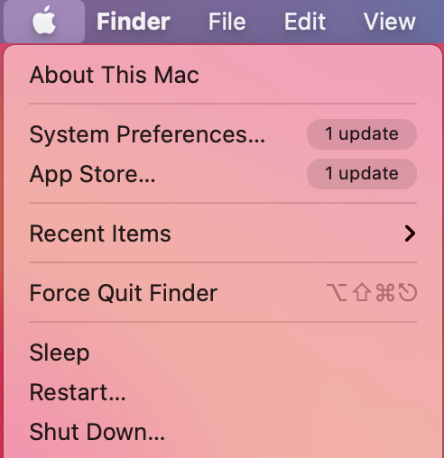
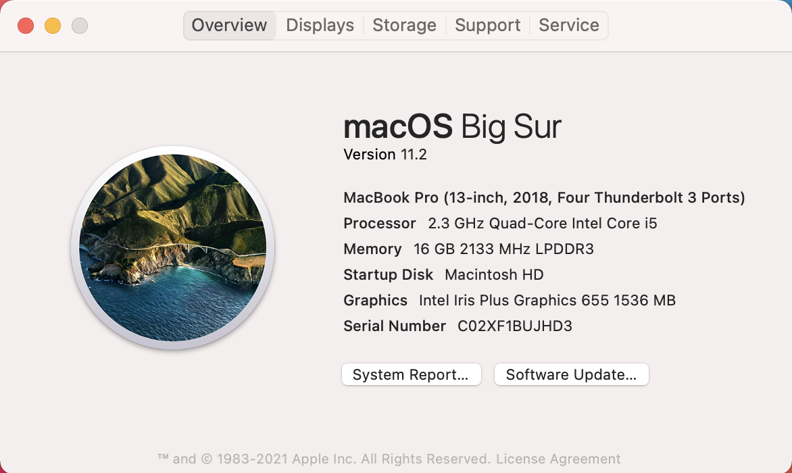
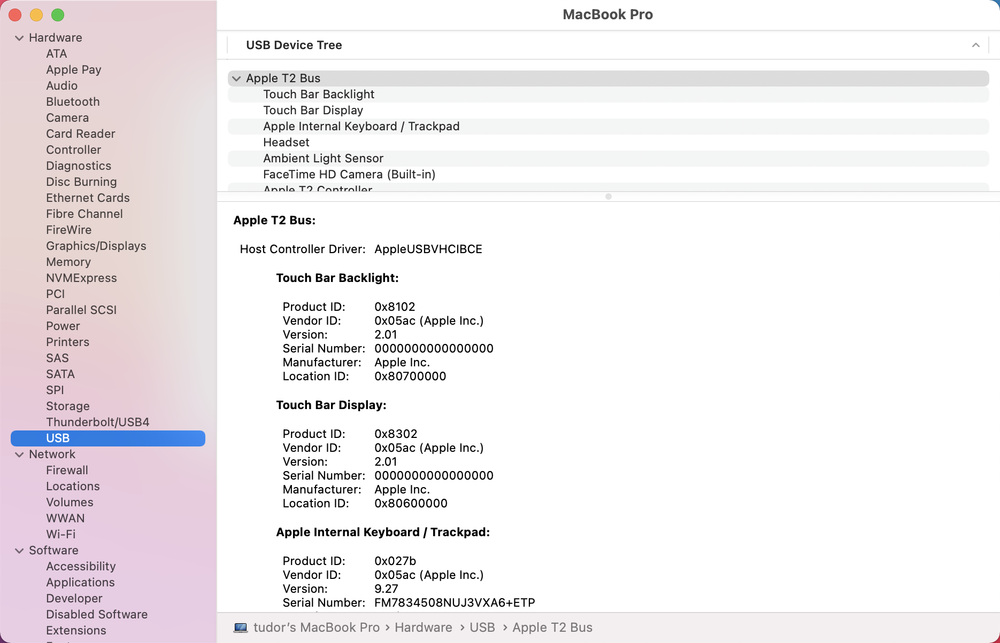
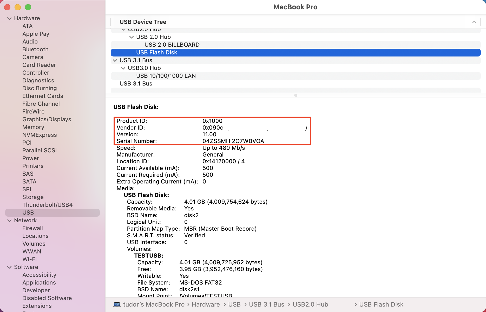

# Device control for macOS

[!INCLUDE [Microsoft 365 Defender rebranding](../../includes/microsoft-defender.md)]

**Applies to:**
- [Microsoft Defender for Endpoint](https://go.microsoft.com/fwlink/p/?linkid=2146631)
- [Microsoft 365 Defender](https://go.microsoft.com/fwlink/?linkid=2118804)

> Want to experience Microsoft Defender for Endpoint? [Sign up for a free trial.](https://www.microsoft.com/microsoft-365/windows/microsoft-defender-atp?ocid=docs-wdatp-exposedapis-abovefoldlink)

[!include[Prerelease information](../../includes/prerelease.md)]

## Requirements

Device control for macOS has the following prerequisites:

>[!div class="checklist"]
> - Microsoft Defender for Endpoint entitlement (can be trial)
> - Minimum OS version: macOS 10.15.4 or higher
> - Minimum product version: 101.24.59
> - Your device must be running with system extensions (this is the default on macOS 11 Big Sur). 
> 
>   You can check if your device is running on system extensions by running the following command and verify that it is printing `endpoint_security_extension` to the console: 
> 
>   ```bash
>   mdatp health --field real_time_protection_subsystem 
>   ```
> - Your device must be in `Beta` (previously called `InsiderFast`) Microsoft AutoUpdate update channel. For more information, see [Deploy updates for Microsoft Defender for Endpoint for Mac](mac-updates.md).
> 
>   You can check the update channel using the following command: 
> 
>    ```bash
>    mdatp health --field release_ring 
>    ```
>
>    If the above command does not print either `Beta` or `InsiderFast`, execute the following command from the Terminal. The channel update takes effect next time the product starts (when the next product update is installed or when the device is rebooted). 
> 
>    ```bash
>    defaults write com.microsoft.autoupdate2 ChannelName -string Beta
>    ```
>
>    Alternatively, if you are in a managed environment (JAMF or Intune), you can configure the update channel remotely. For more information, see [Deploy updates for Microsoft Defender for Endpoint for Mac](mac-updates.md). 

## Device control policy

To configure device control for macOS, you must create a policy that describes the restrictions you want to put in place within your organization.

The device control policy is included in the configuration profile used to configure all other product settings. For more information, see [Configuration profile structure](mac-preferences.md#configuration-profile-structure).

Within the configuration profile, the device control policy is defined in the following section:

|||
|:---|:---|
| **Domain** | `com.microsoft.wdav` |
| **Key** | deviceControl |
| **Data type** | Dictionary (nested preference) |
| **Comments** | See the following sections for a description of the dictionary contents. |

The device control policy can be used to:

- [Customize the URL target for notifications raised by device control](#customize-url-target-for-notifications-raised-by-device-control)
- [Allow or block removable devices](#allow-or-block-removable-devices)

### Customize URL target for notifications raised by device control

When the device control policy that you have put in place is enforced on a device (for example, access to a removable media device is restricted), a notification is displayed to the user.


When end users click this notification, a web page is opened in the default browser. You can configure the URL that is opened when end users click the notification.

|||
|:---|:---|
| **Domain** | `com.microsoft.wdav` |
| **Key** | navigationTarget |
| **Data type** | String |
| **Comments** | If not defined, the product uses a default URL pointing to a generic page explaining the action taken by the product. |

### Allow or block removable devices

The removable media section of the device control policy is used to restrict access to removable media. 

> [!NOTE]
> The following types of removable media are currently supported and can be included in the policy: USB storage devices.

|||
|:---|:---|
| **Domain** | `com.microsoft.wdav` |
| **Key** | removableMediaPolicy |
| **Data type** | Dictionary (nested preference) |
| **Comments** | See the following sections for a description of the dictionary contents. |

This section of the policy is hierarchical, allowing for maximum flexibility and covering a wide range of use cases. At the top level are vendors, identified by a vendor ID. For each vendor, there are products, identified by a product ID. Finally, for each product there are serial numbers denoting specific devices.

```
|-- policy top level 
    |-- vendor 1 
        |-- product 1 
            |-- serial number 1 
            ...
            |-- serial number N 
        ...
        |-- product N 
    ...
    |-- vendor N
```

For information on how to find the device identifiers, see [Look up device identifiers](#look-up-device-identifiers).

The policy is evaluated from the most specific entry to the most general one. Meaning, when a device is plugged in, the product tries to find the most specific match in the policy for each removable media device and apply the permissions at that level. If there is no match, then the next best match is applied, all the way to the permission specified at the top level, which is the default when a device does not match any other entry in the policy.

#### Policy enforcement level

Under the removable media section, there is an option to set the enforcement level, which can take one of the following values:

- `audit` - Under this enforcement level, if access to a device is restricted, a notification is displayed to the user, however the device can still be used. This enforcement level can be useful to evaluate the effectiveness of a policy.
- `block` - Under this enforcement level, the operations that the user can perform on the device are limited to what is defined in the policy. Furthermore, a notification is raised to the user. 

|||
|:---|:---|
| **Domain** | `com.microsoft.wdav` |
| **Key** | enforcementLevel |
| **Data type** | String |
| **Possible values** | audit (default) <br/> block |

#### Default permission level

At the top level of the removable media section, you can configure the default permission level for devices that do not match anything else in the policy.

This setting can be set to:

- `none` - No operations can be performed on the device
- A combination of the following values:
    - `read` - Read operations are permitted on the device
    - `write` - Write operations are permitted on the device
    - `execute` - Execute operations are permitted on the device

> [!NOTE]
> If `none` is present in the permission level, any other permissions (`read`, `write`, or `execute`) will be ignored.

> [!NOTE]
> The `execute` permission only refers to execution of Mach-O binaries. It does not include execution of scripts or other types of payloads.

|||
|:---|:---|
| **Domain** | `com.microsoft.wdav` |
| **Key** | permission |
| **Data type** | Array of strings |
| **Possible values** | none <br/> read <br/> write <br/> execute |

#### Restrict removable media by vendor, product, and serial number

As described in [Allow or block removable devices](#allow-or-block-removable-devices), removable media such as USB devices can be identified by the vendor ID, product ID, and serial number.

At the top level of the removable media policy, you can optionally define more granular restrictions at the vendor level. 

The `vendors` dictionary contains one or more entries, with each entry being identified by the vendor ID.

|||
|:---|:---|
| **Domain** | `com.microsoft.wdav` |
| **Key** | vendors |
| **Data type** | Dictionary (nested preference) |

For each vendor, you can specify the desired permission level for devices from that vendor.

|||
|:---|:---|
| **Domain** | `com.microsoft.wdav` |
| **Key** | permission |
| **Data type** | Array of strings |
| **Possible values** | Same as [Default permission level](#default-permission-level) |

Furthermore, you can optionally specify the set of products belonging to that vendor for which more granular permissions are defined. The `products` dictionary contains one or more entries, with each entry being identified by the product ID. 

|||
|:---|:---|
| **Domain** | `com.microsoft.wdav` |
| **Key** | products |
| **Data type** | Dictionary (nested preference) |

For each product, you can specify the desired permission level for that product.

|||
|:---|:---|
| **Domain** | `com.microsoft.wdav` |
| **Key** | permission |
| **Data type** | Array of strings |
| **Possible values** | Same as [Default permission level](#default-permission-level) |

Furthermore, you can specify an optional set of serial numbers for which more granular permissions are defined.

The `serialNumbers` dictionary contains one or more entries, with each entry being identified by the serial number.

|||
|:---|:---|
| **Domain** | `com.microsoft.wdav` |
| **Key** | serialNumbers |
| **Data type** | Dictionary (nested preference) |

For each serial number, you can specify the desired permission level.

|||
|:---|:---|
| **Domain** | `com.microsoft.wdav` |
| **Key** | permission |
| **Data type** | Array of strings |
| **Possible values** | Same as [Default permission level](#default-permission-level) |

#### Example device control policy

The following example shows how all of the above concepts can be combined into a device control policy. In the following example, note the hierarchical nature of the removable media policy.

```xml
<?xml version="1.0" encoding="UTF-8"?> 
<!DOCTYPE plist PUBLIC "-//Apple//DTD PLIST 1.0//EN" "http://www.apple.com/DTDs/PropertyList-1.0.dtd"> 
<plist version="1.0"> 
<dict> 
    <key>deviceControl</key> 
    <dict> 
        <key>navigationTarget</key> 
        <string>[custom URL for notifications]</string> 
        <key>removableMediaPolicy</key> 
        <dict> 
            <key>enforcementLevel</key> 
            <string>[enforcement level]</string> <!-- audit / block --> 
            <key>permission</key> 
            <array> 
                <string>[permission]</string> <!-- none / read / write / execute --> 
                <!-- other permissions -->
            </array> 
            <key>vendors</key> 
            <dict> 
                <key>[vendor id]</key> 
                <dict>
                    <key>permission</key> 
                    <array> 
                        <string>[permission]</string> <!-- none / read / write / execute --> 
                        <!-- other permissions -->
                    </array> 
                    <key>products</key> 
                    <dict> 
                        <key>[product id]</key> 
                        <dict> 
                            <key>permission</key> 
                            <array> 
                                <string>[permission]</string> <!-- none / read / write / execute --> 
                                <!-- other permissions -->
                            </array> 
                            <key>serialNumbers</key> 
                            <dict> 
                                <key>[serial-number]</key> 
                                <array> 
                                    <string>[permission]</string> <!-- none / read / write / execute --> 
                                    <!-- other permissions -->
                                </array> 
                                <!-- other serial numbers --> 
                            </dict> 
                        </dict> 
                        <!-- other products --> 
                    </dict> 
                </dict> 
                <!-- other vendors --> 
            </dict> 
        </dict> 
    </dict> 
</dict> 
</plist> 
```

We have included more examples of device control policies in the following documents:

- [Examples of device control policies for Intune](mac-device-control-intune.md)
- [Examples of device control policies for JAMF](mac-device-control-jamf.md)

#### Look up device identifiers

To find the vendor ID, product ID, and serial number of a USB device:

1. Log into a Mac device.
1. Plug in the USB device for which you want to look up the identifiers.
1. In the top-level menu of macOS, select **About This Mac**.

    

1. Select **System Report**.

    

1. From the left column, select **USB**.

    

1. Under **USB Device Tree**, navigate to the USB device that you plugged in.

    

1. The vendor ID, product ID, and serial number are displayed. When adding the vendor ID and product ID to the removable media policy, you must only add the part after `0x`. For example, in the below image, vendor ID is `1000` and product ID is `090c`.

#### Discover USB devices in your organization

You can view mount, unmount, and volume change events originating from USB devices in Microsoft Defender for Endpoint advanced hunting. These events can be helpful to identify suspicious usage activity or perform internal investigations.

```
DeviceEvents 
    | where ActionType == "UsbDriveMount" or ActionType == "UsbDriveUnmount" or ActionType == "UsbDriveDriveLetterChanged"
    | where DeviceId == "<device ID>"
```

## Device control policy deployment

The device control policy must be included next to the other product settings, as described in [Set preferences for Microsoft Defender for Endpoint for Mac](mac-preferences.md).

This profile can be deployed using the instructions listed in [Configuration profile deployment](mac-preferences.md#configuration-profile-deployment).

## Troubleshooting tips

After pushing the configuration profile through Intune or JAMF, you can check if it was successfully picked up by the product by running the following command from the Terminal:

```bash
mdatp device-control removable-media policy list
```

This command will print to standard output the device control policy that the product is using. In case this prints `Policy is empty`, make sure that (a) the configuration profile has indeed been pushed to your device from the management console, and (b) it is a valid device control policy, as described in this document.

On a device where the policy has been delivered successfully and where there are one or more devices plugged in, you can run the following command to list all devices and the effective permissions applied to them.

```bash
mdatp device-control removable-media devices list
```

Example of output:

```Output
.Device(s)
|-o Name: Untitled 1, Permission ["read", "execute"]
| |-o Vendor: General "fff0"
| |-o Product: USB Flash Disk "1000"
| |-o Serial number: "04ZSSMHI2O7WBVOA"
| |-o Mount point: "/Volumes/TESTUSB"
```

In the above example, there is only one removable media device plugged in and it has `read` and `execute` permissions, according to the device control policy that was delivered to the device.

## Related topics

- [Examples of device control policies for Intune](mac-device-control-intune.md)
- [Examples of device control policies for JAMF](mac-device-control-jamf.md)