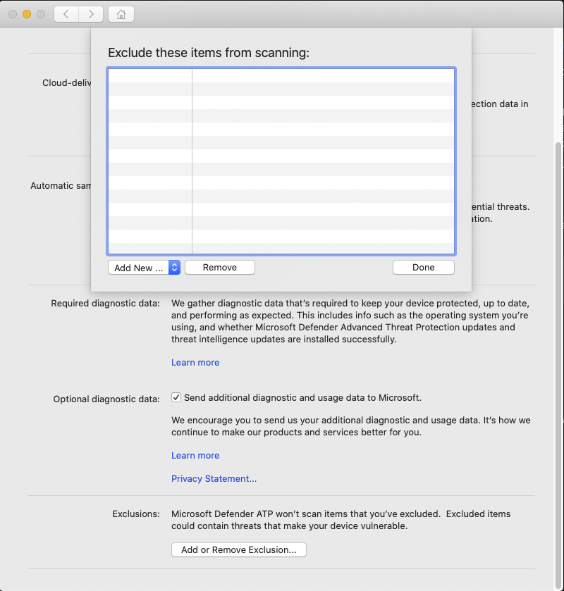

# Configure and validate exclusions for Microsoft Defender ATP for Mac

**Applies to:**

- [Microsoft Defender Advanced Threat Protection (Microsoft Defender ATP) for Mac](microsoft-defender-atp-mac.md)

This article provides information on how to define exclusions that apply to on-demand scans, and real-time protection and monitoring.

>[!IMPORTANT]
>The exclusions described in this article don't apply to other Microsoft Defender ATP for Mac capabilities, including endpoint detection and response (EDR). Files that you exclude using the methods described in this article can still trigger EDR alerts and other detections.

You can exclude certain files, folders, processes, and process-opened files from Microsoft Defender ATP for Mac scans.

Exclusions can be useful to avoid incorrect detections on files or software that are unique or customized to your organization. They can also be useful for mitigating performance issues caused by Microsoft Defender ATP for Mac.

>[!WARNING]
>Defining exclusions lowers the protection offered by Microsoft Defender ATP for Mac. You should always evaluate the risks that are associated with implementing exclusions, and you should only exclude files that you are confident are not malicious.

## Supported exclusion types

The follow table shows the exclusion types supported by Microsoft Defender ATP for Mac.

Exclusion | Definition | Examples
---|---|---
File extension | All files with the extension, anywhere on the device | `.test`
File | A specific file identified by the full path | `/var/log/test.log`
Folder | All files under the specified folder | `/var/log/`
Process | A specific process (specified either by the full path or file name) and all files opened by it | `/bin/cat`<br/>`cat`

## How to configure the list of exclusions

### From the management console

For more information on how to configure exclusions from JAMF, Intune, or another management console, see [Set preferences for Microsoft Defender ATP for Mac](mac-preferences.md).

### From the user interface

Open the Microsoft Defender ATP application and navigate to **Manage settings** > **Add or Remove Exclusion...**, as shown in the following screenshot:



Select the type of exclusion that you wish to add and follow the prompts.

## Validate exclusions lists with the EICAR test file

You can validate that your exclusion lists are working by using `curl` to download a test file.

In the following Bash snippet, replace `test.txt` with a file that conforms to your exclusion rules. For example, if you have excluded the `.testing` extension, replace `test.txt` with `test.testing`. If you are testing a path, ensure that you run the command within that path.

```bash
$ curl -o test.txt https://www.eicar.org/download/eicar.com.txt
```

If Microsoft Defender ATP for Mac reports malware, then the rule is not working. If there is no report of malware, and the downloaded file exists, then the exclusion is working. You can open the file to confirm that the contents are the same as what is described on the [EICAR test file website](http://2016.eicar.org/86-0-Intended-use.html).

If you do not have Internet access, you can create your own EICAR test file. Write the EICAR string to a new text file with the following Bash command:

```bash
echo 'X5O!P%@AP[4\PZX54(P^)7CC)7}$EICAR-STANDARD-ANTIVIRUS-TEST-FILE!$H+H*' > test.txt
```

You can also copy the string into a blank text file and attempt to save it with the file name or in the folder you are attempting to exclude.
