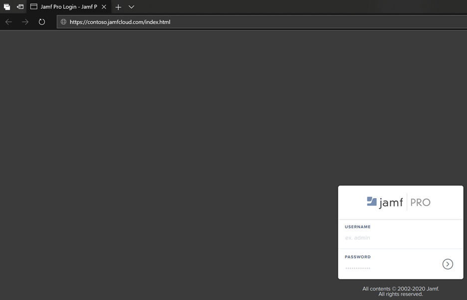
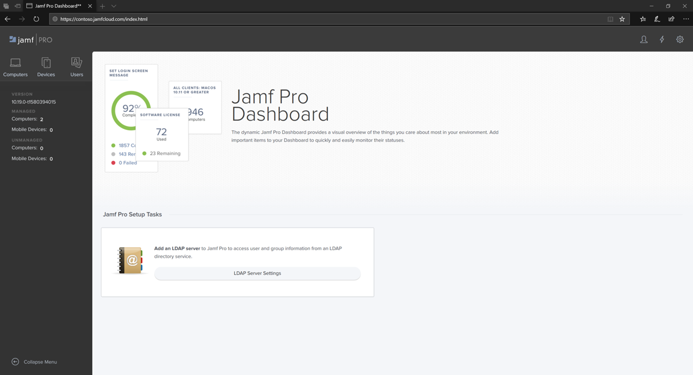
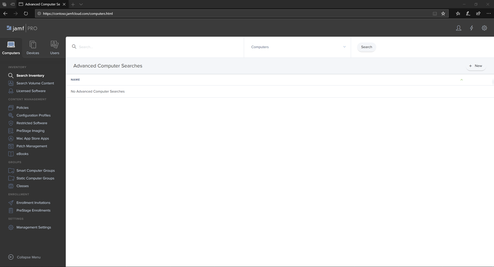

# Log in to JamF Pro

1. Enter your credentials.

    

2. Select **Computers**.

    

3. You will see the settings that are available.

     

## Next step
[Setup the device groups in Jamf Pro](mac-jamfpro-device-groups.md)

