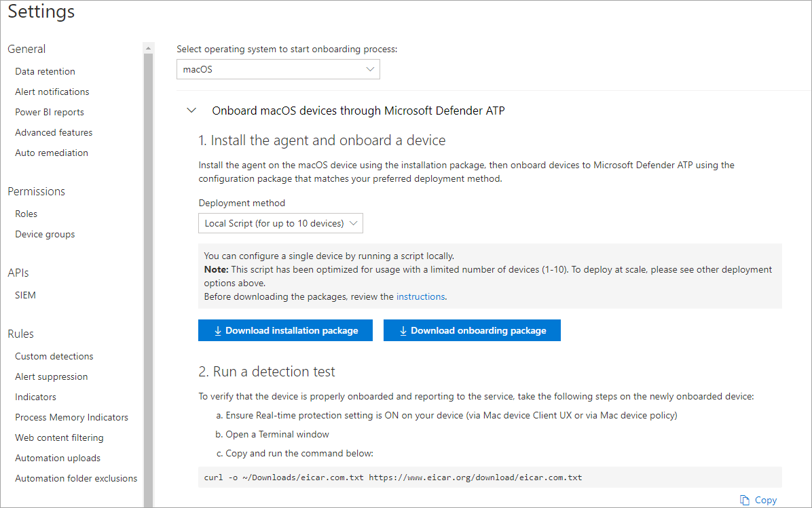

# Manual deployment for Microsoft Defender ATP for macOS

[!INCLUDE [Microsoft 365 Defender rebranding](../../includes/microsoft-defender.md)]


**Applies to:**

- [Microsoft Defender Advanced Threat Protection (Microsoft Defender ATP) for macOS](microsoft-defender-atp-mac.md)

This topic describes how to deploy Microsoft Defender ATP for macOS manually. A successful deployment requires the completion of all of the following steps:
- [Download installation and onboarding packages](#download-installation-and-onboarding-packages)
- [Application installation](#application-installation)
- [Client configuration](#client-configuration)

## Prerequisites and system requirements

Before you get started, see [the main Microsoft Defender ATP for macOS page](microsoft-defender-atp-mac.md) for a description of prerequisites and system requirements for the current software version.

## Download installation and onboarding packages

Download the installation and onboarding packages from Microsoft Defender Security Center:

1. In Microsoft Defender Security Center, go to **Settings > Device Management > Onboarding**.
2. In Section 1 of the page, set operating system to **macOS** and Deployment method to **Local script**.
3. In Section 2 of the page, select **Download installation package**. Save it as wdav.pkg to a local directory.
4. In Section 2 of the page, select **Download onboarding package**. Save it as WindowsDefenderATPOnboardingPackage.zip to the same directory.

    

5. From a command prompt, verify that you have the two files.
    
## Application installation

To complete this process, you must have admin privileges on the device.

1. Navigate to the downloaded wdav.pkg in Finder and open it.

    

2. Select **Continue**, agree with the License terms, and enter the password when prompted.

    

   > [!IMPORTANT]
   > You will be prompted to allow a driver from Microsoft to be installed (either "System Extension Blocked" or "Installation is on hold" or both. The driver must be allowed to be installed.

   

3. Select **Open Security Preferences**  or **Open System Preferences > Security & Privacy**. Select **Allow**:

    

   The installation proceeds.

   > [!CAUTION]
   > If you don't select **Allow**, the installation will proceed after 5 minutes. Defender ATP will be loaded, but some features, such as real-time protection, will be disabled. See [Troubleshoot kernel extension issues](mac-support-kext.md) for information on how to resolve this.

> [!NOTE]
> macOS may request to reboot the device upon the first installation of Microsoft Defender. Real-time protection will not be available until the device is rebooted.

## Client configuration

1. Copy wdav.pkg and MicrosoftDefenderATPOnboardingMacOs.py to the device where you deploy Microsoft Defender ATP for macOS.

    The client device is not associated with orgId. Note that the *orgId* attribute is blank.

    ```bash
    mdatp --health orgId
    ```

2. Run the Python script to install the configuration file:

    ```bash
    /usr/bin/python MicrosoftDefenderATPOnboardingMacOs.py
    ```

3. Verify that the device is now associated with your organization and reports a valid *orgId*:

    ```bash
    mdatp --health orgId
    ```

After installation, you'll see the Microsoft Defender icon in the macOS status bar in the top-right corner.

   
   

## How to Allow Full Disk Access

> [!CAUTION]
> macOS 10.15 (Catalina) contains new security and privacy enhancements. Beginning with this version, by default, applications are not able to access certain locations on disk (such as Documents, Downloads, Desktop, etc.) without explicit consent. In the absence of this consent, Microsoft Defender ATP is not able to fully protect your device.

To grant consent, open System Preferences -> Security & Privacy -> Privacy -> Full Disk Access. Click the lock icon to make changes (bottom of the dialog box). Select Microsoft Defender ATP.

## Logging installation issues

See [Logging installation issues](mac-resources.md#logging-installation-issues) for more information on how to find the automatically generated log that is created by the installer when an error occurs.

## Uninstallation

See [Uninstalling](mac-resources.md#uninstalling) for details on how to remove Microsoft Defender ATP for macOS from client devices.
