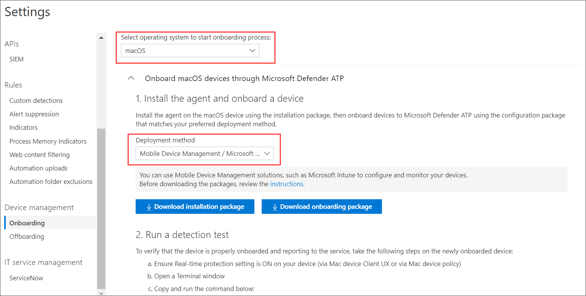

# Intune-based deployment for Microsoft Defender ATP for Mac

> [!NOTE]
> This documentation explains the legacy method for deploying and configuring Microsoft Defender ATP on macOS devices. The native experience is now available in the MEM console. The release of the native UI in the MEM console provide admins with a much simpler way to configure and dfeploy the application and send it down to macOS devices. 
> This blog post explains the new features: https://techcommunity.microsoft.com/t5/microsoft-endpoint-manager-blog/microsoft-endpoint-manager-simplifies-deployment-of-microsoft/ba-p/1322995
> To configure the app go here: https://docs.microsoft.com/mem/intune/protect/antivirus-microsoft-defender-settings-macos
> To deploy the app go here: https://docs.microsoft.com/mem/intune/apps/apps-advanced-threat-protection-macos

**Applies to:**

- [Microsoft Defender Advanced Threat Protection (Microsoft Defender ATP) for Mac](microsoft-defender-atp-mac.md)

This topic describes how to deploy Microsoft Defender ATP for Mac through Intune. A successful deployment requires the completion of all of the following steps:

1. [Download installation and onboarding packages](#download-installation-and-onboarding-packages)
1. [Client device setup](#client-device-setup)
1. [Create System Configuration profiles](#create-system-configuration-profiles)
1. [Publish application](#publish-application)

## Prerequisites and system requirements

Before you get started, see [the main Microsoft Defender ATP for Mac page](microsoft-defender-atp-mac.md) for a description of prerequisites and system requirements for the current software version.

## Overview

The following table summarizes the steps you would need to take to deploy and manage Microsoft Defender ATP for Macs, via Intune. More detailed steps are available below.

| Step | Sample file names | BundleIdentifier |
|-|-|-|
| [Download installation and onboarding packages](#download-installation-and-onboarding-packages) | WindowsDefenderATPOnboarding__MDATP_wdav.atp.xml | com.microsoft.wdav.atp |
| [Approve Kernel Extension for Microsoft Defender ATP](#download-installation-and-onboarding-packages) | MDATP_KExt.xml | N/A |
| [Grant full disk access to Microsoft Defender ATP](#create-system-configuration-profiles-step-8) | MDATP_tcc_Catalina_or_newer.xml | com.microsoft.wdav.tcc |
| [Configure Microsoft AutoUpdate (MAU)](https://docs.microsoft.com/windows/security/threat-protection/microsoft-defender-atp/mac-updates#intune) | MDATP_Microsoft_AutoUpdate.xml | com.microsoft.autoupdate2 |
| [Microsoft Defender ATP configuration settings](https://docs.microsoft.com/windows/security/threat-protection/microsoft-defender-atp/mac-preferences#intune-profile-1)<br/><br/> **Note:** If you are planning to run a 3rd party AV for macOS, set `passiveMode` to `true`. | MDATP_WDAV_and_exclusion_settings_Preferences.xml | com.microsoft.wdav |
| [Configure Microsoft Defender ATP and MS AutoUpdate (MAU) notifications](#create-system-configuration-profiles-step-9) | MDATP_MDAV_Tray_and_AutoUpdate2.mobileconfig | com.microsoft.autoupdate2 or com.microsoft.wdav.tray |

## Download installation and onboarding packages

Download the installation and onboarding packages from Microsoft Defender Security Center:

1. In Microsoft Defender Security Center, go to **Settings** > **Device Management** > **Onboarding**.
2. Set the operating system to **macOS** and the deployment method to **Mobile Device Management / Microsoft Intune**.

    

3. Select **Download installation package**. Save it as _wdav.pkg_ to a local directory.
4. Select **Download onboarding package**. Save it as _WindowsDefenderATPOnboardingPackage.zip_ to the same directory.
5. Download **IntuneAppUtil** from [https://docs.microsoft.com/intune/lob-apps-macos](https://docs.microsoft.com/intune/lob-apps-macos).
6. From a command prompt, verify that you have the three files.
    Extract the contents of the .zip files:

    ```bash
    $ ls -l
    total 721688
    -rw-r--r--  1 test  staff     269280 Mar 15 11:25 IntuneAppUtil
    -rw-r--r--  1 test  staff      11821 Mar 15 09:23 WindowsDefenderATPOnboardingPackage.zip
    -rw-r--r--  1 test  staff  354531845 Mar 13 08:57 wdav.pkg
    $ unzip WindowsDefenderATPOnboardingPackage.zip
    Archive:  WindowsDefenderATPOnboardingPackage.zip
    warning:  WindowsDefenderATPOnboardingPackage.zip appears to use backslashes as path separators
      inflating: intune/kext.xml
      inflating: intune/WindowsDefenderATPOnboarding.xml
      inflating: jamf/WindowsDefenderATPOnboarding.plist
    ```

7. Make IntuneAppUtil an executable:

    ```bash
    $ chmod +x IntuneAppUtil
    ```

8. Create the wdav.pkg.intunemac package from wdav.pkg:

    ```bash
    $ ./IntuneAppUtil -c wdav.pkg -o . -i "com.microsoft.wdav" -n "1.0.0"
    Microsoft Intune Application Utility for Mac OS X
    Version: 1.0.0.0
    Copyright 2018 Microsoft Corporation

    Creating intunemac file for /Users/test/Downloads/wdav.pkg
    Composing the intunemac file output
    Output written to ./wdav.pkg.intunemac.

    IntuneAppUtil successfully processed "wdav.pkg",
    to deploy refer to the product documentation.
    ```

## Client device setup

You do not need any special provisioning for a Mac device beyond a standard [Company Portal installation](https://docs.microsoft.com/intune-user-help/enroll-your-device-in-intune-macos-cp).

1. Confirm device management.

    

    Select **Open System Preferences**, locate **Management Profile** on the list, and select **Approve...**. Your Management Profile would be displayed as **Verified**:

    

2. Select **Continue** and complete the enrollment.

You may now enroll more devices. You can also enroll them later, after you have finished provisioning system configuration and application packages.

3. In Intune, open **Manage** > **Devices** > **All devices**. Here you can see your device among those listed:


## Create System Configuration profiles

1. In Intune, open **Manage** > **Device configuration**. Select **Manage** > **Profiles** > **Create Profile**.
2. Choose a name for the profile. Change **Platform=macOS** to **Profile type=Custom**. Select **Configure**.
3. Open the configuration profile and upload intune/kext.xml. This file was created in one of the preceding sections.
4. Select **OK**.

    

5. Select **Manage** > **Assignments**. In the **Include** tab, select **Assign to All Users & All devices**.
6. Repeat steps 1 through 5 for more profiles.
7. Create another profile, give it a name, and upload the intune/WindowsDefenderATPOnboarding.xml file.
8. Create tcc.xml file with content below. Create another profile, give it any name and upload this file to it.<a name="create-system-configuration-profiles-step-8" id = "create-system-configuration-profiles-step-8"></a>

   > [!CAUTION]
   > macOS 10.15 (Catalina) contains new security and privacy enhancements. Beginning with this version, by default, applications are not able to access certain locations on disk (such as Documents, Downloads, Desktop, etc.) without explicit consent. In the absence of this consent, Microsoft Defender ATP is not able to fully protect your device.
   >
   > The following configuration profile grants Full Disk Access to Microsoft Defender ATP. If you previously configured Microsoft Defender ATP through Intune, we recommend you update the deployment with this configuration profile.

   ```xml
   <?xml version="1.0" encoding="UTF-8"?>
   <!DOCTYPE plist PUBLIC "-//Apple//DTD PLIST 1.0//EN" "http://www.apple.com/DTDs/PropertyList-1.0.dtd">
   <plist version="1.0">
   <dict>
       <key>PayloadDescription</key>
       <string>Allows Microsoft Defender to access all files on Catalina+</string>
       <key>PayloadDisplayName</key>
       <string>TCC - Microsoft Defender</string>
       <key>PayloadIdentifier</key>
       <string>com.microsoft.wdav.tcc</string>
       <key>PayloadOrganization</key>
       <string>Microsoft Corp.</string>
       <key>PayloadRemovalDisallowed</key>
       <false/>
       <key>PayloadScope</key>
       <string>system</string>
       <key>PayloadType</key>
       <string>Configuration</string>
       <key>PayloadUUID</key>
       <string>C234DF2E-DFF6-11E9-B279-001C4299FB44</string>
       <key>PayloadVersion</key>
       <integer>1</integer>
       <key>PayloadContent</key>
       <array>
       <dict>
           <key>PayloadDescription</key>
           <string>Allows Microsoft Defender to access all files on Catalina+</string>
           <key>PayloadDisplayName</key>
           <string>TCC - Microsoft Defender</string>
           <key>PayloadIdentifier</key>
           <string>com.microsoft.wdav.tcc.C233A5E6-DFF6-11E9-BDAD-001C4299FB44</string>
           <key>PayloadOrganization</key>
           <string>Microsoft Corp.</string>
           <key>PayloadType</key>
           <string>com.apple.TCC.configuration-profile-policy</string>
           <key>PayloadUUID</key>
           <string>C233A5E6-DFF6-11E9-BDAD-001C4299FB44</string>
           <key>PayloadVersion</key>
           <integer>1</integer>
           <key>Services</key>
           <dict>
               <key>SystemPolicyAllFiles</key>
               <array>
               <dict>
                   <key>Allowed</key>
                   <true/>
                   <key>CodeRequirement</key>
                   <string>identifier "com.microsoft.wdav" and anchor apple generic and certificate 1[field.1.2.840.113635.100.6.2.6] /* exists */ and certificate leaf[field.1.2.840.113635.100.6.1.13] /* exists */ and certificate leaf[subject.OU] = UBF8T346G9</string>
                   <key>Comment</key>
                   <string>Allow SystemPolicyAllFiles control for Microsoft Defender ATP</string>
                   <key>Identifier</key>
                   <string>com.microsoft.wdav</string>
                   <key>IdentifierType</key>
                   <string>bundleID</string>
               </dict>
               </array>
           </dict>
       </dict>
       </array>
   </dict>
   </plist>
   ```

9. To allow Defender and Auto Update to display notifications in UI on macOS 10.15 (Catalina), import the following .mobileconfig as a custom payload: <a name = "create-system-configuration-profiles-step-9" id = "create-system-configuration-profiles-step-9"></a>

   ```xml
   <?xml version="1.0" encoding="UTF-8"?>
   <!DOCTYPE plist PUBLIC "-//Apple//DTD PLIST 1.0//EN" "http://www.apple.com/DTDs/PropertyList-1.0.dtd">
   <plist version="1.0">
     <dict>
       <key>PayloadContent</key>
       <array>
         <dict>
           <key>NotificationSettings</key>
           <array>
             <dict>
               <key>AlertType</key>
               <integer>2</integer>
               <key>BadgesEnabled</key>
               <true/>
               <key>BundleIdentifier</key>
               <string>com.microsoft.autoupdate2</string>
               <key>CriticalAlertEnabled</key>
               <false/>
               <key>GroupingType</key>
               <integer>0</integer>
               <key>NotificationsEnabled</key>
               <true/>
               <key>ShowInLockScreen</key>
               <false/>
               <key>ShowInNotificationCenter</key>
               <true/>
               <key>SoundsEnabled</key>
               <true/>
             </dict>
             <dict>
               <key>AlertType</key>
               <integer>2</integer>
               <key>BadgesEnabled</key>
               <true/>
               <key>BundleIdentifier</key>
               <string>com.microsoft.wdav.tray</string>
               <key>CriticalAlertEnabled</key>
               <false/>
               <key>GroupingType</key>
               <integer>0</integer>
               <key>NotificationsEnabled</key>
               <true/>
               <key>ShowInLockScreen</key>
               <false/>
               <key>ShowInNotificationCenter</key>
               <true/>
               <key>SoundsEnabled</key>
               <true/>
             </dict>
           </array>
           <key>PayloadDescription</key>
           <string/>
           <key>PayloadDisplayName</key>
           <string>notifications</string>
           <key>PayloadEnabled</key>
           <true/>
           <key>PayloadIdentifier</key>
           <string>BB977315-E4CB-4915-90C7-8334C75A7C64</string>
           <key>PayloadOrganization</key>
           <string>Microsoft</string>
           <key>PayloadType</key>
           <string>com.apple.notificationsettings</string>
           <key>PayloadUUID</key>
           <string>BB977315-E4CB-4915-90C7-8334C75A7C64</string>
           <key>PayloadVersion</key>
           <integer>1</integer>
         </dict>
       </array>
       <key>PayloadDescription</key>
       <string/>
       <key>PayloadDisplayName</key>
       <string>mdatp - allow notifications</string>
       <key>PayloadEnabled</key>
       <true/>
       <key>PayloadIdentifier</key>
       <string>85F6805B-0106-4D23-9101-7F1DFD5EA6D6</string>
       <key>PayloadOrganization</key>
       <string>Microsoft</string>
       <key>PayloadRemovalDisallowed</key>
       <false/>
       <key>PayloadScope</key>
       <string>System</string>
       <key>PayloadType</key>
       <string>Configuration</string>
       <key>PayloadUUID</key>
       <string>85F6805B-0106-4D23-9101-7F1DFD5EA6D6</string>
       <key>PayloadVersion</key>
       <integer>1</integer>
     </dict>
   </plist>
   ```

10. Select **Manage > Assignments**.  In the **Include** tab, select **Assign to All Users & All devices**.

Once the Intune changes are propagated to the enrolled devices, you can see them listed under **Monitor** > **Device status**:


## Publish application

1. In Intune, open the **Manage > Client apps** blade. Select **Apps > Add**.
2. Select **App type=Other/Line-of-business app**.
3. Select **file=wdav.pkg.intunemac**. Select **OK** to upload.
4. Select **Configure** and add the required information.
5. Use **macOS High Sierra 10.13** as the minimum OS.
6. Set *Ignore app version* to **Yes**. Other settings can be any arbitrary value.

    > [!CAUTION]
    > Setting *Ignore app version* to **No** impacts the ability of the application to receive updates through Microsoft AutoUpdate. See [Deploy updates for Microsoft Defender ATP for Mac](mac-updates.md) for additional information about how the product is updated.
    >
    > If the version uploaded by Intune is lower than the version on the device, then the lower version will be installed, effectively downgrading Defender. This could result in a non-functioning application. See [Deploy updates for Microsoft Defender ATP for Mac](mac-updates.md) for additional information about how the product is updated. If you deployed Defender with *Ignore app version* set to **No**, please change it to **Yes**. If Defender still cannot be installed on a client device, then uninstall Defender and push the updated policy.

    

7. Select **OK** and **Add**.

    

8. It may take a few moments to upload the package. After it's done, select the package from the list and go to **Assignments** and **Add group**.

    

9. Change **Assignment type** to **Required**.
10. Select **Included Groups**. Select **Make this app required for all devices=Yes**. Select **Select group to include** and add a group that contains the users you want to target. Select **OK** and **Save**.

    

11. After some time the application will be published to all enrolled devices. You can see it listed in **Monitor** > **Device**, under **Device install status**:

    

## Verify client device state

1. After the configuration profiles are deployed to your devices, open **System Preferences** > **Profiles** on your Mac device.

    <br/>
    

2. Verify that the following configuration profiles are present and installed. The **Management Profile** should be the Intune system profile. _Wdav-config_ and _wdav-kext_ are system configuration profiles that were added in Intune:
    

3. You should also see the Microsoft Defender icon in the top-right corner:

    

## Troubleshooting

Issue: No license found

Solution: Follow the steps above to create a device profile using WindowsDefenderATPOnboarding.xml

## Logging installation issues

For more information on how to find the automatically generated log that is created by the installer when an error occurs, see [Logging installation issues](mac-resources.md#logging-installation-issues).

## Uninstallation

See [Uninstalling](mac-resources.md#uninstalling) for details on how to remove Microsoft Defender ATP for Mac from client devices.
