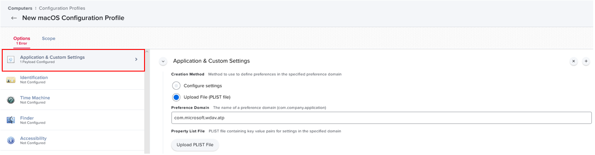

# JAMF-based deployment for Microsoft Defender ATP for Mac

**Applies to:**

- [Microsoft Defender Advanced Threat Protection (Microsoft Defender ATP) for Mac](microsoft-defender-atp-mac.md)

This topic describes how to deploy Microsoft Defender ATP for Mac through JAMF. A successful deployment requires the completion of all of the following steps:

1. [Download installation and onboarding packages](#download-installation-and-onboarding-packages)
1. [Create JAMF policies](#create-jamf-policies)
1. [Client device setup](#client-device-setup)
1. [Deployment](#deployment)
1. [Check onboarding status](#check-onboarding-status)

## Prerequisites and system requirements

Before you get started, please see [the main Microsoft Defender ATP for Mac page](microsoft-defender-atp-mac.md) for a description of prerequisites and system requirements for the current software version.

In addition, for JAMF deployment, you need to be familiar with JAMF administration tasks, have a JAMF tenant, and know how to deploy packages. This includes having a properly configured distribution point. JAMF has many ways to complete the same task. These instructions provide an example for most common processes. Your organization might use a different workflow.

## Overview

The following table summarizes the steps you would need to take to deploy and manage Microsoft Defender ATP for Macs, via JAMF. More detailed steps are available below.

| Step | Sample file names | BundleIdentifier |
|-|-|-|
| [Download installation and onboarding packages](#download-installation-and-onboarding-packages) | WindowsDefenderATPOnboarding__MDATP_wdav.atp.xml | com.microsoft.wdav.atp |
| [Microsoft Defender ATP configuration settings](https://docs.microsoft.com/windows/security/threat-protection/microsoft-defender-atp/mac-preferences#property-list-for-jamf-configuration-profile-1)<br/><br/> **Note:** If you are planning to run a 3rd party AV for macOS, set `passiveMode` to `true`. | MDATP_WDAV_and_exclusion_settings_Preferences.plist | com.microsoft.wdav |
| [Configure Microsoft Defender ATP and MS AutoUpdate (MAU) notifications](#notification-settings) | MDATP_MDAV_Tray_and_AutoUpdate2.mobileconfig | com.microsoft.wdavtray |
| [Configure Microsoft AutoUpdate (MAU)](https://docs.microsoft.com/windows/security/threat-protection/microsoft-defender-atp/mac-updates#jamf) | MDATP_Microsoft_AutoUpdate.mobileconfig | com.microsoft.autoupdate2 |
| [Grant Full Disk Access to Microsoft Defender ATP](#privacy-preferences-policy-control) | Note: If there was one, MDATP_tcc_Catalina_or_newer.plist | com.microsoft.wdav.tcc |
| [Approve Kernel Extension for Microsoft Defender ATP](#approved-kernel-extension) | Note: If there was one, MDATP_KExt.plist | N/A |

## Download installation and onboarding packages

Download the installation and onboarding packages from Microsoft Defender Security Center:

1. In Microsoft Defender Security Center, go to **Settings > Device management > Onboarding**.
2. In Section 1 of the page, set the operating system to **Linux, macOS, iOS or Android**.
3. Set the deployment method to **Mobile Device Management / Microsoft Intune**.

    > [!NOTE]
    > Jamf falls under **Mobile Device Management**.

4. In Section 2 of the page, select **Download installation package**. Save it as _wdav.pkg_ to a local directory.
5. In Section 2 of the page, select **Download onboarding package**. Save it as _WindowsDefenderATPOnboardingPackage.zip_ to the same directory.

    

6. From the command prompt, verify that you have the two files. Extract the contents of the .zip files like so:

    ```bash
    $ ls -l
    total 721160
    -rw-r--r--  1 test  staff      11821 Mar 15 09:23 WindowsDefenderATPOnboardingPackage.zip
    -rw-r--r--  1 test  staff  354531845 Mar 13 08:57 wdav.pkg
    $ unzip WindowsDefenderATPOnboardingPackage.zip
    Archive:  WindowsDefenderATPOnboardingPackage.zip
    warning:  WindowsDefenderATPOnboardingPackage.zip appears to use backslashes as path separators
    inflating: intune/kext.xml
     inflating: intune/WindowsDefenderATPOnboarding.xml
     inflating: jamf/WindowsDefenderATPOnboarding.plist
    ```

## Create JAMF policies

You need to create a configuration profile and a policy to start deploying Microsoft Defender ATP for Mac to client devices.

### Configuration Profile

The configuration profile contains a custom settings payload that includes the following:

- Microsoft Defender ATP for Mac onboarding information
- Approved Kernel Extensions payload to enable running the Microsoft kernel driver

To set the onboarding information, add a property list file that is named **jamf/WindowsDefenderATPOnboarding.plist** as a custom setting. To do this, select **Computers** > **Configuration Profiles** > **New**, and then select **Application & Custom Settings** > **Configure**. From there, you can upload the property list.


  >[!IMPORTANT]
  > You have to set the **Preference Domain** to **com.microsoft.wdav.atp**. There are some changes to the Custom Payloads and also to the Jamf Pro user interface in version 10.18 and later versions. For more information about the changes, see [Configuration Profile Payload Settings Specific to Jamf Pro](https://www.jamf.com/jamf-nation/articles/217/configuration-profile-payload-settings-specific-to-jamf-pro).



### Approved Kernel Extension

To approve the kernel extension:

1. In **Computers > Configuration Profiles** select **Options > Approved Kernel Extensions**.
2. Use **UBF8T346G9** for Team Id.

    

### Privacy Preferences Policy Control

> [!CAUTION]
> macOS 10.15 (Catalina) contains new security and privacy enhancements. Beginning with this version, by default, applications are not able to access certain locations on disk (such as Documents, Downloads, Desktop, etc.) without explicit consent. In the absence of this consent, Microsoft Defender ATP is not able to fully protect your device.
>
> If you previously configured Microsoft Defender ATP through JAMF, we recommend applying the following configuration.

Add the following JAMF policy to grant Full Disk Access to Microsoft Defender ATP.

1. Select **Options > Privacy Preferences Policy Control**.
2. Use any identifier and identifier type = Bundle.
3. Set Code Requirement to `identifier "com.microsoft.wdav" and anchor apple generic and certificate 1[field.1.2.840.113635.100.6.2.6] /* exists */ and certificate leaf[field.1.2.840.113635.100.6.1.13] /* exists */ and certificate leaf[subject.OU] = UBF8T346G9`.
4. Set app or service to SystemPolicyAllFiles and access to Allow.

    

#### Configuration Profile's Scope

Configure the appropriate scope to specify the devices that will receive the configuration profile.

Open **Computers** > **Configuration Profiles**, and select **Scope > Targets**. From there, select the devices you want to target.


Save the **Configuration Profile**.

Use the **Logs** tab to monitor deployment status for each enrolled device.

### Notification settings

Starting in macOS 10.15 (Catalina) a user must manually allow to display notifications in UI. To auto-enable notifications from Defender and Auto Update, you can import the .mobileconfig below into a separate configuration profile and assign it to all devices with Defender:

   ```xml
   <?xml version="1.0" encoding="UTF-8"?>
   <!DOCTYPE plist PUBLIC "-//Apple//DTD PLIST 1.0//EN" "http://www.apple.com/DTDs/PropertyList-1.0.dtd">
   <plist version="1.0"><dict><key>PayloadContent</key><array><dict><key>NotificationSettings</key><array><dict><key>AlertType</key><integer>2</integer><key>BadgesEnabled</key><true/><key>BundleIdentifier</key><string>com.microsoft.autoupdate2</string><key>CriticalAlertEnabled</key><false/><key>GroupingType</key><integer>0</integer><key>NotificationsEnabled</key><true/><key>ShowInLockScreen</key><false/><key>ShowInNotificationCenter</key><true/><key>SoundsEnabled</key><true/></dict><dict><key>AlertType</key><integer>2</integer><key>BadgesEnabled</key><true/><key>BundleIdentifier</key><string>com.microsoft.wdavtray</string><key>CriticalAlertEnabled</key><false/><key>GroupingType</key><integer>0</integer><key>NotificationsEnabled</key><true/><key>ShowInLockScreen</key><false/><key>ShowInNotificationCenter</key><true/><key>SoundsEnabled</key><true/></dict></array><key>PayloadDescription</key><string/><key>PayloadDisplayName</key><string>notifications</string><key>PayloadEnabled</key><true/><key>PayloadIdentifier</key><string>BB977315-E4CB-4915-90C7-8334C75A7C64</string><key>PayloadOrganization</key><string>Microsoft</string><key>PayloadType</key><string>com.apple.notificationsettings</string><key>PayloadUUID</key><string>BB977315-E4CB-4915-90C7-8334C75A7C64</string><key>PayloadVersion</key><integer>1</integer></dict></array><key>PayloadDescription</key><string/><key>PayloadDisplayName</key><string>mdatp - allow notifications</string><key>PayloadEnabled</key><true/><key>PayloadIdentifier</key><string>85F6805B-0106-4D23-9101-7F1DFD5EA6D6</string><key>PayloadOrganization</key><string>Microsoft</string><key>PayloadRemovalDisallowed</key><false/><key>PayloadScope</key><string>System</string><key>PayloadType</key><string>Configuration</string><key>PayloadUUID</key><string>85F6805B-0106-4D23-9101-7F1DFD5EA6D6</string><key>PayloadVersion</key><integer>1</integer></dict></plist>
   ```

### Package

1. Create a package in **Settings > Computer Management > Packages**.

    

2. Upload the package to the Distribution Point.
3. In the **filename** field, enter the name of the package. For example, _wdav.pkg_.

### Policy

Your policy should contain a single package for Microsoft Defender.


Configure the appropriate scope to specify the computers that will receive this policy.

After you save the Configuration Profile, you can use the Logs tab to monitor the deployment status for each enrolled device.

## Client device setup

You'll need no special provisioning for a macOS computer, beyond the standard JAMF Enrollment.

> [!NOTE]
> After a computer is enrolled, it will show up in the Computers inventory (All Computers).

 - Open **Device Profiles**, from the **General** tab, and make sure that **User Approved MDM** is set to **Yes**. If it's currently set to No, the user needs to open **System Preferences > Profiles** and select **Approve** on the MDM Profile.

    <br/>
    

    After a moment, the device's User Approved MDM status will change to **Yes**.

    

    You may now enroll additional devices. You may also enroll them later, after you have finished provisioning system configuration and application packages.

## Deployment

Enrolled client devices periodically poll the JAMF Server, and install new configuration profiles and policies as soon as they are detected.

### Status on the server

You can monitor deployment status in the **Logs** tab:

- **Pending** means that the deployment is scheduled but has not yet happened
- **Completed** means that the deployment succeeded and is no longer scheduled


### Status on client device

After the Configuration Profile is deployed, you'll see the profile for the device in  **System Preferences** > **Profiles >**.


Once the policy is applied, you'll see the Microsoft Defender ATP icon in the macOS status bar in the top-right corner.


You can monitor policy installation on a device by following the JAMF log file:

```bash
    $ tail -f /var/log/jamf.log
    Thu Feb 21 11:11:41 mavel-mojave jamf[7960]: No patch policies were found.
    Thu Feb 21 11:16:41 mavel-mojave jamf[8051]: Checking for policies triggered by "recurring check-in" for user "testuser"...
    Thu Feb 21 11:16:43 mavel-mojave jamf[8051]: Executing Policy WDAV
    Thu Feb 21 11:17:02 mavel-mojave jamf[8051]: Installing Microsoft Defender...
    Thu Feb 21 11:17:23 mavel-mojave jamf[8051]: Successfully installed Microsoft Defender.
    Thu Feb 21 11:17:23 mavel-mojave jamf[8051]: Checking for patches...
    Thu Feb 21 11:17:23 mavel-mojave jamf[8051]: No patch policies were found.
```

You can also check the onboarding status:

```bash
$ mdatp --health
...
licensed                                : true
orgId                                   : "4751b7d4-ea75-4e8f-a1f5-6d640c65bc45"
...
```

- **licensed**: This confirms that the device has an ATP license.

- **orgid**: Your Microsoft Defender ATP org id; it will be the same for your organization.

## Check onboarding status

You can check that devices have been correctly onboarded by creating a script. For example, the following script checks enrolled devices for onboarding status:

```bash
$ mdatp --health healthy
```

The above command prints "1" if the product is onboarded and functioning as expected.

If the product is not healthy, the exit code (which can be checked through `echo $?`) indicates the problem:

- 0 if the device is not yet onboarded
- 3 if the connection to the daemon cannot be established—for example, if the daemon is not running

## Logging installation issues

See [Logging installation issues](mac-resources.md#logging-installation-issues) for more information on how to find the automatically generated log that is created by the installer when an error occurs.

## Uninstallation

This method is based on the script described in [Uninstalling](mac-resources.md#uninstalling).

### Script

Create a script in **Settings > Computer Management > Scripts**.

This script removes Microsoft Defender ATP from the /Applications directory:

```bash
   #!/bin/bash

   echo "Is WDAV installed?"
   ls -ld '/Applications/Microsoft Defender ATP.app' 2>/dev/null

   echo "Uninstalling WDAV..."
   rm -rf '/Applications/Microsoft Defender ATP.app'

   echo "Is WDAV still installed?"
   ls -ld '/Applications/Microsoft Defender ATP.app' 2>/dev/null

   echo "Done!"
```


### Policy

Your policy should contain a single script:


Configure the appropriate scope in the **Scope** tab to specify the devices that will receive this policy.
