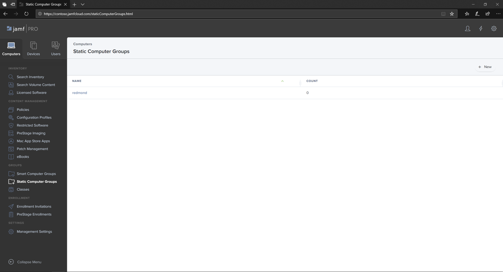
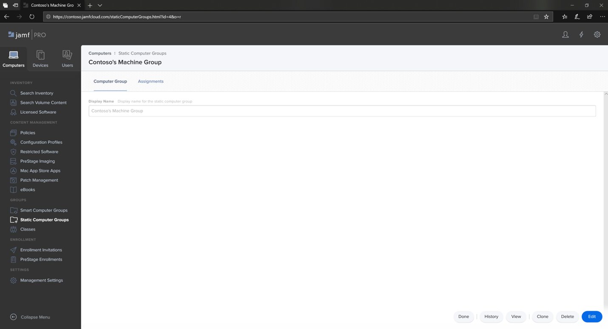
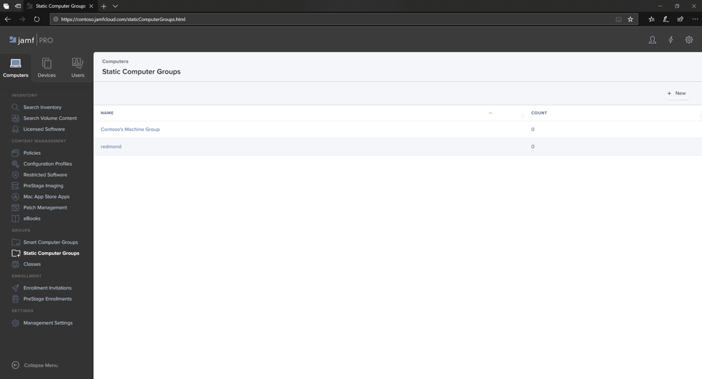

# Set up Microsoft Defender ATP for macOS device groups in Jamf Pro

**Applies to:**

- [Microsoft Defender Advanced Threat Protection (Microsoft Defender ATP) for Mac](microsoft-defender-atp-mac.md)

Set up the device groups similar to Group policy  organizational unite (OUs), Microsoft Endpoint Configuration Manager's device collection, and Intune's device groups.

1. Navigate to **Static Computer Groups**.

2. Select **New**. 

    

3. Provide a display name and select **Save**.

    

4. Now you will see the **Contoso's Machine Group** under **Static Computer Groups**.

    

## Next step
- [Set up Microsoft Defender ATP for macOS policies in Jamf Pro](mac-jamfpro-policies.md)