# Enroll Microsoft Defender ATP for macOS devices into Jamf Pro 

**Applies to:**

- [Microsoft Defender Advanced Threat Protection (Microsoft Defender ATP) for Mac](microsoft-defender-atp-mac.md)

## Enroll macOS devices

There are multiple methods of getting enrolled to JamF.

This article will guide you on two methods:

- [Method 1:  Enrollment Invitations](#enrollment-method-1-enrollment-invitations)
- [Method 2:  Prestage Enrollments](#enrollment-method-2-prestage-enrollments)

For a complete list, see [About Computer Enrollment](https://docs.jamf.com/9.9/casper-suite/administrator-guide/About_Computer_Enrollment.html).

## Enrollment Method 1: Enrollment Invitations

1. In the Jamf Pro dashboard, navigate to **Enrollment invitations**.

    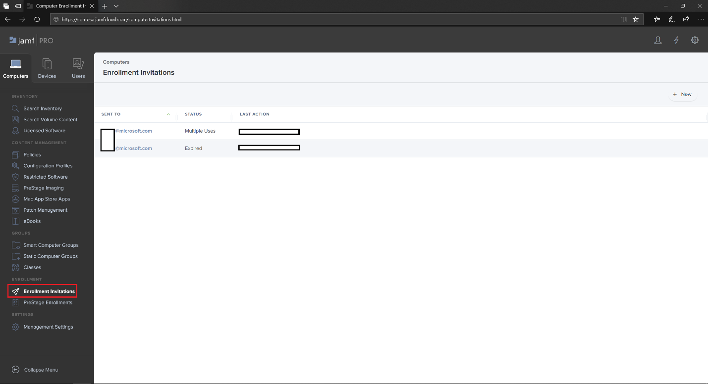

2. Select **+ New**.

    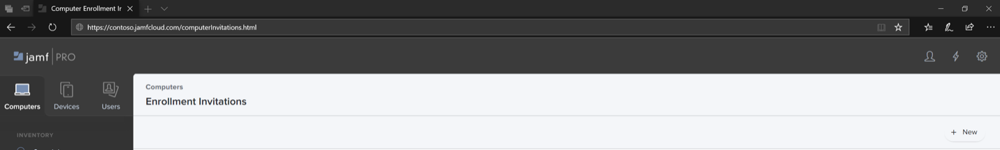

3. In **Specify Recipients for the Invitation** > under **Email Addresses** enter the e-mail address(es) of the recipients.

    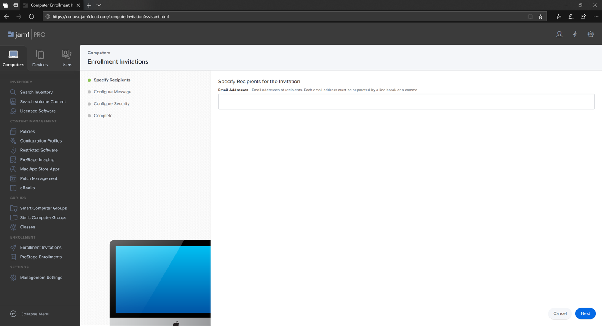

    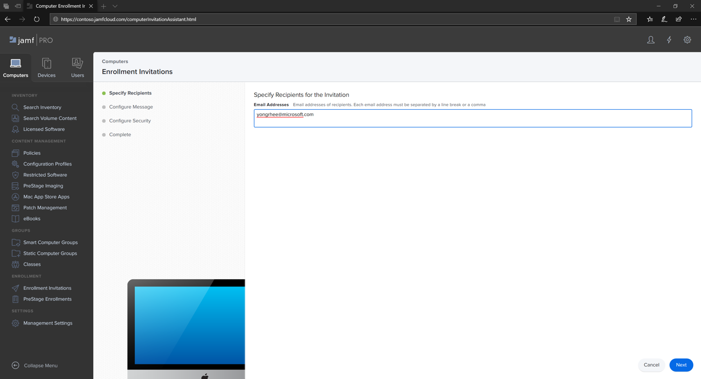

    For example: janedoe@contoso.com

    

4. Configure the message for the invitation.

    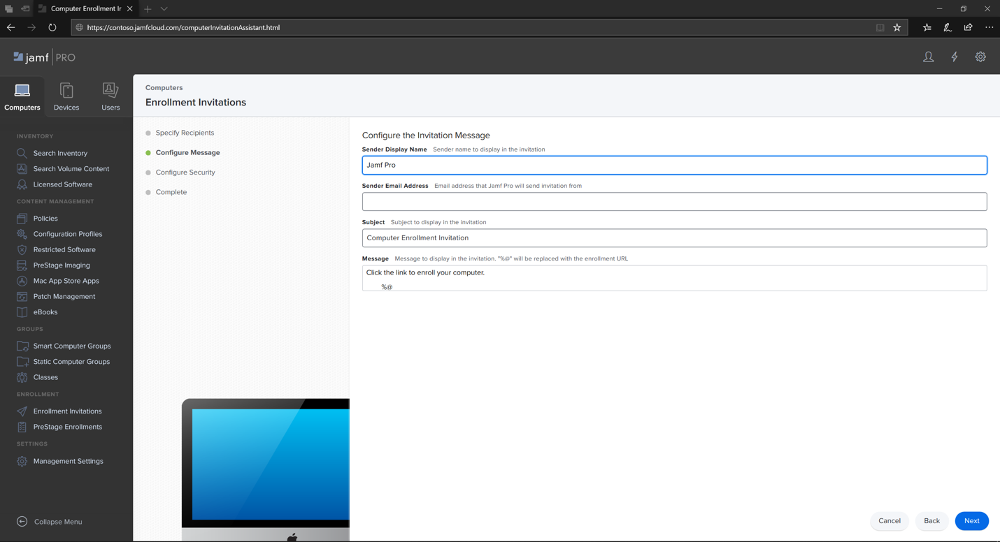

    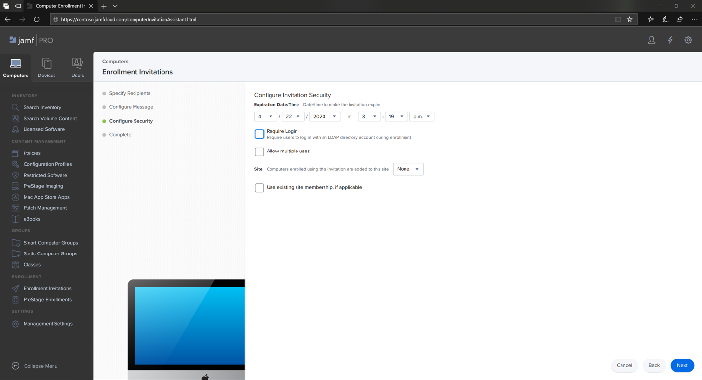

    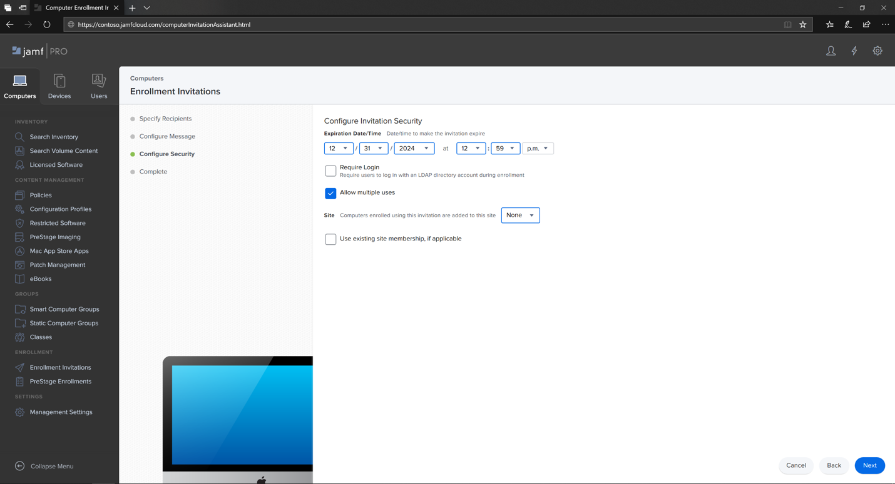

    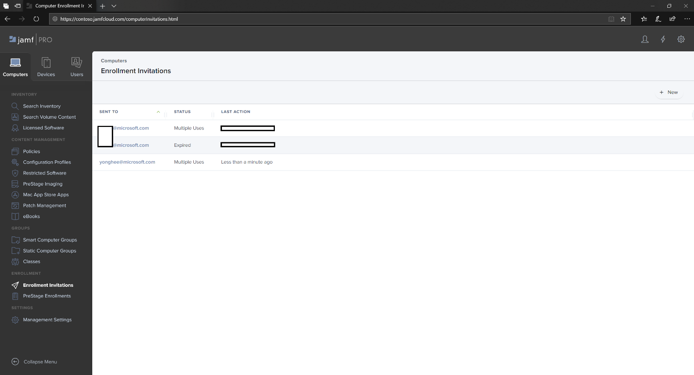

## Enrollment Method 2: Prestage Enrollments

1. In the Jamf Pro dashboard, navigate to **Prestage enrollments**.

    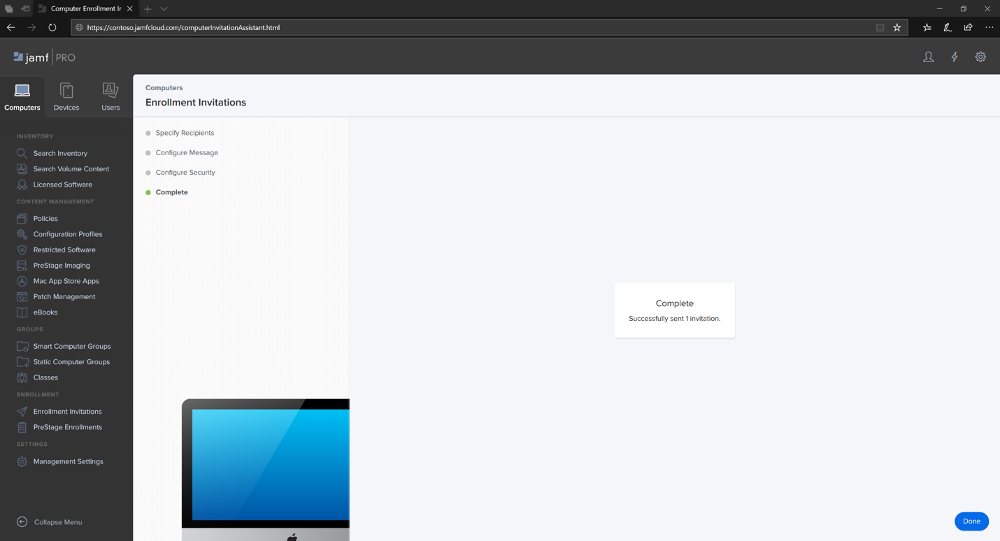

2. Follow the instructions in [Computer PreStage Enrollments](https://docs.jamf.com/9.9/casper-suite/administrator-guide/Computer_PreStage_Enrollments.html).

## Enroll macOS device

1. Select **Continue** and install the CA certificate from a **System Preferences** window.

    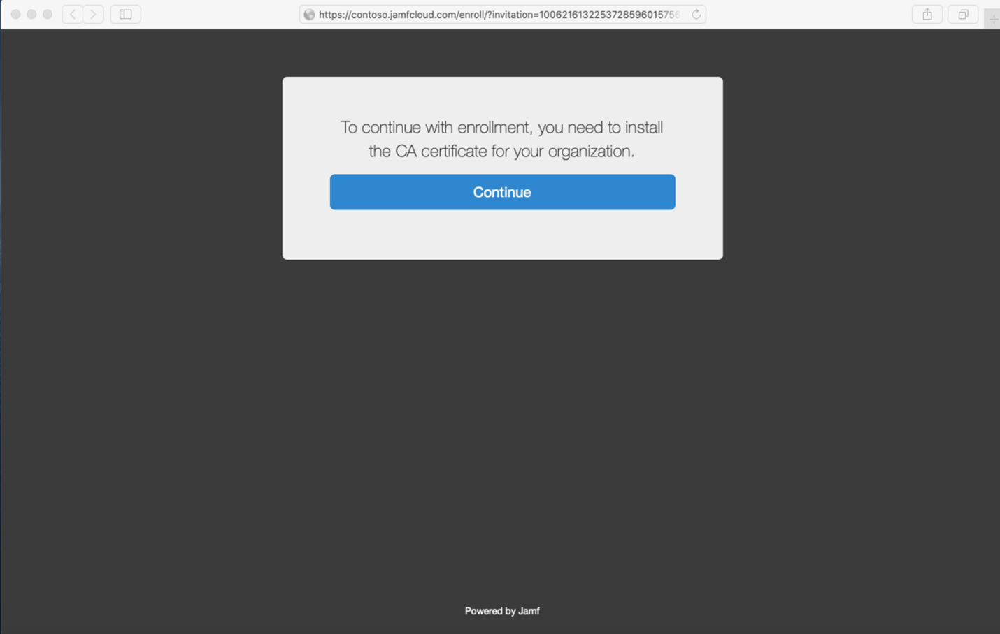

2. Once CA certificate is installed, return to the browser window and select **Continue** and install the MDM profile. 

    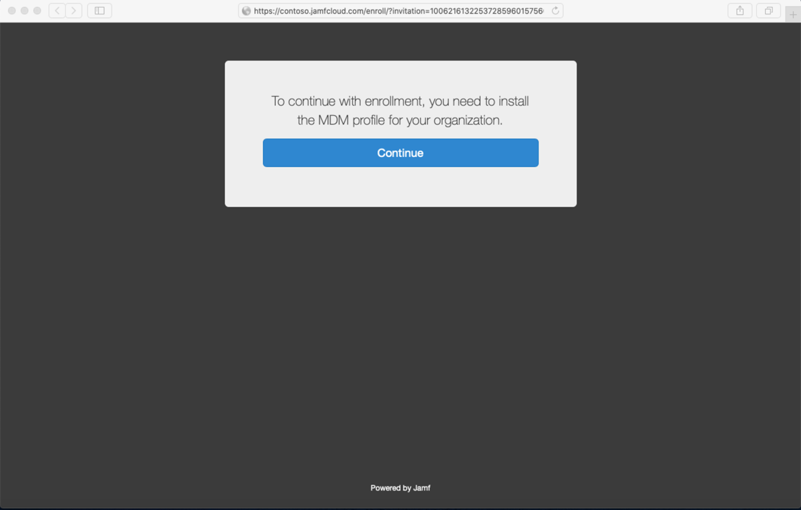

3. Select **Allow** to downloads from JAMF.

    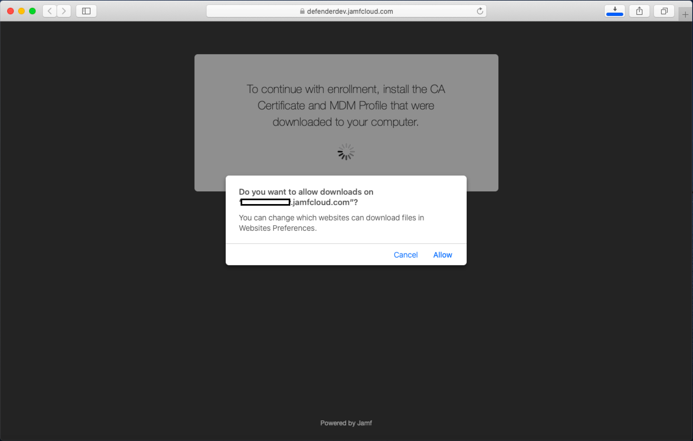

4. Select **Continue** to proceed with the MDM Profile installation. 

    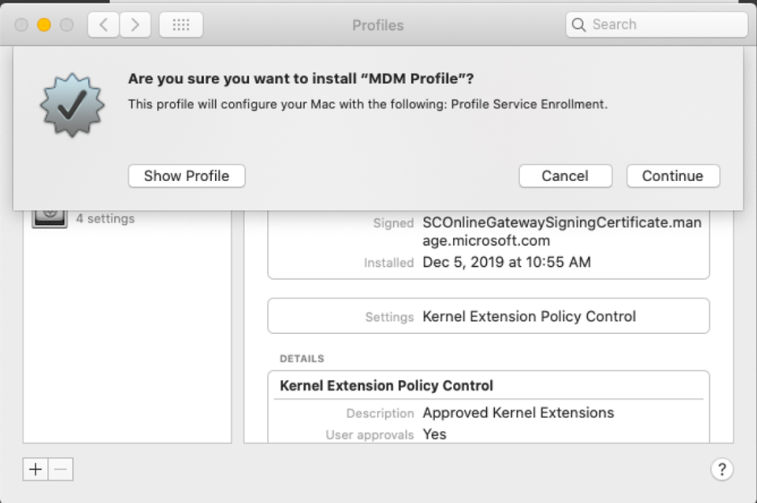

5. Select **Continue** to install the MDM Profile.

    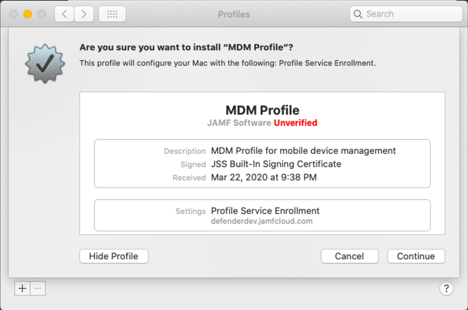

6. Select **Continue**  to complete the configuration. 

    