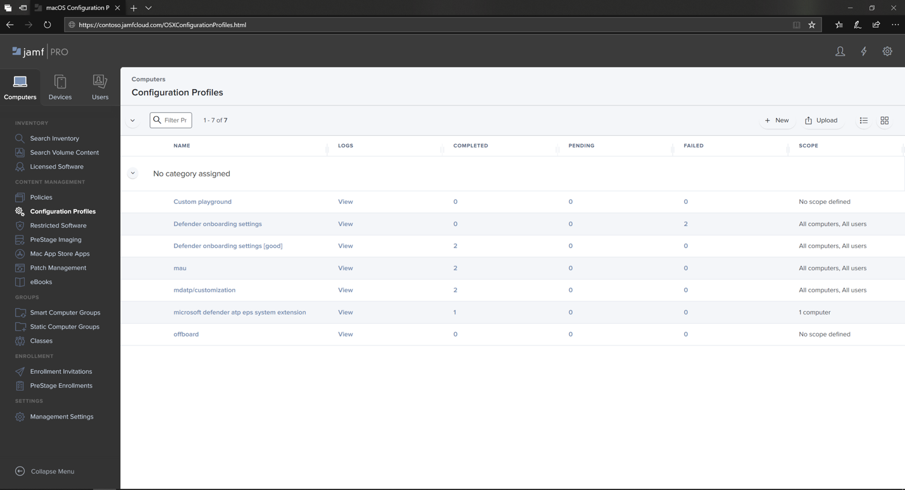
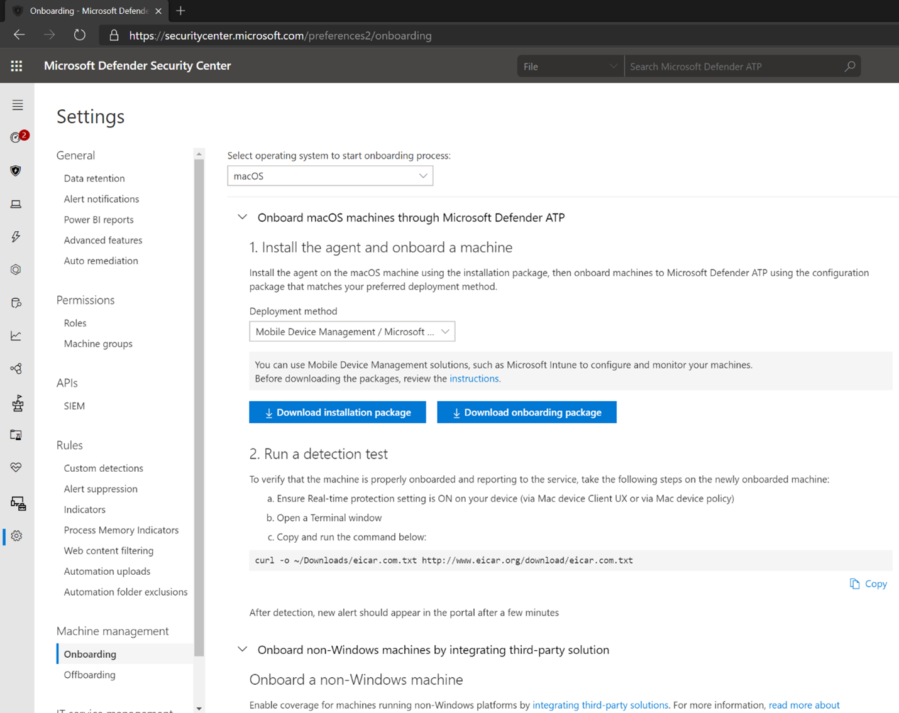
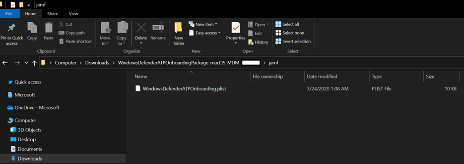
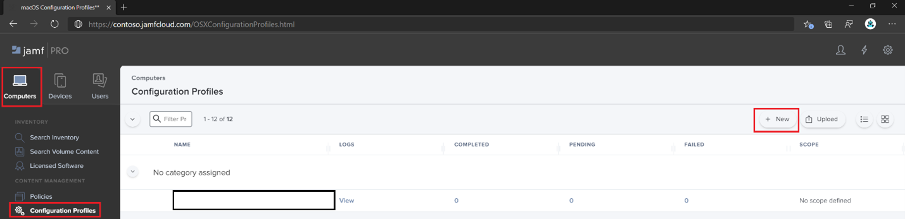
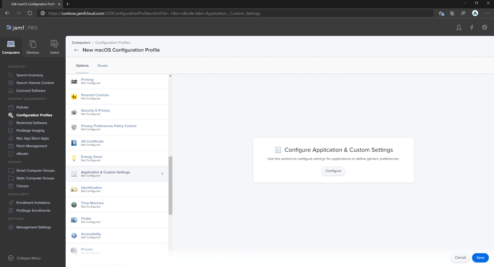
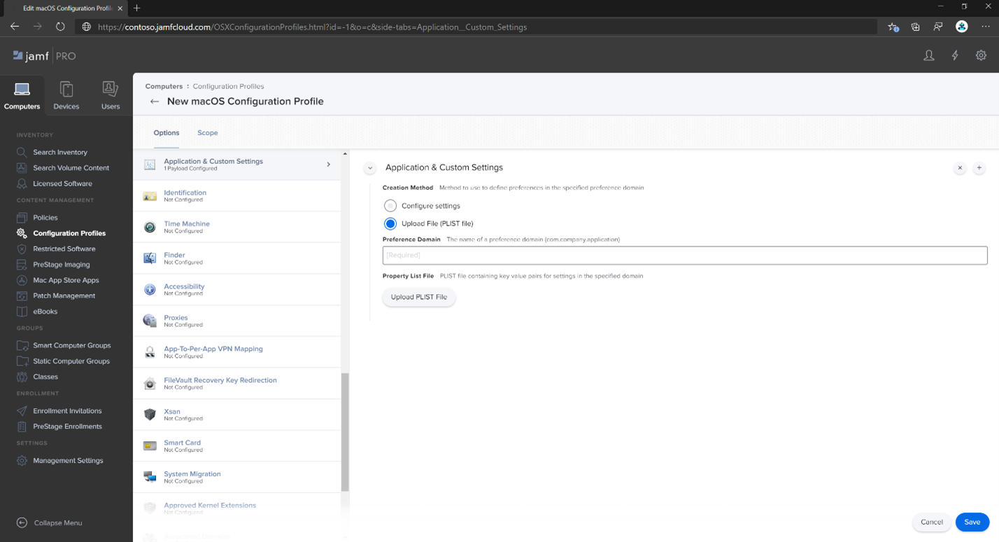
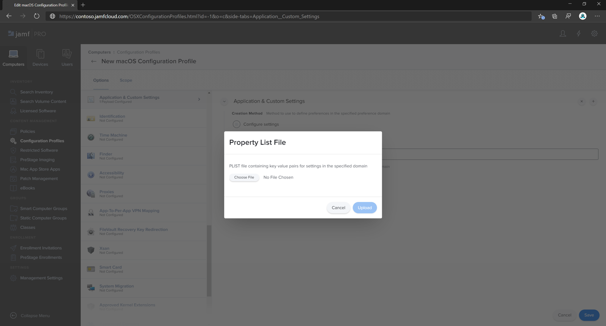
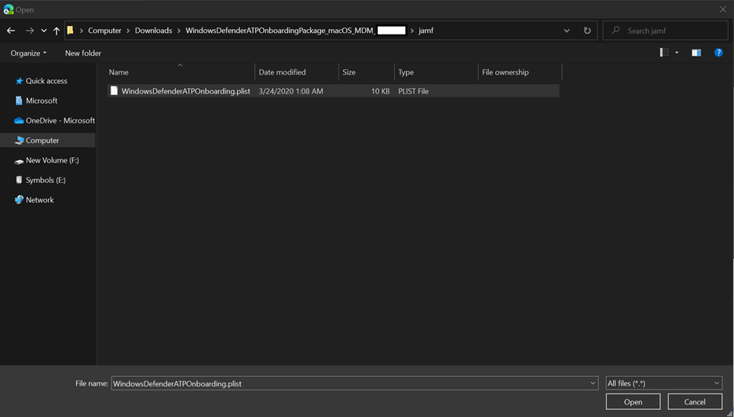

# Setup the Microsoft Defender ATP for macOSpolicies in Jamf Pro

**Applies to:**

- [Microsoft Defender Advanced Threat Protection (Microsoft Defender ATP) for Mac](microsoft-defender-atp-mac.md)

1. In the Jamf Pro dashboard, navigate to **Configuration Profiles**. 

2. Select **New**.

    

3. In [Microsoft Defender Security Center](https://securitycenter.microsoft.com ), navigate to **Settings > Onboarding**. 

4. Select macOS as the operating system and Mobile Device Management / Microsoft Intune as the deployment method.

    

5. Select **Download onboarding package** (WindowsDefenderATPOnboardingPackage.zip).

6. Extract `WindowsDefenderATPOnboardingPackage.zip` such as `WindowsDefenderATPOnboardingPackage_macOS_MDM_contoso`.

7. Copy the file from `C:\Users\JaneDoe_or_JohnDoe.contoso\Downloads\WindowsDefenderATPOnboardingPackage_macOS_MDM_contoso\jamf\WindowsDefenderATPOnboarding.plist`.

8. Use the following Microsoft Defender ATP configuration settings:

    - enableRealTimeProtection
    - passiveMode
    
    >[!NOTE]
    >Not turned on by default, if you are planning to run a third-party AV for macOS, set it to `true`.

    - exclusions
    - excludedPath
    - excludedFileExtension
    - excludedFileName
    - exclusionsMergePolicy
    - allowedThreats
    
    >[!NOTE]
    >EICAR is on the sample, if you are going through a proof-of-concept, remove it especially if you are testing EICAR.
        
    - disallowedThreatActions
    - potentially_unwanted_application
    - archive_bomb
    - cloudService
    - automaticSampleSubmission
    - tags
    - hideStatusMenuIcon
    
     For information, see [Property list for Jamf configuration profile](mac-preferences.md#property-list-for-jamf-configuration-profile).

```XML
<?xml version="1.0" encoding="UTF-8"?>
<!DOCTYPE plist PUBLIC "-//Apple//DTD PLIST 1.0//EN" "http://www.apple.com/DTDs/PropertyList-1.0.dtd">
<plist version="1.0">
<dict>
    <key>antivirusEngine</key>
    <dict>
        <key>enableRealTimeProtection</key>
        <true/>
        <key>passiveMode</key>
        <false/>
        <key>exclusions</key>
        <array>
            <dict>
                <key>$type</key>
                <string>excludedPath</string>
                <key>isDirectory</key>
                <false/>
                <key>path</key>
                <string>/var/log/system.log</string>
            </dict>
            <dict>
                <key>$type</key>
                <string>excludedPath</string>
                <key>isDirectory</key>
                <true/>
                <key>path</key>
                <string>/home</string>
            </dict>
            <dict>
                <key>$type</key>
                <string>excludedFileExtension</string>
                <key>extension</key>
                <string>pdf</string>
            </dict>
            <dict>
                <key>$type</key>
                <string>excludedFileName</string>
                <key>name</key>
                <string>cat</string>
            </dict>
        </array>
        <key>exclusionsMergePolicy</key>
        <string>merge</string>
        <key>allowedThreats</key>
        <array>
            <string>EICAR-Test-File (not a virus)</string>
        </array>
        <key>disallowedThreatActions</key>
        <array>
            <string>allow</string>
            <string>restore</string>
        </array>
        <key>threatTypeSettings</key>
        <array>
            <dict>
                <key>key</key>
                <string>potentially_unwanted_application</string>
                <key>value</key>
                <string>block</string>
            </dict>
            <dict>
                <key>key</key>
                <string>archive_bomb</string>
                <key>value</key>
                <string>audit</string>
            </dict>
        </array>
        <key>threatTypeSettingsMergePolicy</key>
        <string>merge</string>
    </dict>
    <key>cloudService</key>
    <dict>
        <key>enabled</key>
        <true/>
        <key>diagnosticLevel</key>
        <string>optional</string>
        <key>automaticSampleSubmission</key>
        <true/>
    </dict>
    <key>edr</key>
    <dict>
        <key>tags</key>
        <array>
            <dict>
                <key>key</key>
                <string>GROUP</string>
                <key>value</key>
                <string>ExampleTag</string>
            </dict>
        </array>
    </dict>
    <key>userInterface</key>
    <dict>
        <key>hideStatusMenuIcon</key>
        <false/>
    </dict>
</dict>
</plist>
```

10. Configure the notification settings (macOS 10.15 (Catalina) or newer). For more information, see [Notification settings](mac-install-with-jamf.md#notification-settings).

```xml
<?xml version="1.0" encoding="UTF-8"?>
<!DOCTYPE plist PUBLIC "-//Apple//DTD PLIST 1.0//EN" "http://www.apple.com/DTDs/PropertyList-1.0.dtd">
<plist version="1.0"><dict><key>PayloadContent</key><array><dict><key>NotificationSettings</key><array><dict><key>AlertType</key><integer>2</integer><key>BadgesEnabled</key><true/><key>BundleIdentifier</key><string>com.microsoft.autoupdate2</string><key>CriticalAlertEnabled</key><false/><key>GroupingType</key><integer>0</integer><key>NotificationsEnabled</key><true/><key>ShowInLockScreen</key><false/><key>ShowInNotificationCenter</key><true/><key>SoundsEnabled</key><true/></dict><dict><key>AlertType</key><integer>2</integer><key>BadgesEnabled</key><true/><key>BundleIdentifier</key><string>com.microsoft.wdavtray</string><key>CriticalAlertEnabled</key><false/><key>GroupingType</key><integer>0</integer><key>NotificationsEnabled</key><true/><key>ShowInLockScreen</key><false/><key>ShowInNotificationCenter</key><true/><key>SoundsEnabled</key><true/></dict></array><key>PayloadDescription</key><string/><key>PayloadDisplayName</key><string>notifications</string><key>PayloadEnabled</key><true/><key>PayloadIdentifier</key><string>BB977315-E4CB-4915-90C7-8334C75A7C64</string><key>PayloadOrganization</key><string>Microsoft</string><key>PayloadType</key><string>com.apple.notificationsettings</string><key>PayloadUUID</key><string>BB977315-E4CB-4915-90C7-8334C75A7C64</string><key>PayloadVersion</key><integer>1</integer></dict></array><key>PayloadDescription</key><string/><key>PayloadDisplayName</key><string>mdatp - allow notifications</string><key>PayloadEnabled</key><true/><key>PayloadIdentifier</key><string>85F6805B-0106-4D23-9101-7F1DFD5EA6D6</string><key>PayloadOrganization</key><string>Microsoft</string><key>PayloadRemovalDisallowed</key><false/><key>PayloadScope</key><string>System</string><key>PayloadType</key><string>Configuration</string><key>PayloadUUID</key><string>85F6805B-0106-4D23-9101-7F1DFD5EA6D6</string><key>PayloadVersion</key><integer>1</integer></dict></plist>
<?xml version="1.0" encoding="UTF-8"?>
<!DOCTYPE plist PUBLIC "-//Apple//DTD PLIST 1.0//EN" "http://www.apple.com/DTDs/PropertyList-1.0.dtd">
<plist version="1.0">
<dict>
	<key>ChannelName</key>
	<string>InsiderFast</string>
	<key>HowToCheck</key>
	<string>AutomaticDownload</string>
	<key>EnableCheckForUpdatesButton</key>
	<true/>
    <key>DisableInsiderCheckbox</key>
    <false/>
	<key>SendAllTelemetryEnabled</key>
	<true/>
</dict>
</plist>

```

Save it as `AutoEnable_notifications_for_MDATP_AutoUpdate.mobileconfig` or `MDATP_MDAV_notification_settings.plist`.


12. Configure Microsoft AutoUpdate (MAU).

    - JAMF - Set preferences for Microsoft AutoUpdate. For more infomation, see [JAMF](mac-updates.md#jamf).
    - Save the file as e.g. MDATP_MDAV_MAU_settings.plist

    >[!IMPORTANT]
    >Set the Preference Domain to `com.microsoft.autoupdate2`

    Add path to the location of `com.microsoft.autoupdate2.plist`

    `plutil -lint com.microsoft.autoupdate2.plist`
    `com.microsoft.autoupdate2.plist: OK`

13. Grant full disk access to Microsoft Defender ATP. 
    
    Privacy Preferences Policy Control (TCC,  Full Disk Access for macOS 10.15 (Catalina) and newer).

    For more information, see [Privacy preferences policy control](mac-install-with-jamf.md#privacy-preferences-policy-control).

    a. Select **Options > Privacy Preferences Policy Control**.

    b. Use any identifier and identifier type = Bundle.

    c. Set Code Requirement to identifier 'com.microsoft.wdav' and `anchor apple generic and certificate 1[field.1.2.840.113635.100.6.2.6] /* exists */ and certificate leaf[field.1.2.840.113635.100.6.1.13] /* exists */ and certificate leaf[subject.OU] = UBF8T346G9`.

    d. Set app or service to `SystemPolicyAllFiles` and access to `Allow`.

14. Approve Kernel Extension for Microsoft Defender ATP.

    a. In **Computers > Configuration Profiles select Options > Approved Kernel Extensions**.
  
    b. Use **UBF8T346G9** for **Team Id**.


## Onboard the package

1. Locate the file `WindowsDefenderATPOnboarding.plist`.

    

2. In the Jamf Pro dashboard, select **New**.

    

3. Enter the following details:

   **General**
   - Name: MDATP onboarding for macOS
   - Description: MDATP EDR onboarding for macOS
   - Category: None
   - Distribution Method: Install Automatically
   - Level: Computer Level

   **General**
   - Select **Application & Custom Settings**
   - Select **Configure**.

    

4. Select **Upload File (PLIST file)**.

    

5. Select **Upload File (PLIST file) then in **Preference Domain** enter: `com.microsoft.wdav.atp`. 

    

    

6. Select **Open** and select the onboarding file.

    
